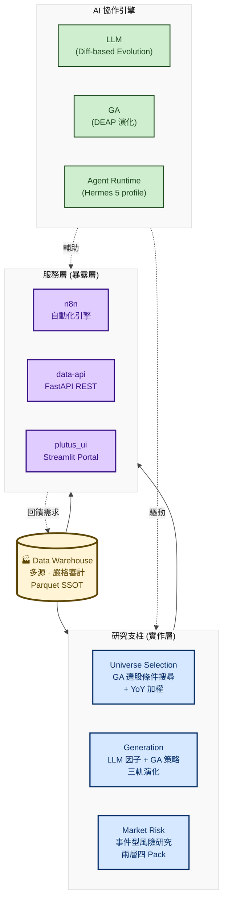

# quant-interview-prep

> 量化交易研究平台作品集與面試準備文件。
>
> **核心敘事**：以嚴格審計的金融資料倉儲為基礎，結合 AI（LLM、遺傳演算法、Agent Runtime）與人類研究員協作，自動化產生選股池、因子、風險訊號，並透過服務層對外暴露。

---

## 一、設計理念（核心邏輯）

整套系統圍繞三個相互支撐的理念：

### 1. 資料倉儲 = 唯一真相源（Single Source of Truth）

**所有研究、回測、風險評估的資料一律從倉儲 parquet 讀取**——這是平台的核心。

- 嚴格審計：Watermark（水位線）+ Gap Calculator（缺口計算）+ 多源交叉校驗 + Discord 告警
- 禁止繞過倉儲：不能直連 FinLab API、不能讀私有 pickle cache、不能在腳本同層自建 dataset
- 為什麼嚴格？因為「**錯的資料比沒資料更可怕**」——缺一筆法人買超不會拋例外，但會讓下游籌碼因子分析得出錯誤結論，且這種錯誤**不會拋例外**，只會靜默讓回測看起來很漂亮，直到實盤爆炸

### 2. AI 協作而非 AI 替代（Human-in-the-loop）

AI 工具不是用來替代研究員，而是把研究員從繁重產生工作中解放，專注於架構與判讀：

| AI 角色 | 工作內容 | 人類研究員的角色 |
|---|---|---|
| **LLM（OpenEvolve）** | 用 Diff-based 演算法自動產生因子程式碼 | 審查因子、調整 prompt、設定評分門檻 |
| **遺傳演算法（DEAP）** | 在巨量條件組合中搜尋最佳選股策略 | 設計條件池、選擇績效指標、判讀結果 |
| **Agent Runtime（Hermes）** | 風險分析、資料查詢、報告生成 | 設定 profile、審查輸出、做最終決策 |
| **LLM（Claude/GPT）** | 程式碼審查、bug 追蹤、文件撰寫 | 架構決策、方法論選擇、結果驗證 |

關鍵：**AI 寫的程式碼一定要人審，不能盲信**。我搭了一套 AI 審查 pipeline（多 subagents 平行：bug review / 標準審查 / 架構審查），未通過不合併。

### 3. 實作 / 暴露 雙層分工

```
能力實作層                能力暴露層
(需要領域知識的決策)       (對外提供機制)
┌──────────────┐         ┌──────────────────┐
│ research     │         │ Hermes (Agent)   │
│ market-risk  │  ───→   │ n8n (自動化)     │
│ evolution-lab│         │ data-api (REST)  │
│ datawarehouse│         │ plutus_ui (UI)   │
└──────────────┘         └──────────────────┘
```

判準：「需要領域知識才能回答的決策」（Sharpe 門檻、因子篩選、研究方向）屬實作層；「把該決策對外暴露的機制」屬暴露層。分開後，研究端改策略不用動 UI，UI 改 layout 不用碰回測邏輯。

---

## 二、系統架構總覽



---

## 三、研究支柱（Research Pillars）

### 1. 股票池篩選研究（Universe Selection）

**問題**：怎麼從上千檔股票中，系統化挑出值得納入投資組合的標的？

**方法**：用遺傳演算法搜尋「複合條件」的最佳組合——把每個選股條件編碼成染色體的位元，GA 自動演化出最適的 4~8 個條件 AND 組合。部位用 YoY（年增率）加權，讓營收成長高的個股權重更大。

**防過擬合三道防線**：
- IS/OOS 六四分（訓練 60%、測試 40% 完全沒看過的資料）
- PBO 機率懲罰（跟隨機策略對賭，沒顯著贏的個體扣分）
- YoY 加權（避免只看技術面，連動基本面）

**對應文件**：[`flowcharts/example_universe_selection.md`](./flowcharts/example_universe_selection.md)

---

### 2. 因子 / 策略生成（LLM + GA Generation）

**問題**：傳統 GA 只能組合既有條件，無法發明新公式。怎麼讓 AI 真的「發明」新因子？

**方法**：雙引擎並行——

| 引擎 | 用途 | 機制 |
|---|---|---|
| **LLM 演化（OpenEvolve）** | 自動產生因子 / 濾網 / 策略程式碼 | Diff-based Evolution：用 SEARCH/REPLACE 改 code，不重寫整段（避免 LLM 破壞可跑程式） |
| **GA 演化（DEAP）** | 搜尋既有條件組合 | 二進位編碼 + 兩點交叉 + 位元翻轉 |

**三軌分工**（同一個 LLM 引擎，不同評分目標）：

- **Alpha 軌**：挖掘布林因子池 → IC + ICIR + DSR 評分
- **Condition 軌**：優化事件濾網 → T-stat + Hit Rate + Coverage
- **Strategy 軌**：生成完整交易策略 → 接 FinLab `sim()` 算 Sharpe / Calmar / MDD

**保多樣性**：MAP-Elites 演算法把候選用「特徵 × 品質」雙維度分箱，每格只留最佳，確保搜尋覆蓋整個特徵空間而非收斂到單一點。

**對應文件**：[`flowcharts/evolution_lab.md`](./flowcharts/evolution_lab.md)

---

### 3. 市場風險研究（Market Risk）

**問題**：怎麼預測市場崩盤，提前調整部位？

**關鍵定位**：**不是傳統 VaR / CVaR / GARCH 那種參數化風險模型**。傳統模型假設常態分布，對尾部事件（崩盤）沒輒。本平台用**事件研究法**直接建模「崩盤事件」本身。

**兩層四 Pack 評估契約**：

| 層 | Pack | 任務 | 評估指標 |
|---|---|---|---|
| 訊號發明 | A · top_risk | 預測下跌 | P(down), probability_lift |
| 訊號發明 | B · bottom_dip | 預測反彈 | P(up rebound) |
| 訊號發明 | C · auxiliary_signal | 市場狀態 | 狀態相關性 |
| 獨立策略 | D · 完整策略 | 自決部位/方向 | OOS net_edge, MDD improvement |

**統計驗證基礎設施**（防假顯著四組工具）：

1. **Purged Walk-forward** — 訓練不能偷看測試期，label 重疊要挖空（embargo = label horizon）
2. **Episode Cluster + n_eff** — 事件擠在幾波行情裡？算有效獨立觀測數（重疊報酬 p 值一律視為上界樂觀）
3. **Block Bootstrap** — 以「波」為單位重抽，不以「筆」假裝獨立
4. **Fisher + BH-FDR** — 顯著性檢定 + 多重比較校正（測很多訊號要扣偽發現率）

**Label 工程**：路徑型 MAE（Maximum Adverse Excursion）—— 未來 h 天**曾經**最深跌到哪，不是第 h 天收在哪。抓得到盤中被洗出去的風險。

**對應文件**：[`flowcharts/market_risk.md`](./flowcharts/market_risk.md)

---

## 四、輔助系統（Auxiliary Systems）

### A. 多源金融資料倉儲（Data Warehouse）— 平台心臟

整合 7 + 1 種資料源，每日審計、嚴格治理：

| 資料源 | 用途 |
|---|---|
| FinMind | 台股 / 美股 / 期權主力 |
| FinLab | 台股基本面 + FinLab US 美股公司資料 |
| yfinance | 美股股價 + 深度基本面 |
| Binance | 加密貨幣 OHLCV |
| FRED / EIA | 總經指標 / 原油 |
| CFTC | 期貨持倉 |
| J-Quants | 日股（已暫停） |
| **KRX（Pykrx + FDR + Naver）** | **韓股——三源組合繞過 KRX 會員牆** |

**關鍵機制**：Redis ZSET 全域任務佇列 + Watermark 水位線 + Gap Calculator 缺口計算 + Bulk Downloader daemon + 多源交叉校驗。

**對應文件**：[`flowcharts/datawarehouse.md`](./flowcharts/datawarehouse.md)

---

### B. 統一 AI 服務編排層（Services）— 對外暴露

把上游研究能力包成四種對外形態：

| 子服務 | 角色 | 技術 |
|---|---|---|
| **Hermes** | Production Agent Runtime，承載 5 個 agent profile | ops/steward→GLM-5.2；librarian/risk/quantix→MiniMax M3 |
| **n8n** | 自動化引擎（排程、webhook、資料 pipeline） | 39 個 workflow（Hermes 19 + Risk 15 + System 5） |
| **data-api** | FastAPI REST API，把倉儲結果暴露為 endpoint | 9 個 router + 5 個 reader + 分級 cache TTL |
| **plutus_ui** | Streamlit Portal（DW 血緣、資料集探索、回測模組） | Python data app |

**Hermes Adapter**（FastAPI :18790）是關鍵橋接——把 HTTP `/tools/invoke` 轉成 Hermes CLI `chat -q`，讓 n8n workflow 可以呼叫 Hermes agent。

**對應文件**：[`flowcharts/services.md`](./flowcharts/services.md)

---

## 五、Repo 結構

```
quant-interview-prep/
├── README.md                      # 本檔（系統總覽與設計理念）
└── flowcharts/                    # 架構流程圖 + 面試輔助文件
    ├── example_universe_selection.md # 1. 範例：GA 演化選股策略（5 張 Mermaid）
    ├── evolution_lab.md           # 2. LLM 因子自動演化實驗室（5 張 Mermaid）
    ├── datawarehouse.md           # 3. 多源金融資料倉儲（4 張 Mermaid）
    ├── services.md                # 4. 統一 AI 服務編排層（5 張 Mermaid）
    ├── market_risk.md             # 5. 事件型市場風險評估（5 張 Mermaid）
    ├── SOURCE_MANIFEST.md         # 每份流程圖對應的程式碼路徑（追溯用）
    └── INTERVIEW_BRIEFING.md      # 面試口語稿：30 秒簡報 + 專有名詞 + 預期 Q&A + 地雷
```

> **注意**：本 repo 僅包含**文件與流程圖**，不含程式碼。原始碼位於私有 Plutus monorepo；每份流程圖的程式路徑對照請見 [`flowcharts/SOURCE_MANIFEST.md`](./flowcharts/SOURCE_MANIFEST.md)。

---

## 六、閱讀順序建議

### 👔 給招募端（5 分鐘版本）
1. 本 README（特別是「設計理念」與「系統架構總覽」）
2. 任選一份 flowchart 的開頭「專案概述」章節

### 💻 給技術面試官（30 分鐘版本）
1. 本 README
2. [`flowcharts/datawarehouse.md`](./flowcharts/datawarehouse.md)（平台核心）
3. [`flowcharts/market_risk.md`](./flowcharts/market_risk.md)（方法論最嚴謹）
4. [`flowcharts/INTERVIEW_BRIEFING.md`](./flowcharts/INTERVIEW_BRIEFING.md)「預期問題」章節

### 🎯 給求職者自己（面試前準備）
1. [`flowcharts/INTERVIEW_BRIEFING.md`](./flowcharts/INTERVIEW_BRIEFING.md) —— 口語稿，反覆練 30 秒電梯簡報
2. [`flowcharts/SOURCE_MANIFEST.md`](./flowcharts/SOURCE_MANIFEST.md) —— 確保每個細節都能追溯到程式碼
3. 5 份 flowchart 各跑一次 IDE Mermaid 預覽，確認渲染正常
4. 找人模擬面試，特別練習「地雷題」（每份 briefing 末尾都有列）

---

## 七、技術棧總表

| 類別 | 技術 |
|---|---|
| **資料層** | Parquet (Apache Arrow) · Redis ZSET · SQLite · Supabase |
| **資料源** | FinMind · FinLab · yfinance · Binance · FRED · EIA · CFTC · J-Quants · Pykrx · FinanceDataReader · Naver Finance |
| **計算層** | pandas · NumPy · SciPy · scikit-learn |
| **量化框架** | DEAP（GA）· OpenEvolve（LLM 演化）· vectorbt · finlab |
| **AI / LLM** | GLM-5.2 · MiniMax M3 · Claude · Hermes Agent Runtime · OpenCode |
| **統計驗證** | Fisher exact test · BH-FDR · Block Bootstrap · Purged Walk-forward · MAP-Elites · Event Study · CAPM-adjusted AR |
| **服務層** | FastAPI · Streamlit · n8n · Docker Compose |
| **視覺化** | Plotly · matplotlib · Mermaid |
| **基礎設施** | Docker · Redis · SQLite · PostgreSQL (Supabase) |

---

## 八、設計取捨（被問到可以這樣答）

| 取捨 | 我的選擇 | 為什麼 |
|---|---|---|
| Parquet vs PostgreSQL | Parquet | pandas 原生、columnar 壓縮比高、無寫入鎖衝突 |
| Redis ZSET vs Celery | Redis ZSET | 已用 Redis、需優先順序排序、不引入重框架 |
| LLM Diff vs Rewrite | Diff-based | LLM 重寫整段易破壞可跑程式；diff 成功率 30%→70% |
| 事件研究 vs VaR | 事件研究 | VaR 假設常態分布，對崩盤沒效；事件研究直接建模尾部 |
| 雙層（實作/暴露）vs 單層 | 雙層 | 關注點分離 + 部署獨立 + 換 UI 不動策略 |
| AI 寫 code vs 自己寫 | AI + 人審 | AI 提速，但一定要 subagents 平行審查才能信任 |

---

> **聯絡**：[你的聯絡資訊]
> **GitHub**：[你的 GitHub 連結]
> **履歷**：[連結]
