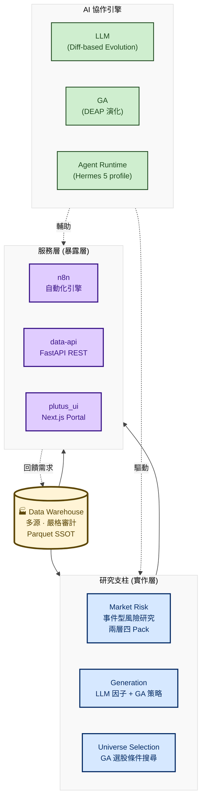

# quant-interview-prep

> 以嚴格審計的資料倉儲為底，用 AI（LLM、遺傳演算法、Agent）協助研究，
> 產出選股池、因子與風險訊號，再透過服務層對外暴露。

## ⚡ 電梯簡報（30 秒版）

**當前研究重心**：指數風險預警與 ETF 交易系統。底層是一套具備統計嚴謹度的風險研究管線，以事件研究法建模崩盤事件，並透過 Snapshot Pipeline 驅動 Web UI 即時展示。

| 亮點 | 數據 |
|---|---|
| 🛡️ 唯一通過 IS + OOS 雙驗證的市場風險訊號 | 4 段 walk-forward + 4 次危機事件全通過 |
| 📉 槓桿守門 Overlay 控制最大回撤 | MDD −56.3% → −12.1%（代價：同期少賺一半） |
| 🤖 LLM + GA 雙引擎因子演化（研究層） | Diff-based 修改保可執行，MAP-Elites 確保策略多樣性 |
| 🏗️ 8 個資料源、6 個限速群組 | 水位線 + 缺口計算 + Discord 告警確保資料品質 |

> [!IMPORTANT]
> **對招募者的一句話**：這個專案不只會「跑回測」，它展示了我如何設計一個具備防假陽性統計守門機制、實作與暴露層嚴格分離的生產級量化研究基礎設施。

---

## 0. 一頁式導覽

| # | 主題 | 簡述 |
|---|---|---|
| 1 | [事件型市場風險平台](./flowcharts/market_risk.md) | 不用 VaR/GARCH，用事件研究法直接建模崩盤事件 |
| 1.1 | [槓桿守門 Overlay](./flowcharts/market_risk_studies/leverage_guard_overlay.md) | 訊號 → 逐日曝險倍數，量化「保險的保費」 |
| 1.2 | [FinGPT 恐慌指數](./flowcharts/market_risk_studies/fingpt_risk.md) | 12 年輿情推論 → 恐慌百分位環境描述器 |
| 1.3 | [恐慌反彈訊號](./flowcharts/market_risk_studies/fingpt_panic_rebound.md) | 恐慌 + 技術超跌 → 5 日反彈機率顯著提升 |
| 1.4 | [產業輪動風險](./flowcharts/market_risk_studies/industry_rotation_risk.md) | 集團輪動強度 + 主線強度 → 1-5 風險分數 |
| 2 | [LLM 因子演化實驗室](GA_evolution_lab.md) | 讓 LLM 用 SEARCH/REPLACE diff 自動改寫因子程式碼 |
| 3 | [GA 選股策略](GA_universe_selection_deep_GA.md) | 用遺傳演算法搜尋「4~8 個選股條件 AND 組合」的最佳解 |
| 4 | [AI 服務編排層](./flowcharts/services.md) | 把研究能力包成 Agent / 自動化 / REST / Web 四種對外形態 |
| 5 | [多源資料倉儲](./flowcharts/datawarehouse.md) | 8 個資料源、水位線 + 缺口計算 + 每日審計的 Parquet 倉儲 |
| 6 | [策略回測報告](./backtest_reports/) | 17 份 FinLab 全期回測範例，研究層候選篩選 |

---

## 一、當前交易邏輯（研究要服務的目標）

> 這節說明**所有研究為什麼存在**：底下每一層都對應一份研究文件。
> 線上儀表板：[風險面板](https://preview.plutus-ui.pages.dev/risk/) ｜ [標的選擇](https://preview.plutus-ui.pages.dev/etf/)

操作以**波段**為主，決策分三層：

### 1. 風險偏好轉弱 —— 提前約 20 日的預警

指標由**加密貨幣跌幅**計算。2022 年後加密貨幣與股市相關性明顯提升，
其中不乏「非長期看漲、波動劇烈」的大市值幣種——這類投機性市場只要風吹草動，
就可能觸發程式停損或大量放空，使跌幅加劇。

當這個訊號亮燈、而費城半導體與台股指數同時處於盤整時，**未來 20 日台股出現大幅回檔的機率偏高**。
歷史上日圓套利平倉、川普關稅、美伊戰爭、韓國去槓桿等事件都出現過這個型態。

→ 對應研究：[事件型市場風險平台](./flowcharts/market_risk.md)（ETH/台股議題）

### 2. 籌碼結構與價格趨勢 —— 提前約 5 日的確認

由**期權資料 + 指數均線**計算。訊號亮起後距離風險發生約 5 日，
此時**降 beta、空手、避險**都是可選動作，歷史上能有效減緩最大回撤。

→ 對應研究：[槓桿守門 Overlay](./flowcharts/market_risk_studies/leverage_guard_overlay.md)

### 3. 反彈機率訊號 —— 進場參考

反彈之前，**全市場波動會進入極值**。歷史回測 5 日反彈機率顯著提升，
但**無法預測底部位置**——此訊號只能說明「反彈機率提高」，不能宣稱「這就是底」。
2008 年仍承受 34% 跌幅，須搭配分批進場與嚴格停損。

→ 對應研究：[恐慌反彈訊號](./flowcharts/market_risk_studies/fingpt_panic_rebound.md)

### 標的選擇與快照匯出 (ETF & 策略追蹤)

2025 年底起因市場波動放大，主要交易標的暫時改為 **ETF** 降低波動。
為了在 Web UI 展示 ETF 的回測績效，系統實作了一套**靜態快照管線 (Snapshot Pipeline)**：
- **排程運算**：由 n8n 建立 `Daily ETF Backtest Export` 每日排程（22:15），呼叫後端 API 計算主動與被動 ETF 的回測數據。
- **匯出靜態檔**：將結果匯出為 JSON 快照（Slim Snapshot）存回 Data Warehouse。
- **前端讀取**：Web UI 僅透過唯讀 Reader 讀取靜態快照，不觸發即時回測，落實「實作與暴露分離」，保護後端算力並確保回應極快。

> **擴充性 (Scalability)**：這套快照管線架構已足夠穩定。未來 **FinLab 產出的量化選股策略**，也能無縫掛上這套管線，與 ETF 共同在 Web UI 上被追蹤與使用。

---

## 二、設計理念

### 1. 資料倉儲是核心

**所有研究、回測、風險評估的資料一律從倉儲 parquet 讀取。**
嚴格審計：水位線 + 缺口計算 + 多源交叉校驗 + Discord 告警。

### 2. AI 協作，不是 AI 替代

AI 把研究員從繁重的產生工作中解放，專注在架構與判讀：

| AI 角色 | 工作內容 | 人類研究員的角色 |
|---|---|---|
| **LLM 演化（OpenEvolve）** | 自動產生因子程式碼 | 審查因子、調整 prompt、設定評分門檻 |
| **遺傳演算法（DEAP）** | 在巨量條件組合中搜尋最佳選股策略 | 設計條件池、選擇績效指標、判讀結果 |
| **Agent Runtime（Hermes）** | 風險分析、資料查詢、報告生成 | 設定 profile、審查輸出、做最終決策 |
| **LLM（Claude / GPT）** | 程式碼審查、bug 追蹤、文件撰寫 | 架構決策、方法論選擇、結果驗證 |

### 3. 研究階段 / 發展階段

```
研究專案                   發展階段
(不同議題的研究)            (自動化研究或放入儀表板觀察)
┌──────────────┐         ┌──────────────────┐
│ research     │         │ Hermes (Agent)   │
│ market-risk  │  ───→   │ n8n (自動化)      │
│ evolution-lab│         │ data-api (REST)  │
│ datawarehouse│         │ plutus_ui (Web)  │
└──────────────┘         └──────────────────┘
```

---

## 三、系統架構總覽



---

## 四、市場風險研究（主軸）

**問題**：怎麼預測市場崩盤，提前調整部位？

**關鍵定位**：**不是** VaR / CVaR / GARCH 那種參數化模型。
傳統模型假設常態分布，對尾部事件沒輒；本平台用**事件研究法**直接建模「崩盤事件」本身。

### 兩層四 Pack 評估契約

| 層 | Pack | 任務 | 主決策指標 |
|---|---|---|---|
| 訊號發明 | **A · top_risk** | 預測下跌 | `probability_lift` |
| 訊號發明 | **B · bottom_dip** | 預測反彈 | `probability_lift` + `magnitude_lift`（須同向） |
| 訊號發明 | **C · auxiliary_signal** | 市場狀態（無方向） | 狀態相關性 |
| 獨立策略 | **D · 完整策略** | 自決部位 / 方向 | OOS `net_edge`、MDD 改善 |

### 防假顯著的四組工具

1. **Purged Walk-forward** — 訓練不能偷看測試期，label 重疊要挖空
2. **Episode Cluster + n_eff** — 事件擠在幾波行情裡？算有效獨立觀測數
3. **Block Bootstrap** — 以「波」為單位重抽，不以「筆」假裝獨立
4. **Fisher + BH-FDR** — 顯著性檢定 + 多重比較校正

**Label 工程**：路徑型 MAE——未來 h 天**曾經**最深跌到哪，不是第 h 天收在哪，抓得到盤中被洗出去的風險。

📄 [事件型市場風險平台](./flowcharts/market_risk.md)

### 四個 Pack 的代表案例

| Pack | 議題 | 結論 |
|---|---|---|
| **D** | [槓桿守門 Overlay](./flowcharts/market_risk_studies/leverage_guard_overlay.md) | **CONDITIONAL**：最大回撤 −56.3% → −12.1%，但同期少賺一半 |
| **C** | [FinGPT 恐慌指數](./flowcharts/market_risk_studies/fingpt_risk.md) | 降格為 overlay；含兩次主動修正的紀錄 |
| **B** | [恐慌反彈訊號](./flowcharts/market_risk_studies/fingpt_panic_rebound.md) | ✅ **唯一 IS + OOS 雙 KEEP**，4 段 walk-forward 與 4 次危機事件皆通過 |
| **C** | [產業輪動風險](./flowcharts/market_risk_studies/industry_rotation_risk.md) | v1 鎖定；12 輪迭代只有 baseline 過關 |

---

## 五、因子 / 策略生成（LLM + GA）

**問題**：傳統 GA 只能組合既有條件，無法發明新公式。怎麼讓 AI 真的「發明」新因子？

**方法**：雙引擎並行——

| 引擎 | 用途 | 機制 |
|---|---|---|
| **LLM 演化（OpenEvolve）** | 產生因子 / 濾網 / 策略程式碼 | Diff-based：用 SEARCH/REPLACE 只改該改的幾行，避免 LLM 重寫時破壞可跑的程式 |
| **GA 演化（DEAP）** | 搜尋既有條件組合 | 二進位編碼 + 兩點交叉 + 位元翻轉 |

**三軌分工**（同一個 LLM 引擎，不同評分目標）：

- **Alpha 軌**：挖掘布林因子池 → IC + ICIR + DSR
- **Condition 軌**：優化事件濾網 → T-stat + Hit Rate + Coverage
- **Strategy 軌**：生成完整策略 → 接回測算 Sharpe / Calmar / MDD

**保多樣性**：MAP-Elites 把候選用「特徵 × 品質」雙維度分箱，每格只留最佳，
確保搜尋覆蓋整個特徵空間而不是收斂到單一點。

📄 [LLM 因子演化實驗室](GA_evolution_lab.md)

---

## 六、股票池篩選（GA）

**問題**：怎麼從上千檔股票中，系統化挑出值得納入投資組合的標的？

**方法**：把每個選股條件編碼成染色體的一個位元，GA 自動演化出最適的 4~8 個條件 AND 組合。
部位用營收年增率（YoY）加權，讓成長高的個股權重更大。

**防過擬合三道防線**：

- **IS/OOS 六四分** — 訓練 60%、測試 40% 完全沒看過的資料
- **PBO 機率懲罰** — 跟隨機策略對賭，沒顯著贏的個體扣分
- **YoY 加權** — 避免只看技術面，讓部位連動基本面

📄 [GA 選股策略](GA_universe_selection_deep_GA.md)

---

## 七、AI 服務編排層

把上游研究能力包成四種對外形態：

| 子服務 | 角色 | 規模 |
|---|---|---|
| **Hermes** | Agent Runtime，承載 5 個 agent profile | 維運類用 GLM-5.2、研究類用 MiniMax-M3 |
| **n8n** | 自動化引擎（排程、webhook、資料 pipeline） | 48 個 workflow |
| **data-api** | FastAPI REST，把倉儲結果暴露為 endpoint | 9 個 router + 5 個 reader + 分級快取 |
| **plutus_ui** | Next.js Portal | `web/` 內網站 + `web-public/` 對外站 |

**設計理念是「實作跟暴露分離」**——研究端改策略不用動 UI，UI 改版不用碰回測邏輯。

**內外網隔離**是本層最值得講的設計：對外站不得連內網 API、不得有寫入能力、
不得出現最高權限憑證，且**演算法細節與交易指示語彙不得離開內網**——
用路由白名單腳本機械化把關，不是靠自覺。

📄 [AI 服務編排層](./flowcharts/services.md)

---

## 八、多源資料倉儲

量化研究裡「**錯的資料比沒有資料更可怕**」——缺一筆法人買超不會拋例外，
但會讓下游籌碼因子靜默得出錯誤結論，直到實盤才爆炸。

| 資料源 | 用途 |
|---|---|
| FinMind | 台股 / 美股 / 期權主力 |
| FinLab（含 US） | 台股基本面 + 美股公司資料 |
| yfinance | 美股股價 + 深度基本面 |
| Binance | 加密貨幣 OHLCV |
| FRED / EIA | 總經指標 / 原油 |
| CFTC / US Congress / CNN F&G | 期貨持倉 / 議員交易 / 市場情緒 |
| **KRX（Pykrx + FDR + Naver）** | 韓股——三源組合覆蓋 Open API 未提供的欄位 |
| J-Quants | 日股（已暫停） |

> 口徑：以「進程隔離單位」分 **6 個限速群組**，CFTC / FRED / EIA / Congress / CNN 共用 `macro` 群組。
> **被問「幾個資料源」答「6 個限速群組、8 個對外供應方」。**

**關鍵機制**：Redis ZSET 任務佇列 + 水位線 + 缺口計算 + 常駐下載 daemon + 多源交叉校驗，
外加**配額安全鐵律**（禁為了補進度而調高並行——會觸發停權並打掉所有資料源的當日更新）。

📄 [多源資料倉儲](./flowcharts/datawarehouse.md)

---

## 九、策略回測報告

17 份 FinLab 全期回測，是**研究層的候選篩選**，不是實盤績效。

已扣手續費與證交稅；**未扣滑價、未做 IS/OOS 切分、且有倖存者偏誤**——
所以年化報酬應視為上界，用途是挑方向。真正把統計嚴謹度做完整的是市場風險那條線。

📄 [策略回測報告](./backtest_reports/)

---

## 十、技術棧

| 類別 | 技術 |
|---|---|
| **資料層** | Parquet (Apache Arrow) · Redis ZSET · SQLite · Supabase |
| **資料源** | FinMind · FinLab · yfinance · Binance · FRED · EIA · CFTC · Pykrx · FinanceDataReader · Naver Finance · J-Quants |
| **計算層** | pandas · NumPy · SciPy · scikit-learn |
| **量化框架** | DEAP（GA）· OpenEvolve（LLM 演化）· vectorbt · finlab |
| **AI / LLM** | MiniMax-M3（研究 profile + 因子演化）· GLM-5.2（維運 profile）· Claude · OpenCode · **Llama-3-8B + FinGPT LoRA 8-bit**（輿情推論） |
| **統計驗證** | Fisher exact test · BH-FDR · Block Bootstrap · Purged Walk-forward · Episode Cluster / n_eff · Event Study · CAPM-adjusted AR · 前視偏差偵測 |
| **服務層** | FastAPI · Next.js 16 / React 19 · n8n · Docker Compose |
| **視覺化** | Plotly · matplotlib · Mermaid |
| **基礎設施** | Docker · Redis · SQLite · PostgreSQL (Supabase) · supervisord |

---

## 十一、設計取捨

| 取捨 | 我的選擇 | 為什麼 |
|---|---|---|
| 事件研究 vs VaR | 事件研究 | VaR 假設常態分布，對崩盤沒效；事件研究直接建模尾部 |
| LLM Diff vs Rewrite | Diff-based | LLM 重寫整段易破壞可跑程式；改用 diff 後成功率大幅提升 |
| Parquet vs PostgreSQL | Parquet | pandas 原生、壓縮比高、無寫入鎖衝突 |
| Redis ZSET vs Celery | Redis ZSET | 已用 Redis、需優先順序排序、不引入重框架 |
| 雙層（實作/暴露）vs 單層 | 雙層 | 關注點分離 + 部署獨立 + 換 UI 不動策略 |
| Streamlit vs Next.js | Next.js | 對外站必須能用腳本證明沒碰內網，Streamlit 做不到 |
| 加大並行補進度 vs 慢補 | 慢補 | 佔滿配額會觸發停權，且會同時打掉所有資料源的當日更新 |

---

## 十二、未展開的研究資產

Plutus monorepo 內還有以下研究，尚未整理成流程圖：

| 子專案 | 內容 |
|---|---|
| `research/jp-tw-lead-lag` | 日股 / 台股領先-落後關係 |
| `research/factor-pipeline` · `feature-engineering` | 因子生產與特徵工程管線 ＆ MCP |
| `research/hyperparameters_tuning` | 超參數搜尋 |
| `research/intraday_analysis` | 盤中資料研究 |

---

> **GitHub**：https://github.com/Jang-jhih/quant-interview-prep
> **聯絡**：`[請填入]` ｜ **履歷**：`[請填入]`
