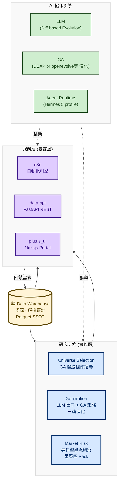

# quant-interview-prep

> **核心敘事**：以嚴格審計的金融資料倉儲為基礎，結合 AI（LLM、遺傳演算法、Agent Runtime）與人類研究員協作，自動化產生選股池、因子、風險訊號，並透過服務層對外暴露。

---

## 0. 一頁式導覽（5 分鐘版本看這張就好）

| #   | 主題                                                                         | 簡述                                      |
| --- | -------------------------------------------------------------------------- | --------------------------------------- |
| 5   | [事件型市場風險平台](./flowcharts/market_risk.md)                                   | 不用 VaR/GARCH，用事件研究法直接建模崩盤事件             |
| 5.4 | [槓桿守門 Overlay](./flowcharts/market_risk_studies/leverage_guard_overlay.md) | 訊號 → 逐日曝險倍數，量化「保險的保費」                   |
| 5.1 | [FinGPT 恐慌指數](./flowcharts/market_risk_studies/fingpt_risk.md)             | 12 年輿情推論 → 恐慌百分位環境描述器                   |
| 5.3 | [恐慌抄底訊號](./flowcharts/market_risk_studies/fingpt_panic_rebound.md)         | 恐慌 + 技術超跌 → 5 日反彈機率顯著提升                 |
| 5.2 | [產業輪動風險](./flowcharts/market_risk_studies/industry_rotation_risk.md)       | 集團輪動強度 + 主線強度 → 1-5 風險分數                |
| 2   | [LLM 因子演化實驗室](./flowcharts/evolution_lab.md)                               | 讓 LLM 用 SEARCH/REPLACE diff 自動改寫因子程式碼   |
| 1   | [GA 選股策略](universe_selection_deep_GA.md)                      | 用遺傳演算法搜尋「4~8 個選股條件 AND 組合」的最佳解          |
| 4   | [AI 服務編排層](./flowcharts/services.md)                                       | 把研究能力包成 Agent / 自動化 / REST / Web 四種對外形態 |
| 3   | [多源資料倉儲](./flowcharts/datawarehouse.md)                                    | 8 個資料源、水位線 + 缺口計算 + 每日審計的 Parquet 倉儲    |
| 6   | [策略回測報告](./backtest_reports/)                                              | 17 份 FinLab 全期回測範例，研究層候選篩選              |


---

當前交易邏輯：
參考：https://preview.plutus-ui.pages.dev/risk/
方式以波段為主：
1.時刻觀察當前市場風險：
投機性資產風險偏好轉弱:該指標由加密貨幣跌幅計算，在2022年之後加密貨幣與股市相關性提升，有的非長期看漲且波動劇烈的大市值幣種，我猜可能是這類型投機性市場風吹草動都能造成程式交易停損或者大量放空導致跌幅加劇，此時的費城半導體與台灣指數正在盤整,經分析夠在未來二十日台股高機率會有大幅回測,如日圓套利平倉,川普關稅,美伊戰爭,韓國去槓桿都有發生此類情況

2.籌碼結構與價格趨勢:
由期權資料及指數均線計算,距離風險發生時間約五天內,在該時段降beta.空手.避險都能是選擇,歷史中能夠減緩max drawdown幅度

3.在底部訊號確認:
在反彈之前,全市場的波動進入極值,歷史回測中勝率八成,但是在2008年仍遭受34%跌幅,所以該指標除了分批進場以外,仍然需要進行優化

標的選擇：https://preview.plutus-ui.pages.dev/etf/
因2025年底感受到整體市場波動放大且節奏快速,股價也都偏高,過往的交易程式節奏較慢且點位不容易抓,對我而言交易難度升高,改為選用ＥＴＦ方式交易來降低波動,在主動式ＥＴＦ上市之後可以借用經理人選股能力.低股價好進出，整個系統完善後可能換回交易程式


## 一、設計理念（核心邏輯）

整套系統圍繞三個相互支撐的理念：

### 1. 資料倉儲 

**所有研究、回測、風險評估的資料一律從倉儲 parquet 讀取**——這是平台的核心。

- 嚴格審計：Watermark（水位線）+ Gap Calculator（缺口計算）+ 多源交叉校驗 + Discord 告警

### 2. AI 協作而非 AI 替代（Human-in-the-loop）

AI 工具不是用來替代研究員，而是把研究員從繁重產生工作中解放，專注於架構與判讀：

| AI 角色                          | 工作內容                      | 人類研究員的角色              |
| ------------------------------ | ------------------------- | --------------------- |
| **LLM（OpenEvolve）**            | 用 Diff-based 演算法自動產生因子程式碼 | 審查因子、調整 prompt、設定評分門檻 |
| **遺傳演算法（DEAP or Openevolve等）** | 在巨量條件組合中搜尋最佳選股策略          | 設計條件池、選擇績效指標、判讀結果     |
| **Agent Runtime（Hermes）**      | 風險分析、資料查詢、報告生成            | 設定 profile、審查輸出、做最終決策 |
| **LLM（Claude/GPT）**            | 程式碼審查、bug 追蹤、文件撰寫         | 架構決策、方法論選擇、結果驗證       |


### 3. 研究階段 / 發展階段 

```
研究專案                  發展階段
(不同的議題研究專案)        (繼續自動化研究或者放入儀表板觀察)
┌──────────────┐         ┌──────────────────┐
│ research     │         │ Hermes (Agent)   │
│ market-risk  │  ───→   │ n8n (自動化)      │
│ evolution-lab│         │ data-api (REST)  │
│ datawarehouse│         │ plutus_ui (Web)  │
└──────────────┘         └──────────────────┘
```


---

## 二、系統架構總覽



---

## 三、研究支柱（Research Pillars）

### 1. 股票池篩選研究（Universe Selection）

**問題**：怎麼從上千檔股票中，系統化挑出值得納入投資組合的標的？

**方法**：用遺傳演算法搜尋「複合條件」的最佳組合——把每個選股條件編碼成染色體的位元，GA 自動演化出最適的 4~8 個條件 AND 組合。部位用 YoY（年增率）加權，讓營收成長高的個股權重更大。

**防過擬合三道防線**：
- IS/OOS 六四分（訓練 60%、測試 40% 完全沒看過的資料）
- PBO 機率懲罰（跟隨機策略對賭，沒顯著贏的個體扣分）
- YoY 加權（避免只看技術面，連動基本面）

**對應文件**：[`flowcharts/example_universe_selection.md`](universe_selection_deep_GA.md)

---

### 2. 因子 / 策略生成（LLM + GA Generation）

**問題**：傳統 GA 只能組合既有條件，無法發明新公式。怎麼讓 AI 真的「發明」新因子？

**方法**：雙引擎並行——

| 引擎 | 用途 | 機制 |
|---|---|---|
| **LLM 演化（OpenEvolve）** | 自動產生因子 / 濾網 / 策略程式碼 | Diff-based Evolution：用 SEARCH/REPLACE 改 code，不重寫整段（避免 LLM 破壞可跑程式） |
| **GA 演化（DEAP）** | 搜尋既有條件組合 | 二進位編碼 + 兩點交叉 + 位元翻轉 |

**三軌分工**（同一個 LLM 引擎，不同評分目標）：

- **Alpha 軌**：挖掘布林因子池 → IC + ICIR + DSR 評分
- **Condition 軌**：優化事件濾網 → T-stat + Hit Rate + Coverage
- **Strategy 軌**：生成完整交易策略 → 接 FinLab `sim()` 算 Sharpe / Calmar / MDD

**保多樣性**：MAP-Elites 演算法把候選用「特徵 × 品質」雙維度分箱，每格只留最佳，確保搜尋覆蓋整個特徵空間而非收斂到單一點。

**對應文件**：[`flowcharts/evolution_lab.md`](./flowcharts/evolution_lab.md)

---

### 3. 市場風險研究（Market Risk）

**問題**：怎麼預測市場崩盤，提前調整部位？

**關鍵定位**：**不是傳統 VaR / CVaR / GARCH 那種參數化風險模型**。傳統模型假設常態分布，對尾部事件（崩盤）沒輒。本平台用**事件研究法**直接建模「崩盤事件」本身。

**兩層四 Pack 評估契約**：

| 層 | Pack | 任務 | 評估指標 |
|---|---|---|---|
| 訊號發明 | A · top_risk | 預測下跌 | P(down), probability_lift |
| 訊號發明 | B · bottom_dip | 預測反彈 | P(up rebound) |
| 訊號發明 | C · auxiliary_signal | 市場狀態 | 狀態相關性 |
| 獨立策略 | D · 完整策略 | 自決部位/方向 | OOS net_edge, MDD improvement |

**統計驗證基礎設施**（防假顯著四組工具）：

1. **Purged Walk-forward** — 訓練不能偷看測試期，label 重疊要挖空（embargo = label horizon）
2. **Episode Cluster + n_eff** — 事件擠在幾波行情裡？算有效獨立觀測數（重疊報酬 p 值一律視為上界樂觀）
3. **Block Bootstrap** — 以「波」為單位重抽，不以「筆」假裝獨立
4. **Fisher + BH-FDR** — 顯著性檢定 + 多重比較校正（測很多訊號要扣偽發現率）

**Label 工程**：路徑型 MAE（Maximum Adverse Excursion）—— 未來 h 天**曾經**最深跌到哪，不是第 h 天收在哪。抓得到盤中被洗出去的風險。

**對應文件**：[`flowcharts/market_risk.md`](./flowcharts/market_risk.md)

---

## 四、輔助系統（Auxiliary Systems）

### A. 多源金融資料倉儲（Data Warehouse）— 平台心臟

整合 7 + 1 種資料源，每日審計、嚴格治理：

| 資料源 | 用途 |
|---|---|
| FinMind | 台股 / 美股 / 期權主力 |
| FinLab | 台股基本面 + FinLab US 美股公司資料 |
| yfinance | 美股股價 + 深度基本面 |
| Binance | 加密貨幣 OHLCV |
| FRED / EIA | 總經指標 / 原油 |
| CFTC / US Congress / CNN F&G | 期貨持倉 / 議員交易 / 市場情緒 |
| **KRX（Pykrx + FDR + Naver）** | **韓股——三源組合覆蓋 Open API 未提供的欄位** |
| J-Quants | 日股（已暫停，registry 保留但無 worker） |

> 口徑：`SOURCE_CONFIG` 以「進程隔離單位」分 **6 個限速群組**
> （`finmind` / `jquants` / `binance` / `macro` / `yfinance` / `krx`），CFTC、FRED、EIA、Congress、CNN
> 都掛在 `macro` 群組共用限速器。**被問「幾個資料源」答「6 個限速群組、8 個對外供應方」。**

**關鍵機制**：Redis ZSET 全域任務佇列 + Watermark 水位線 + Gap Calculator 缺口計算 + Bulk Downloader daemon + 多源交叉校驗 + **配額安全鐵律**（禁為補 backlog 調高並行）。

**對應文件**：[`flowcharts/datawarehouse.md`](./flowcharts/datawarehouse.md)

---

### B. 統一 AI 服務編排層（Services）— 對外暴露

把上游研究能力包成四種對外形態：

| 子服務 | 角色 | 技術 |
|---|---|---|
| **Hermes** | Production Agent Runtime，承載 5 個 agent profile | 全域 default MiniMax-M3（429 fallback GLM-4.5）；ops/steward 於 profile 層覆寫為 GLM-5.2 |
| **n8n** | 自動化引擎（排程、webhook、資料 pipeline） | **48 個 workflow**（Hermes 25 + Risk 18 + System 4 + 根層 1） |
| **data-api** | FastAPI REST API，把倉儲結果暴露為 endpoint | 9 個 router + 5 個 reader + 分級 cache TTL |
| **plutus_ui** | **Next.js** Portal：`web/` 內網站 + `web-public/` 對外站 | Next 16 + React 19（[ADR-003](./flowcharts/services.md) 定為唯一前端） |

**Hermes Adapter**（FastAPI :18790）是關鍵橋接——把 HTTP `/tools/invoke` 轉成 Hermes CLI `chat -q`，讓 n8n workflow 可以呼叫 Hermes agent。

**內外網隔離**是本層最值得講的設計：對外站 `web-public/` 不得引用 data-api、不得有寫入型 route、
不得出現 `service_role`，且**演算法細節與交易指示語彙不得離開內網**——
用 `scripts/check-public-isolation.sh` 的路由白名單機械化把關，不是靠自覺。詳見 [`services.md`](./flowcharts/services.md) §四.1。


---


## 七、技術棧總表

| 類別           | 技術                                                                                                                                                                                                              |
| ------------ | --------------------------------------------------------------------------------------------------------------------------------------------------------------------------------------------------------------- |
| **資料層**      | Parquet (Apache Arrow) · Redis ZSET · SQLite · Supabase                                                                                                                                                         |
| **資料源**      | FinMind · FinLab · yfinance · Binance · FRED · EIA · CFTC · J-Quants · Pykrx · FinanceDataReader · Naver Finance                                                                                                |
| **計算層**      | pandas · NumPy · SciPy · scikit-learn                                                                                                                                                                           |
| **量化框架**     | DEAP（GA）· OpenEvolve（LLM 演化）· vectorbt · finlab                                                                                                                                                                 |
| **AI / LLM** | MiniMax-M3（Hermes 研究 profile + 因子演化）· GLM-5.2（Hermes 維運 profile）· GLM-4.5（fallback）· Claude · OpenCode · **Llama-3-8B + FinGPT LoRA 8-bit**（cnyes 輿情推論）                                                         |
| **統計驗證**     | Fisher exact test · BH-FDR · Block Bootstrap · Purged Walk-forward · Episode Cluster / n_eff · MAP-Elites · Event Study · CAPM-adjusted AR · **前視偏差偵測**（`core/package/data_leakage_detection`：靜態掃描 + 動態時間一致性測試） |
| **服務層**      | FastAPI · Next.js 16 / React 19 · n8n · Docker Compose                                                                                                                                                          |
| **視覺化**      | Plotly · matplotlib · Mermaid                                                                                                                                                                                   |
| **基礎設施**     | Docker · Redis · SQLite · PostgreSQL (Supabase) · supervisord                                                                                                                                                   |

---

## 八、設計取捨（被問到可以這樣答）

| 取捨                    | 我的選擇       | 為什麼                                     |
| --------------------- | ---------- | --------------------------------------- |
| Parquet vs PostgreSQL | Parquet    | pandas 原生、columnar 壓縮比高、無寫入鎖衝突          |
| Redis ZSET vs Celery  | Redis ZSET | 已用 Redis、需優先順序排序、不引入重框架                 |
| LLM Diff vs Rewrite   | Diff-based | LLM 重寫整段易破壞可跑程式；diff 成功率 30%→70%        |
| 事件研究 vs VaR           | 事件研究       | VaR 假設常態分布，對崩盤沒效；事件研究直接建模尾部             |
| 雙層（實作/暴露）vs 單層        | 雙層         | 關注點分離 + 部署獨立 + 換 UI 不動策略                |
| 加大並行補 backlog vs 慢補   | 慢補         | 佔滿配額會觸發停權 / IP ban，且會**同時打掉所有資料源**的當日更新 |

---

## 九、未展開的研究資產

Plutus monorepo 內還有以下研究，尚未整理成流程圖——列出來是為了說明「這 9 份不是全部」：

| 子專案                                                | 內容               |
| -------------------------------------------------- | ---------------- |
| `research/jp-tw-lead-lag`                          | 日股 / 台股領先-落後關係   |
| `research/factor-pipeline` · `feature-engineering` | 因子生產與特徵工程管線 ＆ＭＣＰ |
| `research/hyperparameters_tuning`                  | 超參數搜尋            |
| `research/intraday_analysis`                       | 盤中資料研究           |


