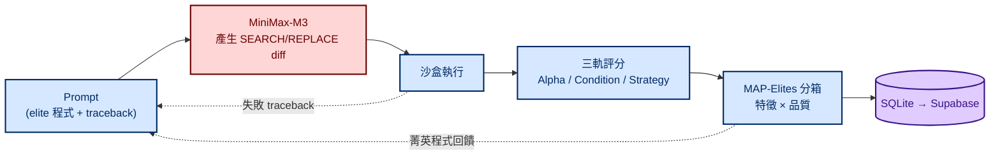
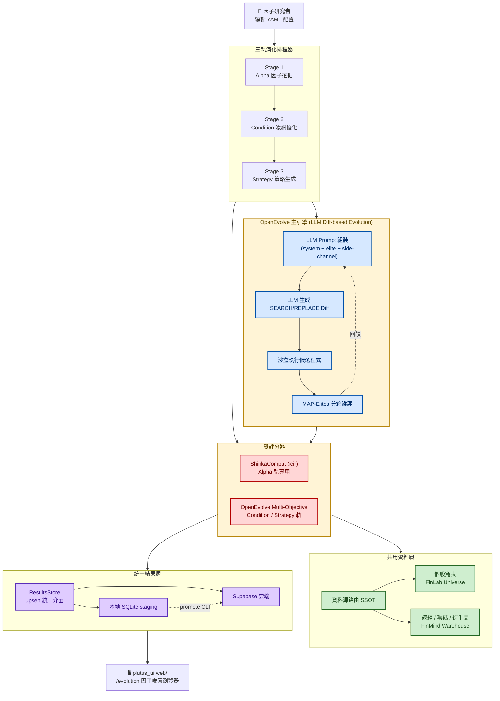
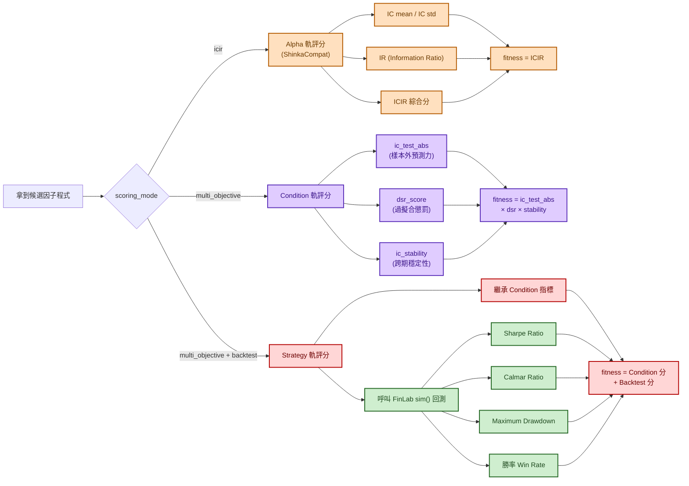
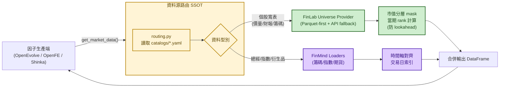

# LLM 驅動的量化因子自動演化實驗室

## 專案概述

以 **OpenEvolve**（LLM 驅動 + Diff-based Evolution + MAP-Elites）為主力引擎，打造**自動化金融因子發現與策略生成**的完整實驗室。系統圍繞三個核心問題：

1. **怎麼讓 LLM 寫出有效因子？** 用「進化式 prompt」——每輪把當前最強的候選程式、失敗的 traceback、與目標 IC 方向都餵給 LLM，讓它基於 SEARCH/REPLACE diff 產生下個版本。
2. **怎麼避免過擬合？** 三軌分層評估：Alpha 軌用 IC/ICIR + 去氣夏普比（DSR）；Condition 軌加上 IC 穩定性；Strategy 軌直接串接真實回測引擎的 Sharpe / Calmar / MDD。
3. **怎麼保留多樣性？** MAP-Elites 雙維度分箱（feature × quality），每個生態格只留最佳，演化探索覆蓋整個特徵空間而非收斂到單一點。

### 三軌分工

| 軌道 | 目標 | 評分核心 | 終點產物 |
|---|---|---|---|
| **Alpha** | 挖掘布林因子池 | IC + ICIR + DSR | 可組合的高 IC 布林因子 |
| **Condition** | 優化事件濾網 | T-stat + Hit Rate + Coverage | 策略進場濾網條件 |
| **Strategy** | 生成完整交易策略 | FinLab `sim()` Sharpe / Calmar / MDD | 可直接部署的交易策略 |


> 📖 **讀法**：想快速理解看 **§1.0 白板版**（≤7 個框）；想看細節往下讀。標示 `>` 引言與「地雷 / 講法」的區塊是作者自己的面試準備筆記，**可直接略過**。

---

## 一、整體架構

### 1.0 白板版（被要求「畫一下 LLM 演化怎麼跑」時畫這張）

> 6 個框，一條回饋線。口訣：**LLM 只改 diff → 沙盒跑 → 評分 → MAP-Elites 填格 → 失敗訊息餵回去。**



### 1.1 細節版



---

## 二、OpenEvolve 演化迴圈（一個世代）

OpenEvolve 是整個實驗室的核心。每一個世代（generation）都會走完這 12 個步驟，**LLM 不斷改寫候選程式、MAP-Elites 不斷收斂**，直到跑完指定代數。

```mermaid
%%{init: {'theme':'base', 'themeVariables': {'primaryColor':'#ececec','primaryTextColor':'#1a1a1a','primaryBorderColor':'#555555','lineColor':'#555555','secondaryColor':'#e0e0e0','tertiaryColor':'#f0f0f0','fontFamily':'"Noto Sans TC", "Microsoft JhengHei", sans-serif'}}}%%
flowchart TD
    START(["進入演化世代"]) --> LOAD["載入 YAML 配置<br/>+ 注入 IC 方向指導"]
    LOAD --> INIT["生成動態初始程式<br/>(含 evolution_goal)"]
    INIT --> PATCH["套用 LLM Logging 補丁<br/>剝離 reasoning model 的 think 標籤"]
    PATCH --> LOOP{"MAP-Elites 主迴圈"}

    LOOP --> PROMPT["組裝 LLM Prompt<br/>① system_message<br/>② 競技場 elite 程式碼<br/>③ 失敗 traceback (side-channel)"]
    PROMPT --> GEN["LLM 生成候選程式<br/>🔍 SEARCH/REPLACE Diff 格式<br/>(非整檔重寫，省 token)"]
    GEN --> APPLY["套用 Diff 到當前最佳程式<br/>→ 新版候選程式"]
    APPLY --> SANDBOX["沙盒執行候選程式<br/>計算布林因子訊號"]
    SANDBOX --> SCORE["呼叫對應軌道的評分器<br/>(詳見 §三)"]
    SCORE --> MAPELITES["MAP-Elites 寫回<br/>特徵 × 品質 雙維分箱<br/>每格只留最佳"]
    MAPELITES --> CKPT["落盤 checkpoint<br/>(best_program.py + info.json)"]
    CKPT --> FEEDBACK[" side-channel 錯誤學習<br/>將本輪 traceback 整理<br/>成下輪 prompt 提示"]
    FEEDBACK --> NEXT{"未達目標代數？"}
    NEXT -- 是 --> LOOP
    NEXT -- 否 --> DONE(["演化結束"])

    DONE --> OUTPUT["輸出最終 best program<br/>+ 全程指標 JSON"]

    classDef loop fill:#d6e8ff,stroke:#0050aa,stroke-width:2px,color:#002b66;
    classDef eval fill:#ffd6d6,stroke:#b30000,stroke-width:2px,color:#6b0000;
    classDef highlight fill:#fff4d6,stroke:#b8860b,stroke-width:2px,color:#5c4500;
    classDef baseline fill:#e0ccff,stroke:#5a2eb8,stroke-width:2px,color:#3a1488;
    class LOOP,PROMPT,GEN,APPLY,SANDBOX,MAPELITES,CKPT,FEEDBACK,NEXT loop;
    class SCORE eval;
    class PROMPT,FEEDBACK highlight;
```



### Diff-based Evolution 為什麼省成本？

傳統 LLM 演化要求 LLM **每次重寫整份程式**（動輒數百行）。OpenEvolve 改用 **SEARCH/REPLACE Diff 格式**：

```
原檔：def factor(df): return df['a']
Diff：
  <<<<<<< SEARCH
  return df['a']
  =======
  return df['a'] * 0.5 + df['b'] * 0.5
  >>>>>>> REPLACE
```

LLM 只需輸出**變動片段**，token 消耗降低 80–90%，且每代可嘗試更多候選。

---

## 三、三軌評分比較

三條軌道各有獨立的 scoring_mode 與評估指標。Strategy 軌最完整——把 Condition 評分 + FinLab 真實回測同時考慮。



### 三軌評分對照表

| 軌道 | scoring_mode | 主要指標 | 過擬合防線 | 終點 |
|---|---|---|---|---|
| **Alpha** | `icir` | IC、ICIR | DSR (Deflated Sharpe Ratio) | 高 IC 布林因子 |
| **Condition** | `multi_objective` | ic_test_abs | × dsr × stability | 事件濾網條件 |
| **Strategy** | `multi_objective` + `backtest` | Condition 指標 + 回測指標 | FinLab 真實回測 MDD / 勝率 | 可部署交易策略 |

---

## 四、共用資料層（資料源路由）

所有因子生產端禁止直接呼叫 FinLab / FinMind API，必須透過統一資料層。這個設計確保：
- **資料源切換** 只需改一份 routing YAML
- **Universe 分層** 由市值逐期 rank 計算（嚴禁全期統計 → 防 lookahead bias）
- **資料快取** 集中管理，避免重複下載



---

## 五、統一結果層（ResultsStore + Promote）

三條軌道跑完之後，結果都會經過**兩階段寫入**：

1. **Stage 1（local）**：先落本地 SQLite staging 表（payload JSON 格式，不追隨 Supabase schema 漂移）
2. **Stage 2（promote）**：人工驗證後執行 promote CLI，冪等晉升到 Supabase

```mermaid
%%{init: {'theme':'base', 'themeVariables': {'primaryColor':'#ececec','primaryTextColor':'#1a1a1a','primaryBorderColor':'#555555','lineColor':'#555555','secondaryColor':'#e0e0e0','tertiaryColor':'#f0f0f0','fontFamily':'"Noto Sans TC", "Microsoft JhengHei", sans-serif'}}}%%
flowchart LR
    subgraph PROD["因子生產端"]
        P1["Alpha 演化"]
        P2["Condition 演化"]
        P3["Strategy 演化"]
        P4["OpenFE Pipeline"]
    end

    PROD -->|"store.upsert(data, table)"| RS["ResultsStore<br/>統一 upsert 介面"]

    RS --> BACKEND{"EVOLAB_RESULTS_BACKEND"}
    BACKEND -- "local (預設)" --> STAGING[("staging.sqlite<br/>通用 payload JSON 表")]
    BACKEND -- "supabase" --> DIRECT[("Supabase 雲端<br/>alpha_factors / condition_factors")]

    STAGING --> PROMOTE["promote CLI<br/>--table X [--dry-run]"]
    PROMOTE --> DIRECT

    DIRECT --> UI["🖥️ plutus_ui web/<br/>/evolution 因子唯讀瀏覽"]

    classDef baseline fill:#e0ccff,stroke:#5a2eb8,stroke-width:2px,color:#3a1488;
    classDef highlight fill:#fff4d6,stroke:#b8860b,stroke-width:2px,color:#5c4500;
    classDef loop fill:#d6e8ff,stroke:#0050aa,stroke-width:2px,color:#002b66;
    class RS,STAGING,DIRECT,PROMOTE baseline;
    class PROD,P1,P2,P3,P4 highlight;
    class UI loop;
```



### 為什麼要兩階段？

| 設計 | 理由 |
|---|---|
| 先落 SQLite staging | 演化結果常需反覆驗證，避免垃圾資料直接污染雲端 |
| Payload JSON 結構 | schema 漂移時不會卡關（supabase 表加欄位不會讓 staging 失效） |
| promote CLI 冪等 | `promoted_at` 標記後重跑不會重複上傳 |
| `--dry-run` 預覽 | 晉升前可先看有多少筆待推 |

---

## 六、核心參數一覽

| 參數 | 預設值 | 意義 |
|---|---|---|
| 演化代數 | 20 / 400（可調） | MAP-Elites 主迴圈世代數 |
| LLM 模型 | **MiniMax-M3**（三處角色，見 §6.1） | 程式生成 LLM，走 OpenAI 相容 client |
| Diff 格式 | SEARCH/REPLACE | 候選程式增量更新格式 |
| 重採樣週期 | D / W / M / Q | IC 計算的時間週期 |
| `scoring_mode` | icir / multi_objective | 評分器選擇 |
| `experiment_id` | 1–8 | 三軌實驗分組（1-6: Alpha、7: Condition、8: Strategy）|
| `EVOLAB_RESULTS_BACKEND` | local / supabase | 結果寫入 backend |
| `UNIVERSE_TIER` | all / large / mid / small | 市值分層 universe |
| `EVOLUTION_DATA_BACKEND` | finlab_only / hybrid / multi | 資料源配置 |

### 進化實驗室決策依據

| 應用場景 | 選用軌道 | 理由 |
|---|---|---|
| 挖掘布林因子池 | Alpha (icir) | Diff-based 節省 90% token + ShinkaCompat 保留 IC 標準 |
| 優化策略濾網 | Condition | MAP-Elites 探索多樣性 + T-stat/Hit Rate 確保精準 |
| 生成可部署策略 | Strategy | Side-Channel 從 traceback 學習 + FinLab sim() 真實驗證 |

### 6.1 LLM 配置：同一個模型、三個角色

配置檔（`openevolve/financial_evolution/src/configs/boolean_factor_config.yaml`
與 `configs/modes/{alpha,condition,strategy}/*.yaml`）裡 **MiniMax-M3 被指派了三個不同角色**：

| 角色 | 用途 | 為什麼分開設 |
|---|---|---|
| **主力生成** | 產生 SEARCH/REPLACE diff | 低溫，要穩定產出可套用的 diff |
| **高溫探索** | 同模型、高 temperature | 主力容易卡在區域最佳；高溫那支負責跳出去，配合 MAP-Elites 填格 |
| **評估回饋** | 讀評分結果，整理成下輪 prompt 提示 | 把「為什麼分數低」翻成自然語言，比丟數字給主力有效 |

全部走 `api_base: https://api.minimax.io/v1` + `MINIMAX_API_KEY`（OpenAI 相容介面）。

> **選型理由（會被問）**：程式碼生成能力 + 1M context（要塞 elite 程式碼 + traceback + 資料 schema），
> 且與 Hermes 研究類 profile 用同一個 provider，**只管一組 API key 與一份配額**。
> 走 OpenAI 相容介面是刻意的——換 provider 只改 `api_base` 與模型名，不動演化邏輯。

---

## 七、技術棧

| 領域           | 套件                                                     |
| ------------ | ------------------------------------------------------ |
| LLM 演化框架     | **OpenEvolve**（MAP-Elites + Diff-based + Side-Channel） |
| LLM Provider | **MiniMax-M3**（`api.minimax.io/v1`，OpenAI 相容 client）   |
| 台股量化回測       | **FinLab** (`data.get`、`sim` 回測引擎)                     |
| 總經與衍生品資料     | **FinMind** / DataWarehouse (Parquet)                  |
| 結果儲存         | **SQLite** (staging) + **Supabase** (production)       |
| 配置           | `YAML` (catalogs + factors_config + modes)             |
| 視覺化瀏覽        | **Next.js**（`plutus_ui/web/` 的 `/evolution` 路由，唯讀）     |
| 過擬合檢測        | **DSR** (Deflated Sharpe Ratio) + IC stability         |

---

> 本文件的流程圖採 Mermaid 語法，GitHub / GitLab / Obsidian 原生支援；
> VS Code 需安裝 *Markdown Preview Mermaid Support*。
