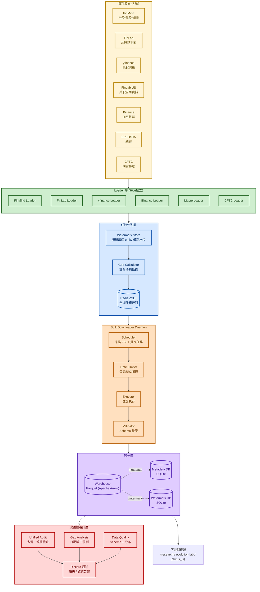
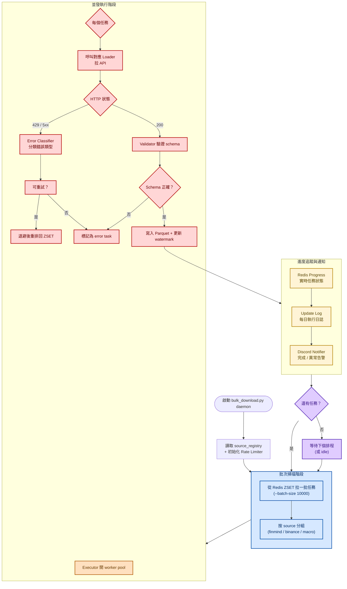
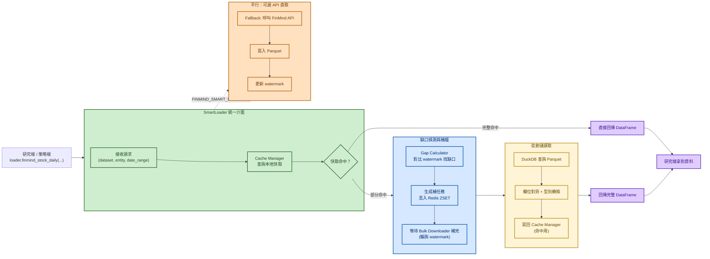
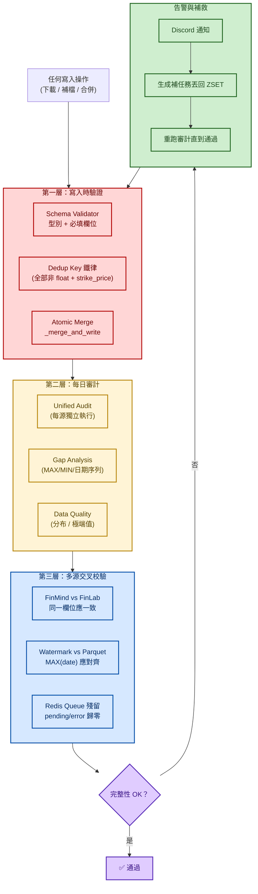

# 多源金融資料倉儲系統

## 專案概述

一個支援 **7 種資料源、近百張資料表、PB 級歷史資料**的統一金融資料倉儲，設計核心是「**資料完整性優先於一切**」——任何下載、補檔、寫入操作都必須通過嚴格的缺口審計與多源校驗。

### 為什麼需要這套系統？

量化研究裡「**錯的資料比沒有資料更可怕**」。一個缺失的法人買超記錄、一個被去重邏輯吃掉的同日多類別列，會讓下游的籌碼因子分析直接得出錯誤結論，而且這種錯誤**不會拋例外**——它只會靜默讓你的回測績效看起來很漂亮，直到實盤爆炸。

本系統圍繞三個核心問題設計：

1. **多源資料怎麼統一？** 用「**資料源路由 + 水位線 + Redis ZSET 任務佇列**」——每個資料源有獨立 loader、獨立 schema、獨立審計工具，但透過統一的 SmartLoader 介面暴露給研究端。
2. **資料怎麼不缺？** 用「**Watermark + Gap Calculator + 自動補缺**」——每次查詢都會比對水位線，發現缺口會自動生成補任務丟進佇列；每天跑審計腳本確認無缺口。
3. **並發下載怎麼不撞？** 用「**Redis ZSET 全域任務佇列 + Lock Manager + Rate Limiter**」——百萬級任務用掃描窗批次拉取，避免熱門資料源被自身 API 限流。

### 支援資料源

| 資料源 | 用途 | 配額 / 限制 |
|---|---|---|
| **FinMind** | 台股 / 美股 / 期權主力 | Sponsor Pro, 20,000 req/hr |
| **FinLab** | 台股基本面 + FinLab US 美股公司資料 | API Key |
| **yfinance** | 美股股價 + 深度基本面 | 53 API |
| **Binance** | 加密貨幣 OHLCV（前 10 大幣） | Public API |
| **FRED / EIA** | 總經指標 / 原油 | Public |
| **CFTC** | 期貨持倉 | Public |
| **J-Quants** | 日股（**已暫停**） | Registry 保留 |

> 本文件所有流程圖使用 **Mermaid** 語法，配色統一採「淺色底 + 深色字」原則，相容於亮／暗 IDE 主題。顯示方式請見**第六節**。

---

## 一、整體架構（多源攝取 → 倉儲 → 審計）

---

## 二、Bulk Downloader 工作流（增量下載的核心）

Bulk Downloader 是倉儲的心臟，以 daemon 形式常駐，不斷從 Redis ZSET 拉任務、限速下載、驗證、寫入。

### 設計亮點

| 設計 | 為什麼這樣做 |
|---|---|
| **掃描窗 10000** | 百萬級 binance 任務會埋住 finmind，必須用大掃描窗輪詢所有源 |
| **Watermark 水位線** | 每個 entity（股票代號 + 資料集）獨立記錄最新時間，增量下載不重複 |
| **ZSET 排序** | 用時間戳當 score，舊任務自動排前面，補缺比新資料優先 |
| **Schema Validator** | API 偶爾會回不完整 JSON，必須在寫入前擋下，避免污染 Parquet |
| **Dedup Key 鐵律** | `全部非 float64 欄 + strike_price`（曾因只用 `(id, date)` 靜默損毀 99% 籌碼資料） |

---

## 三、SmartLoader 查詢路徑（下游怎麼讀資料）

研究端不直接呼叫 FinMind API，而是透過 SmartLoader 統一介面。它會**自動偵測缺口、觸發補檔、再回傳資料**。

### 雙模式切換

| 環境變數 | 模式 | 行為 |
|---|---|---|
| `FINMIND_SMART_MODE=true` | SmartLoader | 缺口偵測 + 自動補檔 + 倉儲讀取（推薦） |
| `FINMIND_SMART_MODE=false` | CachedDataLoader | 快取優先，miss 時直接打 API + 寫倉儲 |
| `FINMIND_WRITE_TO_WAREHOUSE=true` | 任何模式 | API 呼叫後自動寫入 Parquet |

---

## 四、資料完整性保證機制

> **核心鐵律**：研究與交易決策直接依賴倉儲資料 —— 缺一天、漏一個類別，下游結論就是錯的。

### 已知陷阱與防線

| 陷阱 | 防線 |
|---|---|
| Dedup key 用 `(id, date)` 會把同日多類別列去重成 1 列 | 強制 `全部非 float64 欄 + strike_price`，並有 `test_storage_atomic.py::TestDedupKeyFix` 守門 |
| 百萬級 binance backlog 會埋住 finmind 任務 | 加 `--batch-size 10000` 加大掃描窗，按 source 輪詢 |
| 單次短快照會誤判下載吞吐 | 用 ≥60–90 秒穩態窗口兩點取樣 |
| API 回不完整 JSON | Schema Validator 在寫入前擋下，避免污染 Parquet |

---

## 五、技術棧

| 領域 | 套件 / 服務 |
|---|---|
| 資料源 API | FinMind (Sponsor Pro) / FinLab / yfinance / Binance / FRED / EIA / CFTC / J-Quants |
| 列式儲存 | **Apache Parquet** (via PyArrow) |
| SQL 引擎 | **DuckDB** (查詢 Parquet) |
| 任務佇列 | **Redis ZSET** (時間排序) |
| 中介資料 | SQLite (watermark / metadata / data_catalog) |
| 並發控制 | `asyncio` + 自建 Lock Manager + Rate Limiter |
| 監控通知 | Discord Webhook |
| 容器化 | Docker Compose |
| 程式語言 | Python 3.11+ |

---

## 六、如何在 IDE 完整呈現 Mermaid 流程圖

這份文件中的所有流程圖使用 **Mermaid 語法**，已內嵌「淺底深字」主題變數，**相容於亮／暗 IDE 主題**。要在 IDE 看到渲染結果，依使用的 IDE 安裝對應套件：

### VS Code / Cursor（最推薦）

在延伸模組市集搜尋並安裝**任一**即可：

| 套件 | Publisher | 說明 |
|---|---|---|
| **Markdown Preview Mermaid Support** | *Matt Biilmann* | 最主流、最穩定，安裝後直接用 `Ctrl+Shift+V` 預覽 Markdown 就會渲染 |
| **Markdown Mermaid** | *Brian Koh* | 整合更完整，支援匯出 PNG/SVG |
| **Mermaid Markdown Syntax Highlighting** | *NETRON* | 額外提供語法高亮（可與上面任一搭配） |

**操作**：打開 `.md` 檔 → `Ctrl+Shift+V`（Mac: `Cmd+Shift+V`）開啟預覽 → 流程圖會自動渲染。

### JetBrains 家族（PyCharm / IntelliJ / DataGrip）

**新版 (2023.1 之後) 內建支援**，無需額外安裝：

1. `Settings` → `Languages & Frameworks` → `Markdown`
2. 勾選 **"Render Mermaid diagrams in preview"**
3. 開啟 Markdown 檔後，右上角切換到 **Preview** 或 **Split** 模式即可

### GitHub / GitLab

**原生支援**，把 `.md` push 上去後直接在網頁上看到渲染結果，**不需安裝任何套件**。

### Obsidian / Notion / HackMD

**原生支援**，把整份內容貼進去即會渲染。適合用來當面試時的展示媒介。

### 瀏覽器直接看（免安裝）

把整份 `.md` 內容貼到以下任一線上工具即可：
- **Mermaid Live Editor**：https://mermaid.live
- **GitHub Gist**：貼成 `.md` gist 直接渲染

---

## 七、附錄：Mermaid 渲染驗證

如果你的 IDE 流程圖顯示空白或出現語法錯誤，先做這兩件事：

1. **確認副檔名為 `.md`**（不是 `.txt`、`.markdown`）
2. **貼到 [mermaid.live](https://mermaid.live) 驗證語法**：能渲染就代表 IDE 端問題；不能渲染代表語法錯（這份文件已通過驗證）。
