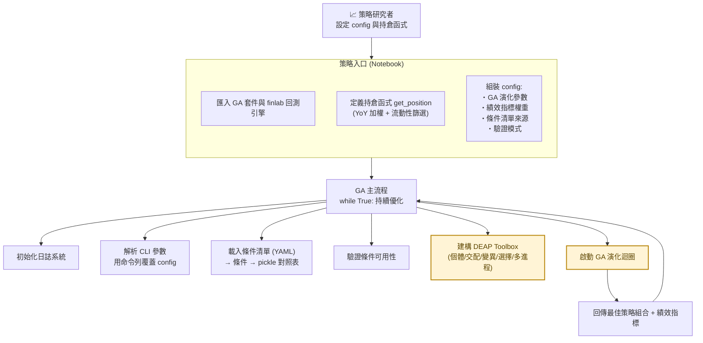
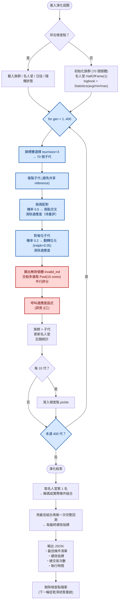
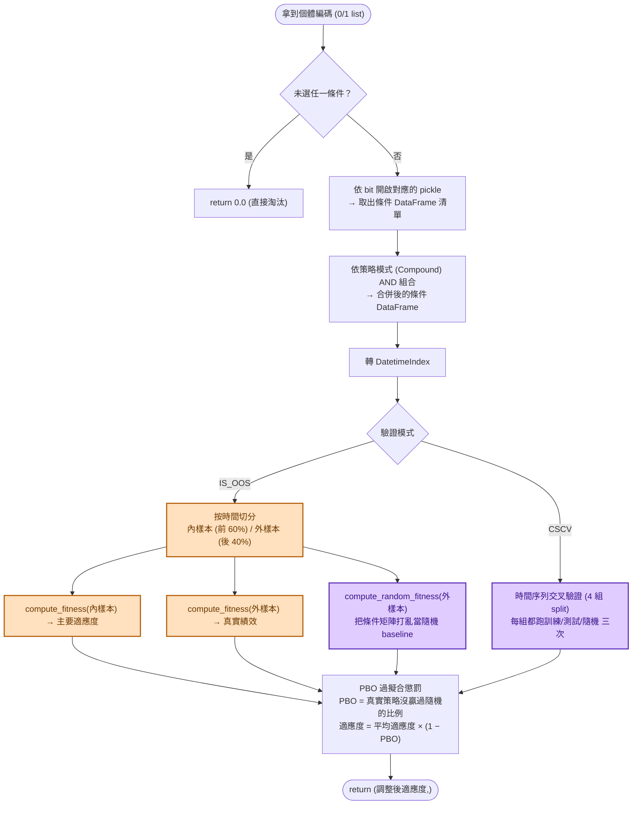
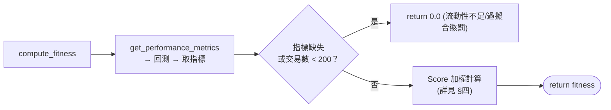
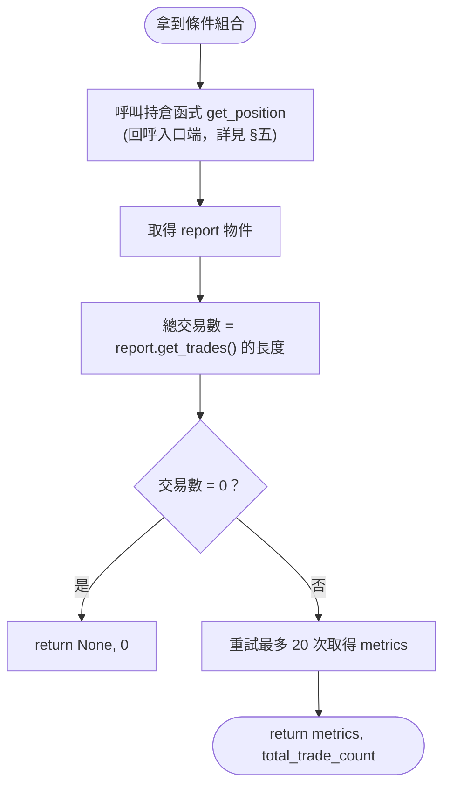
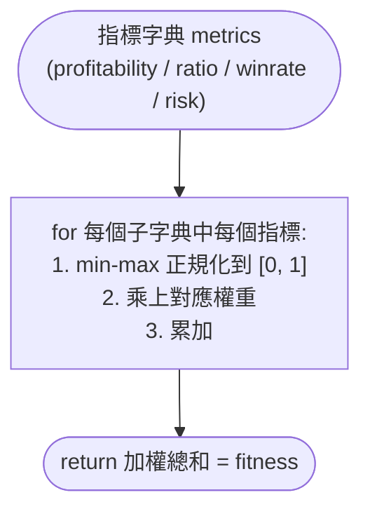
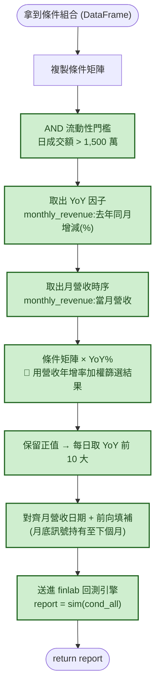

# 以遺傳演算法優化台股複合條件選股策略

## 專案概述

以 **DEAP 遺傳演算法** 為核心，自動搜尋台股選股策略中「複合條件」的最佳組合，並透過 **YoY 營收加權持倉**、**IS/OOS 內外樣本驗證**、**PBO 過擬合懲罰** 三道機制，確保搜尋出來的策略在同時考慮「獲利能力」與「風險控管」下具備樣本外穩健性。

整個系統圍繞三個核心問題：

1. **搜尋什麼？** 從一組條件清單中，以二進位編碼挑選 4–8 個條件 AND 組合，作為一個「個體」。
2. **怎麼評分？** 把個體的條件組合轉成持倉 → 回測 → 取出 10 個績效指標 → 加權得到適應度。
3. **怎麼避免過擬合？** 60% 內樣本訓練、40% 外樣本驗證，並用 PBO 機率（真實策略沒贏過隨機策略的比例）懲罰適應度。

> 本文件所有流程圖使用 **Mermaid** 語法，配色統一採「淺色底 + 深色字」原則，相容於亮／暗 IDE 主題。顯示方式請見**第八節**。

---

## 一、整體架構

---

## 二、GA 演化迴圈

每跑一輪主流程，會執行 **400 代** 演化，每代從 70 個個體中篩選、重組、評分。支援 checkpoint：中斷後可從最近的檢查點恢復。

---

## 三、適應度評估（每一個個體都會走這條路）

這是整個系統最關鍵的環節——**把一段二進位編碼轉成「這個策略有多好」的單一分數**，並用 PBO 懲罰避免過擬合。

### compute_fitness(條件) 內部

### get_performance_metrics（真正呼叫回測）

---

## 四、適應度加權公式（Score）

採用 **加權平均** 模式：對 10 個績效指標做 min-max 正規化後，以指定權重加總。

| 指標 | 權重 | 正規化範圍 | 類別 |
|---|---|---|---|
| 年化報酬率 annualReturn | 0.1 | [0, 1] | 獲利能力 |
| Sharpe Ratio | 0.1 | [0, 100] | 風險調整 |
| Sortino Ratio | 0.1 | [0, 100] | 風險調整 |
| **Calmar Ratio** | **0.6** | [0, 100] | 風險調整 |
| **最大回撤 maxDrawdown** | **0.6** | [-1, 0] | 風險 |
| Value at Risk (VaR) | 0.1 | [-1, 0] | 風險 |
| Conditional VaR (CVaR) | 0.1 | [-1, 0] | 風險 |
| 勝率 winRate | 0.1 | [0, 1] | 交易品質 |
| MAE (最大不利偏移) | 0.1 | — | 交易品質 |
| MFE (最大有利偏移) | 0.1 | — | 交易品質 |

> 權重設計哲學：**重壓風險控管**——Calmar Ratio（年化報酬/最大回撤）與最大回撤本身的權重同為 0.6，其餘指標各 0.1。意思是「在風險可控下追求報酬」優先於「純追求高報酬」。

---

## 五、持倉函式邏輯（get_position）

這是策略端的核心：把 GA 搜出的條件組合，結合 **YoY 營收成長率** 當加權，轉成實際部位後回測。

### 持倉選股的邏輯順序

1. **流動性過濾** — 排除日均成交額不足 1500 萬的個股（避免滑點與流動性陷阱）
2. **條件組合 AND** — GA 挑出的 4–8 個條件須同時成立
3. **YoY 加權** — 把布林條件乘上「去年同期營收增減 %」，等於用營收動能為通過條件的個股排序
4. **Top 10 選股** — 每個時間點只持有 YoY 最強的 10 檔
5. **月頻持有** — 訊號以月營收日期為基準，月底換倉

---

## 六、核心參數一覽

| 參數 | 值 | 意義 |
|---|---|---|
| 策略模式 | `Compound_Conditions` | 條件 AND 組合 |
| 特徵數範圍 | 4–8 | 每個個體挑選的條件數 |
| 族群大小 | 70 | 每代 70 個個體 |
| 交叉機率 | 0.5 | 兩點交叉 |
| 變異機率 | 0.2 | 翻轉位元 (indpb=0.05) |
| 演化代數 | 400 | 收斂世代上限 |
| 平行核心 | 15 | 多進程 Pool 大小 |
| 最小交易數 | 200 | 低於則視為無效策略 |
| 評分模式 | weighted | 加權平均 |
| 驗證模式 | IS_OOS | 60/40 內外樣本 |

---

## 七、技術棧

| 領域 | 套件 |
|---|---|
| 遺傳演算法框架 | **DEAP** (Distributed Evolutionary Algorithms in Python) |
| 台股量化回測 | **FinLab** (`data.get` 取因子、`sim` 回測引擎) |
| 平行運算 | Python `multiprocessing.Pool` |
| 時間序列切分 | `sklearn.model_selection.TimeSeriesSplit` |
| 資料處理 | `pandas`, `numpy` |
| 序列化 | `pickle` (檢查點與條件快取) |
| 配置 | `YAML` (條件清單來源) |

---

## 八、如何在 IDE 完整呈現 Mermaid 流程圖

這份文件中的所有流程圖使用 **Mermaid 語法**，已內嵌「淺底深字」主題變數，**相容於亮／暗 IDE 主題**，不需另外調整配色。要在 IDE 看到渲染結果，依使用的 IDE 安裝對應套件：

### VS Code / Cursor（最推薦）

在延伸模組市集搜尋並安裝**任一**即可：

| 套件 | Publisher | 說明 |
|---|---|---|
| **Markdown Preview Mermaid Support** | *Matt Biilmann* | 最主流、最穩定，安裝後直接用 `Ctrl+Shift+V` 預覽 Markdown 就會渲染 |
| **Markdown Mermaid** | *Brian Koh* | 整合更完整，支援匯出 PNG/SVG |
| **Mermaid Markdown Syntax Highlighting** | *NETRON* | 額外提供語法高亮（可與上面任一搭配） |

**操作**：打開 `.md` 檔 → `Ctrl+Shift+V`（Mac: `Cmd+Shift+V`）開啟預覽 → 流程圖會自動渲染。

> 若想所見即所得（邊打字邊渲染）：安裝上面任一擴充後，再加裝 **Markdown All in One**（*yzhang*）。

### JetBrains 家族（PyCharm / IntelliJ / DataGrip）

**新版 (2023.1 之後) 內建支援**，無需額外安裝：

1. `Settings` → `Languages & Frameworks` → `Markdown`
2. 勾選 **"Render Mermaid diagrams in preview"**
3. 開啟 Markdown 檔後，右上角切換到 **Preview** 或 **Split** 模式即可

**舊版** 需在 Plugins 市集搜尋 *Markdown* plugin 並升級至內建版本。

### GitHub / GitLab

**原生支援**，把 `.md` push 上去後直接在網頁上看到渲染結果，**不需安裝任何套件**。

### Obsidian / Notion / HackMD

**原生支援**，把整份內容貼進去即會渲染。適合用來當面試時的展示媒介。

### 瀏覽器直接看（免安裝）

把整份 `.md` 內容貼到以下任一線上工具即可：
- **Mermaid Live Editor**：https://mermaid.live
- **GitHub Gist**：貼成 `.md` gist 直接渲染

---

## 九、附錄：Mermaid 渲染驗證

如果你的 IDE 流程圖顯示空白或出現語法錯誤，先做這兩件事：

1. **確認副檔名為 `.md`**（不是 `.txt`、`.markdown`）
2. **貼到 [mermaid.live](https://mermaid.live) 驗證語法**：能渲染就代表 IDE 端問題；不能渲染代表語法錯（這份文件已通過驗證）。
