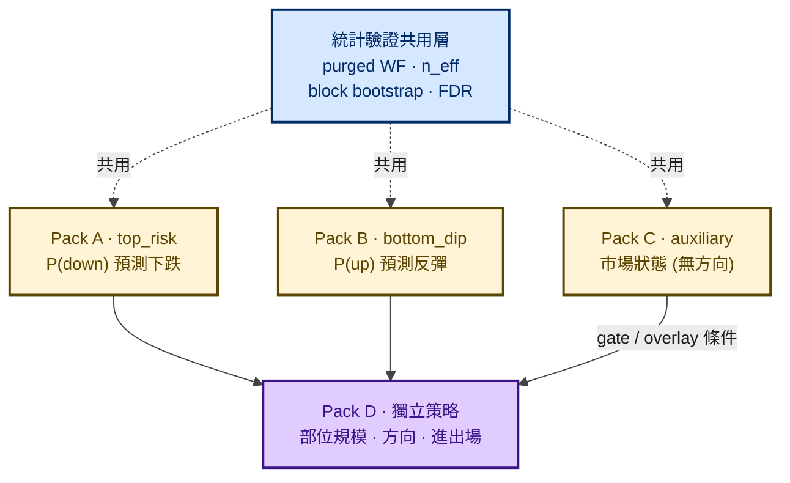
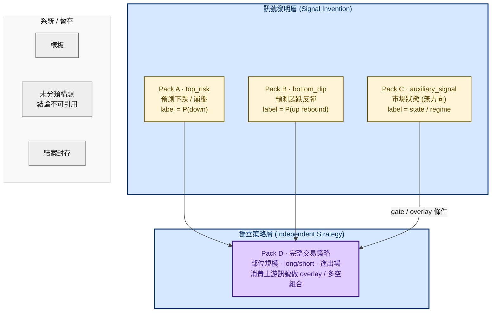
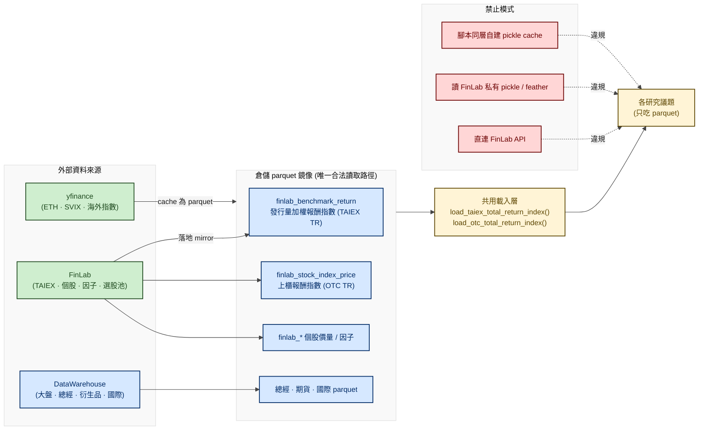
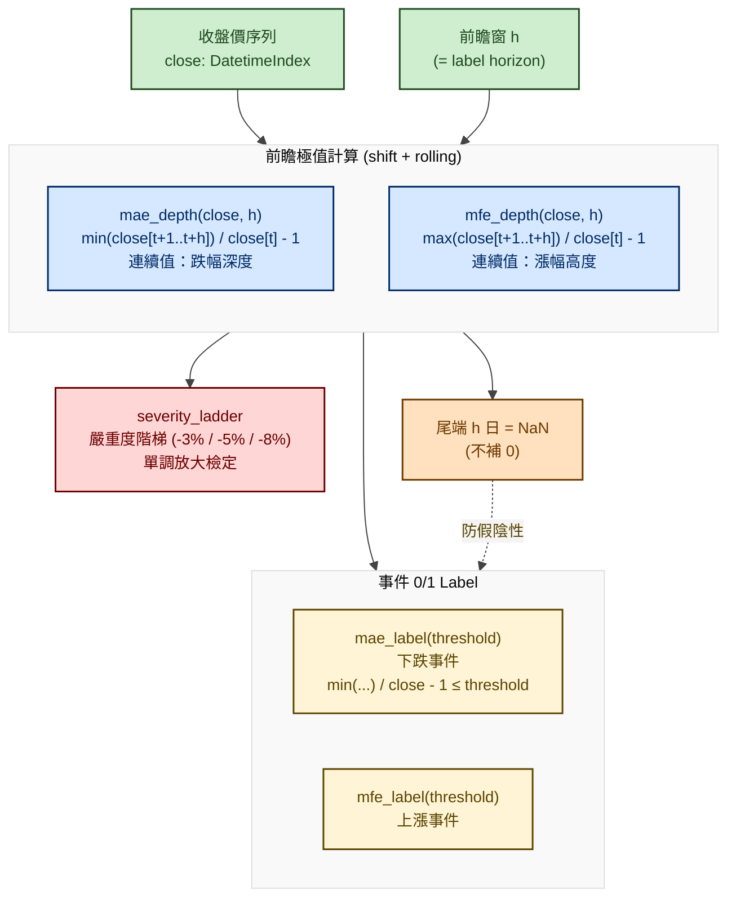
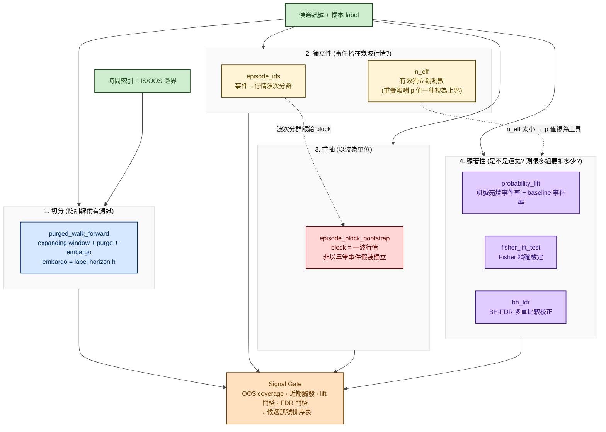
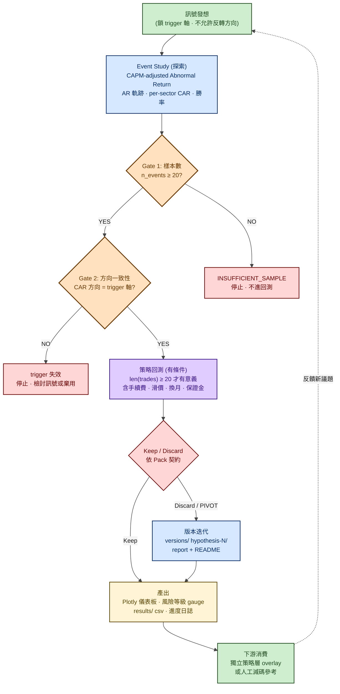

# 市場風險評估研究平台 — 流程圖

> 履歷用途：以流程圖呈現「事件型市場風險研究框架」的整體運作。本平台**不是**傳統 VaR／CVaR／GARCH 參數化風險模型，而是以「**市場資料 → 技術／衍生品因子 → 未來下跌事件 label → 機率／事件風險評估 → 樣本外驗證 → 報告**」為骨幹的**事件型研究迴圈**，搭配嚴格的兩層四 Pack 評估契約，確保每個訊號的統計效力與方向意義可被審計。

---

## 一、平台定位

| 項目         | 內容                                                                                                           |
| ---------- | ------------------------------------------------------------------------------------------------------------ |
| **研究標的**   | 台股加權指數（TAIEX 上市）、上櫃指數（OTC）、跨市場資產（ETH、SVIX、台指期等）                                                              |
| **核心任務**   | 預測「未來 h 日內是否發生特定幅度下跌／上漲事件」，輸出可評估的訊號序列與風險等級                                                                   |
| **方法論主軸**  | Event Study（CAPM-adjusted Abnormal Return）+ Path-type Label + Purged Walk-forward + Block Bootstrap + FDR 校正 |
| **與策略層切分** | 只發明並驗證訊號的預測力；**部位規模／方向／進出場**一律交下游獨立策略層決定                                                                     |
| **雙市場覆蓋**  | TAIEX（上市）＋ OTC（上櫃）同步評估；指數口徑須明確標示「價格指數」vs「報酬指數 total return」                                                  |
|            |                                                                                                              |

> 📖 **讀法**：想快速理解看 **§2.0 白板版**（≤7 個框）；想看細節往下讀。標示 `>` 引言與「地雷 / 講法」的區塊是作者自己的面試準備筆記，**可直接略過**。

---

## 二、整體研究架構（兩層四 Pack）

> 研究本體分為「訊號發明層」與「獨立策略層」。前者只輸出可評估訊號，後者消費上游訊號形成可下單策略。四種 Pack 對應四種 label 與 Keep 門檻，**契約不可混用**。

### 2.0 白板版（被要求「畫一下你的風險研究框架」時畫這張）

> 5 個框。口訣：**上面三個只發明訊號、下面一個才決定部位；C 是無方向的環境條件。**

### 2.1 細節版

> **用語釘死（會被拿 CLAUDE.md 對帳）**：`market-risk/CLAUDE.md` 另有「**研究方法六類**」的說法
> （Event Study、因子研究…等**方法論**分類）。**方法論六類 ≠ 評估契約四類**：
> 前者決定「用什麼手法研究」，後者決定「用什麼指標判 Keep」。
> 換方法論**不改** Pack A/B/C/D 契約——被問到時要能一句話分清這兩個維度。

**評估契約差異（Keep 門檻）**

| Pack | Label 形式 | 主決策指標 | 禁止 |
|---|---|---|---|
| A · top_risk | P(down) 事件機率 | `probability_lift`、`magnitude_lift`、嚴重度階梯 RR | 宣稱 P(up) |
| B · bottom_dip | P(up rebound) 事件機率 | `probability_lift`、`magnitude_lift` | 宣稱 P(down) |
| C · auxiliary_signal | 市場狀態分群 | 狀態相關性、覆蓋率 | 做方向預測 Keep |
| D · 獨立策略 | 部位序列＋策略績效 | 扣成本後 OOS `net_edge > 0`、`mdd_improvement`、`trade_count_ratio` | 用方向 `probability_lift` 當主決策 |

---

## 三、四個 Pack 的代表案例

> 置於 [`./market_risk_studies/`](./market_risk_studies/) 子資料夾。**四份合起來才看得到完整故事**：
> 從「訊號沒過（A）」→「訊號真的過了（B）」→「不做方向的環境描述（C）」→「訊號怎麼變成部位（D）」。

| Pack | 研究主題 | 獨立文件 | 判定 | 面試故事 |
|---|---|---|---|---|
| **A · top_risk** | ETH → 台股崩盤預警 | 本檔 §七 案例 | **PIVOT**（檢力失敗）| 嚴重度階梯單調放大但 OOS 只有 4 個獨立事件；誠實區分「檢力失敗」與「證據失敗」 |
| **B · bottom_dip** | 恐慌抄底訊號 | [`fingpt_panic_rebound.md`](./market_risk_studies/fingpt_panic_rebound.md) | ✅ **IS + OOS 雙 KEEP** | **全平台唯一通過完整驗證的訊號**：IS n=69 / OOS n=13 / 4 段 walk-forward / 4 次危機事件全過，含 2020 COVID |
| **C · auxiliary_signal** | FinGPT 恐慌環境指數 | [`fingpt_risk.md`](./market_risk_studies/fingpt_risk.md) | Overlay（降格後保留）| 兩次連續 pivot 的因果鏈：先誤判為「訊號退化」，追查後發現是 baseline drift，再發現卡點的前提本身也寫錯 |
| **C · auxiliary_signal** | 產業輪動風險 | [`industry_rotation_risk.md`](./market_risk_studies/industry_rotation_risk.md) | v1 LOCK | **12 輪 autoresearch**（1 KEEP + 11 DISCARD）；v8/v9 Pareto 邊界；自曝 circular 評估 |
| **D · 獨立策略** | 槓桿守門 Overlay | [`leverage_guard_overlay.md`](./market_risk_studies/leverage_guard_overlay.md) | **CONDITIONAL** | **事前登記 + 一次性 hold-out 開封**：MDD −56.3%→−12.1%（改善 44.1pp），代價是同期少賺一半 |

> Pack C 底下 `analyses/auxiliary_signal/` 共 7 個子模組；尚未展開的 5 個
> （`composite_aux_ensemble` / `concept_vol_decay` / `derivatives_chip_thermometer` /
> `no_leader_vol_breadth` / `vol_lead_indicators`）維持在 Pack C 節點底下，待後續按需擴充。

---

## 四、資料源治理與雙市場覆蓋

> 所有指標、標籤、基準指數一律從倉儲 parquet 讀取。禁止直連 FinLab API、禁止讀 FinLab 私有 pickle／feather cache、禁止在腳本同層自建 dataset。TAIEX 與 OTC 必須同時評估。

**指數口徑強制揭露**

| 口徑 | 還原除權息 | 用途 |
|---|---|---|
| 價格指數 | 否 | 短期崩盤事件標的 |
| 報酬指數 total return | 是 | 長期績效、回測報酬基準 |

兩者為不同資料，**不可混用**；研究與生產路徑偏離時須明確標記。

---

## 五、Label 工程（路徑型事件 Label）

> Label 抓的是「未來 h 天**曾經**最深跌到哪／最高漲到哪」，不是「第 h 天收在哪」。前者抓得到盤中被洗出去的風險，點對點報酬抓不到。尾端 h 日一律 NaN，不補 0——「未知」與「未發生」必須可區分。

**兩套階梯數字不要搞混**

| 來源 | 門檻 | 說明 |
|---|---|---|
| **框架預設** | `-3% / -5% / -8%` | `path_labels.py` 的 `DEFAULT_SEVERITY_THRESHOLDS`（上圖 SEV 節點用的是這組） |
| **ETH/TWII 議題覆寫** | `-5% / -7% / -10% / -12%` | 該議題事件較稀少，把門檻往深處拉才有區辨度（下表用的是這組） |

> 階梯門檻是**每個議題自己選**的參數，不是全平台固定值。被問「為什麼你的階梯跟預設不一樣」，
> 答：**門檻要選在事件數還夠算統計量、又能區分嚴重度的地方**，所以隨議題的事件分布調整。

**嚴重度階梯範例（ETH/TWII 議題實測，全歷史 35 次事件）**

| MAE 門檻 | Risk Ratio (相對 baseline) | 解讀 |
|---|---|---|
| ≤ −5% | 1.79× | 訊號亮燈時，跌幅超過 5% 的機率為 baseline 的 1.79 倍 |
| ≤ −7% | 2.36× | 嚴重度放大 |
| ≤ −10% | 3.32× | 再放大 |
| ≤ −12% | 3.87× | 再放大（單調） |

階梯單調放大 = 訊號不是只抓到淺跌，而是「越嚴重越準」；若階梯反轉，代表訊號只在淺跌有效，實戰價值低。

> **配套要一起講的節制**：`probability_lift` 的 bootstrap 95% CI 是 `[-0.0005, +0.3443]`——
> **下界僅微幅低於 0**。所以正確說法是「階梯形狀像真訊號，但區間估計還壓不到 0 以上」，
> 不能只報 3.87× 就說有效。

---

## 六、統計驗證管線

> 驗證基礎設施只吃呼叫端已算好的 label／mask／p 值，內部**無任何 shift(−N)、bfill 或 center**——前瞻視窗一律由 Label 工程層負責。四組工具各回答一個常被寫錯的問題。

> **讀圖注意**：四組工具是**並聯的四道獨立檢核**（各回答一個常被寫錯的問題），
> 不是「必須依序跑完的管線」。唯一的兩條依賴是虛線標的那兩條：
> `episode_ids` 的波次分群是 `episode_block_bootstrap` 的輸入；
> `n_eff` 太小時顯著性檢定的 p 值只能當**上界**解讀。
> 之前把它畫成一條直鏈，容易被誤讀成「bootstrap 一定要在 walk-forward 之後」——實際互不相依。

**四組工具對照**

| 工具 | 回答的問題 | 寫錯的後果 |
|---|---|---|
| `purged_walk_forward` | 訓練資料有沒有偷看到測試期？ | label 重疊沒挖掉 → OOS 假高分 |
| `episode_ids` / `n_eff` | 這些事件其實擠在幾波行情裡？ | 把 30 個事件當 30 個獨立樣本 → p 值樂觀上界 |
| `episode_block_bootstrap` | 以「波」為單位重抽 | 以「筆」為單位重抽 → 假顯著 |
| `probability_lift` / `fisher_lift_test` / `bh_fdr` | 訊號亮燈時事件率高多少？是不是運氣？測很多組要扣多少？ | 沒做 FDR 校正 → 偽發現 |

### 六.1 前視偏差的第五道防線：機械化偵測

前面四組是**統計**防線。但「程式碼裡不小心用到未來資料」是**工程**問題，靠 code review 抓不完。
所以另有一個獨立工具：`core/package/data_leakage_detection/`。

作法是**兩階段驗證**（`market-risk/CLAUDE.md` 明載「風險模型上線前**必跑**」）：

| 階段 | 做什麼 | 實作 |
|---|---|---|
| **靜態掃描** | 掃出可疑呼叫（`shift(-N)`、`bfill`、`center=True`、全期統計量）| 白名單只有 `path_labels.py`——label 計算層是唯一允許看未來的地方 |
| **動態時間一致性測試** | 把資料源 monkeypatch 成「只到某個截止日」，重算指標，**比對兩次結果的重疊區間是否一致** | `check_future_data_leakage(df_earlier, df_later)` + `_create_patched_get` / `_create_patched_indicator` |

第二階段是關鍵：**如果一個指標沒有偷看未來，那麼把資料截短之後，重疊期間的值必須完全相同。**
值變了就代表有洩漏——這個檢測不需要你看得懂那段程式在算什麼。

> 面試講法：「防前視偏差我不只靠規則和 review，我有一個**可以跑的測試**——
> 截短資料重算，重疊區間不一致就是洩漏。這比人眼看 `shift` 可靠。」

---

## 七、研究流程與 Keep / Discard 迴圈

> 流程核心：訊號發想 → Event Study 探索 → 雙 gate 把關 → (有條件) 策略回測 → Pack 評估。**禁止跳過 Event Study 直接回測**——等於盲目 grid search，不知道為什麼賺／賠。ETH/TWII 議題為本框架的代表性範例。

**ETH/TWII 議題實例（Pack A · top_risk）**

| 階段 | 內容 |
|---|---|
| 研究問題 | ETH 20 日累積跌幅能否預測台股加權指數未來 20 天的崩盤事件？ |
| 訊號源 | ETH 20 日累積強度（intensity） |
| Label | TWII 未來 20 日 MAE ≤ 門檻（嚴重度階梯 −5% / −10% / −12%） |
| 雙市場 | TAIEX（^TWII）＋ OTC（^TWOII）＋ 倉儲 total return 報酬指數同步驗證 |
| 評估 | precision、baseline event rate、risk ratio、frozen calibration、leave-one-out |
| **樣本規模** | **全歷史獨立事件 35 次**（物理天花板）；**OOS 驗證期（2023-01~2024-12，2 年）內只有 4 個獨立事件** |
| 結論 | **PIVOT**（檢力失敗，非證據失敗）— 方向不隨機、嚴重度階梯單調放大，但 lift 的 bootstrap CI 下界仍微幅低於 0 |
| 回測狀態 | ⚠️ **未跑 vectorbt 實戰回測**——依議題規範，vectorbt 對帳是 KEEP 前的關卡；本議題判 PIVOT 而**止步於 gate**，所以沒有扣成本後的結論 |
| 正當用法 | 不安裝為自動交易訊號；保留為**人工減碼 overlay 警示參考**（intensity > 0.20） |

> **兩個數字不要講錯**（這題最容易自曝）：
> - **35** = 全歷史獨立事件數上限，是「這個議題最多只能拿到這麼多樣本」的物理限制
> - **4** = OOS 期間的獨立事件數，**這才是檢力不足的真正原因**——2 年的期間長度看起來夠，
>   但事件只有 4 個。「期間夠長」不等於「樣本夠多」，這正是 `n_eff` 要解決的問題
>
> 所以：**35 不是 `n_eff`**。被問「你的有效獨立觀測數是多少」，答的是事件層級的獨立事件數（OOS 4 個），
> 不是總天數、也不是 35。

> 「PIVOT」不是「訊號無效」，而是「樣本不足以統計顯著」——方向性存在但檢力不足。下游 Pack D 策略可在此前提下評估策略增量，**不對 Pack A 判定背書**。

---

## 八、技術棧

| 類別 | 技術 / 工具 |
|---|---|
| **資料處理** | Python · pandas · NumPy · SciPy |
| **統計驗證** | Fisher exact test · BH-FDR 校正 · Block Bootstrap · Walk-forward |
| **事件研究** | CAPM-adjusted Abnormal Return · CAR · Event Study |
| **回測** | FinLab `sim()` · vectorbt |
| **視覺化** | Plotly（深色主題、IDE Remote iframe 渲染） · matplotlib |
| **資料源** | FinLab（落地 DataWarehouse parquet mirror） · DataWarehouse · yfinance |
| **儲存格式** | Parquet（強制） — 禁止 pickle / feather 作為資料源 |
| **市場覆蓋** | TAIEX 上市 · OTC 上櫃 · 跨市場（ETH、SVIX、台指期、美股） |

---

---

> 本文件的流程圖採 Mermaid 語法，GitHub / GitLab / Obsidian 原生支援；
> VS Code 需安裝 *Markdown Preview Mermaid Support*。
