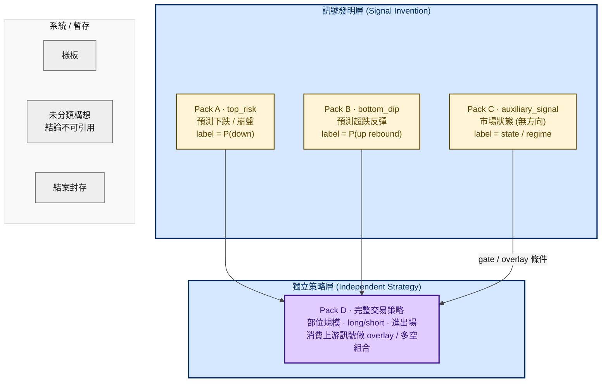
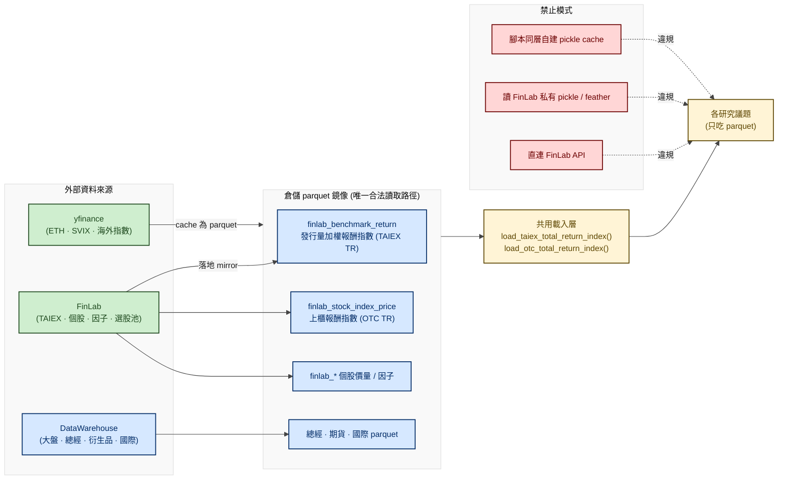
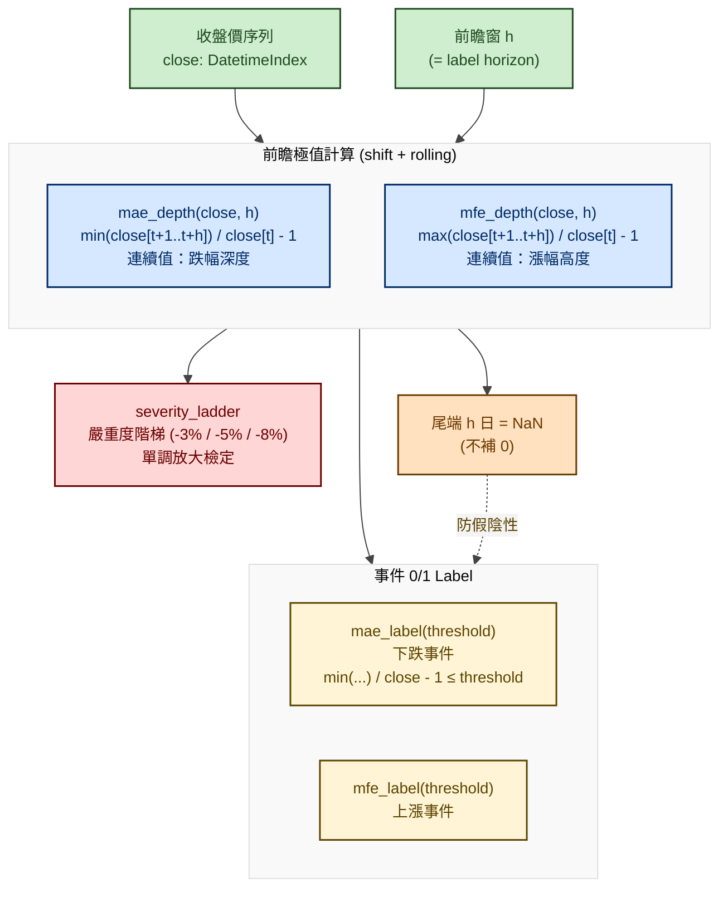
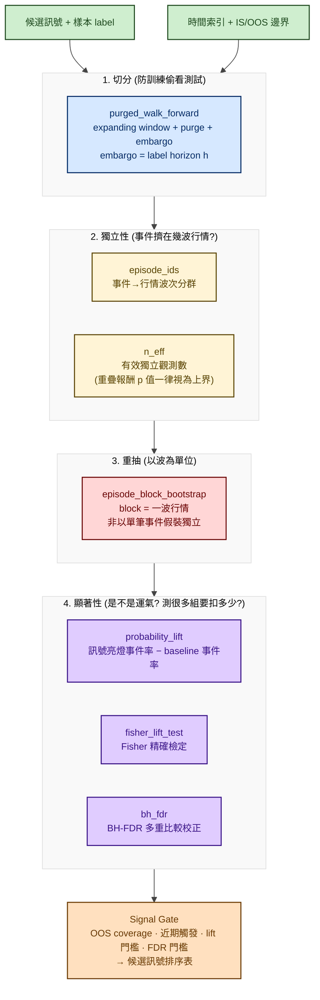
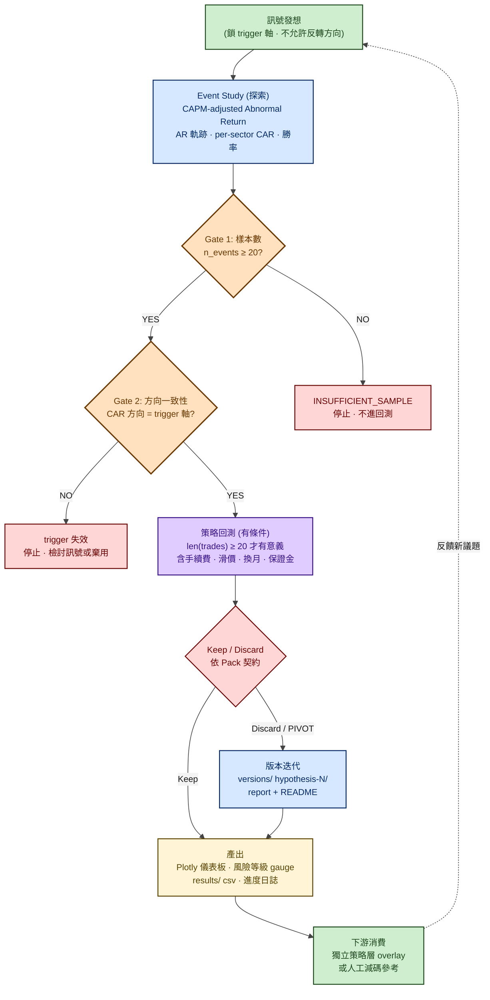

# 市場風險評估研究平台 — 流程圖

> 履歷用途：以流程圖呈現「事件型市場風險研究框架」的整體運作。本平台**不是**傳統 VaR／CVaR／GARCH 參數化風險模型，而是以「**市場資料 → 技術／衍生品因子 → 未來下跌事件 label → 機率／事件風險評估 → 樣本外驗證 → 報告**」為骨幹的**事件型研究迴圈**，搭配嚴格的兩層四 Pack 評估契約，確保每個訊號的統計效力與方向意義可被審計。

---

## 一、平台定位

| 項目 | 內容 |
|---|---|
| **研究標的** | 台股加權指數（TAIEX 上市）、上櫃指數（OTC）、跨市場資產（ETH、SVIX、台指期等） |
| **核心任務** | 預測「未來 h 日內是否發生特定幅度下跌／上漲事件」，輸出可評估的訊號序列與風險等級 |
| **方法論主軸** | Event Study（CAPM-adjusted Abnormal Return）+ Path-type Label + Purged Walk-forward + Block Bootstrap + FDR 校正 |
| **與策略層切分** | 只發明並驗證訊號的預測力；**部位規模／方向／進出場**一律交下游獨立策略層決定 |
| **雙市場覆蓋** | TAIEX（上市）＋ OTC（上櫃）同步評估；指數口徑須明確標示「價格指數」vs「報酬指數 total return」 |

---

## 二、整體研究架構（兩層四 Pack）

> 研究本體分為「訊號發明層」與「獨立策略層」。前者只輸出可評估訊號，後者消費上游訊號形成可下單策略。四種 Pack 對應四種 label 與 Keep 門檻，**契約不可混用**。

**評估契約差異（Keep 門檻）**

| Pack | Label 形式 | 主決策指標 | 禁止 |
|---|---|---|---|
| A · top_risk | P(down) 事件機率 | `probability_lift`、`magnitude_lift`、嚴重度階梯 RR | 宣稱 P(up) |
| B · bottom_dip | P(up rebound) 事件機率 | `probability_lift`、`magnitude_lift` | 宣稱 P(down) |
| C · auxiliary_signal | 市場狀態分群 | 狀態相關性、覆蓋率 | 做方向預測 Keep |
| D · 獨立策略 | 部位序列＋策略績效 | 扣成本後 OOS `net_edge > 0`、`mdd_improvement`、`trade_count_ratio` | 用方向 `probability_lift` 當主決策 |

---

## 三、資料源治理與雙市場覆蓋

> 所有指標、標籤、基準指數一律從倉儲 parquet 讀取。禁止直連 FinLab API、禁止讀 FinLab 私有 pickle／feather cache、禁止在腳本同層自建 dataset。TAIEX 與 OTC 必須同時評估。

**指數口徑強制揭露**

| 口徑 | 還原除權息 | 用途 |
|---|---|---|
| 價格指數 | 否 | 短期崩盤事件標的 |
| 報酬指數 total return | 是 | 長期績效、回測報酬基準 |

兩者為不同資料，**不可混用**；研究與生產路徑偏離時須明確標記。

---

## 四、Label 工程（路徑型事件 Label）

> Label 抓的是「未來 h 天**曾經**最深跌到哪／最高漲到哪」，不是「第 h 天收在哪」。前者抓得到盤中被洗出去的風險，點對點報酬抓不到。尾端 h 日一律 NaN，不補 0——「未知」與「未發生」必須可區分。

**嚴重度階梯範例（ETH/TWII 議題實測）**

| MAE 門檻 | Risk Ratio (相對 baseline) | 解讀 |
|---|---|---|
| ≤ −5% | 1.79× | 訊號亮燈時，跌幅超過 5% 的機率為 baseline 的 1.79 倍 |
| ≤ −10% | 3.32× | 嚴重度放大 |
| ≤ −12% | 3.87× | 嚴重度再放大（單調） |

階梯單調放大 = 訊號不是只抓到淺跌，而是「越嚴重越準」；若階梯反轉，代表訊號只在淺跌有效，實戰價值低。

---

## 五、統計驗證管線（防漏、防重抽錯、防多重比較）

> 驗證基礎設施只吃呼叫端已算好的 label／mask／p 值，內部**無任何 shift(−N)、bfill 或 center**——前瞻視窗一律由 Label 工程層負責。四組工具各回答一個常被寫錯的問題。

**四組工具對照**

| 工具 | 回答的問題 | 寫錯的後果 |
|---|---|---|
| `purged_walk_forward` | 訓練資料有沒有偷看到測試期？ | label 重疊沒挖掉 → OOS 假高分 |
| `episode_ids` / `n_eff` | 這些事件其實擠在幾波行情裡？ | 把 30 個事件當 30 個獨立樣本 → p 值樂觀上界 |
| `episode_block_bootstrap` | 以「波」為單位重抽 | 以「筆」為單位重抽 → 假顯著 |
| `probability_lift` / `fisher_lift_test` / `bh_fdr` | 訊號亮燈時事件率高多少？是不是運氣？測很多組要扣多少？ | 沒做 FDR 校正 → 偽發現 |

---

## 六、研究流程與 Keep / Discard 迴圈

> 流程核心：訊號發想 → Event Study 探索 → 雙 gate 把關 → (有條件) 策略回測 → Pack 評估。**禁止跳過 Event Study 直接回測**——等於盲目 grid search，不知道為什麼賺／賠。ETH/TWII 議題為本框架的代表性範例。

**ETH/TWII 議題實例（Pack A · top_risk）**

| 階段 | 內容 |
|---|---|
| 研究問題 | ETH 20 日累積跌幅能否預測台股加權指數未來 20 天的崩盤事件？ |
| 訊號源 | ETH 20 日累積強度（intensity） |
| Label | TWII 未來 20 日 MAE ≤ 門檻（嚴重度階梯 −5% / −10% / −12%） |
| 雙市場 | TAIEX（^TWII）＋ OTC（^TWOII）＋ 倉儲 total return 報酬指數同步驗證 |
| 評估 | precision、baseline event rate、risk ratio、frozen calibration、leave-one-out |
| 結論 | **PIVOT**（檢力失敗，非證據失敗）— 事件數天花板 35 次，但方向不隨機；嚴重度階梯單調放大 |
| 正當用法 | 不安裝為自動交易訊號；保留為**人工減碼 overlay 警示參考**（intensity > 0.20） |

> 「PIVOT」不是「訊號無效」，而是「樣本不足以統計顯著」——方向性存在但檢力不足。下游 Pack D 策略可在此前提下評估策略增量，**不對 Pack A 判定背書**。

---

## 七、技術棧

| 類別 | 技術 / 工具 |
|---|---|
| **資料處理** | Python · pandas · NumPy · SciPy |
| **統計驗證** | Fisher exact test · BH-FDR 校正 · Block Bootstrap · Walk-forward |
| **事件研究** | CAPM-adjusted Abnormal Return · CAR · Event Study |
| **回測** | FinLab `sim()` · vectorbt |
| **視覺化** | Plotly（深色主題、IDE Remote iframe 渲染） · matplotlib |
| **資料源** | FinLab（落地 DataWarehouse parquet mirror） · DataWarehouse · yfinance |
| **儲存格式** | Parquet（強制） — 禁止 pickle / feather 作為資料源 |
| **市場覆蓋** | TAIEX 上市 · OTC 上櫃 · 跨市場（ETH、SVIX、台指期、美股） |

---

## 八、IDE Mermaid 渲染套件指南

> 以下套件安裝後，可直接在 IDE 預覽本文 Mermaid 區塊。推薦組合以 ★ 標示。

### VS Code ★ 推薦

1. **Markdown Preview Mermaid Support**（bierner.markdown-mermaid）
   - 安裝後開啟 .md → `Cmd/Ctrl + Shift + V` 預覽
2. **Markdown All in One**（yzhang.markdown-all-in-one）
   - 完整 Markdown 工具鏈，搭配上一個套件
3. （選用）**Mermaid Markdown Syntax Highlighting** — 程式碼區塊語法高亮

### JetBrains 系列（PyCharm / IntelliJ）

1. **Markdown** plugin（內建）
   - Settings → Languages & Frameworks → Markdown → 勾選 Mermaid 支援
2. （選用）**Mermaid** plugin — 進階主題與匯出

### 線上工具

| 工具 | 用途 |
|---|---|
| **[mermaid.live](https://mermaid.live)** | 官方互動式編輯器，貼上語法即時預覽、調主題、匯 PNG/SVG |
| **GitHub / GitLab** | 原生支援 Mermaid 區塊渲染，push 後直接在 README／Issue 看圖 |

### Obsidian

1. 內建 Mermaid 支援（無需裝套件）
2. 進階：**Obsidian Mermaid Tools** — 主題切換、匯出增強

### 注意事項

- Mermaid 主題變數（`%%{init}%%`）在部分舊版渲染器可能不完整支援；建議升級到最新版套件
- 流程圖內中文節點需確認 IDE 字型支援（VS Code 與 JetBrains 預設字型皆支援）
- 匯出圖片時若色彩流失，改用 mermaid.live 匯出後嵌入

---

## 九、渲染驗證附錄

> 本文件所有 Mermaid 區塊皆採用「**淺底深字**」配色：背景一律淺色（`#ececec` / `#d6e8ff` / `#fff4d6` 等），文字一律深色（`#1a1a1a` / `#002b66` / `#5c4500` 等）。避免白底白字或淺底淺字導致投影／列印時無法閱讀。

**配色對照表**

| 配色名 | 底色 | 字色 | 用途 |
|---|---|---|---|
| 中性灰 | `#ececec` | `#1a1a1a` | 預設節點 |
| loop 藍 | `#d6e8ff` | `#002b66` | 流程、計算、切分 |
| highlight 黃 | `#fff4d6` | `#5c4500` | 重點節點、Label、報告 |
| eval 紅 | `#ffd6d6` | `#6b0000` | 決策、停止、禁止 |
| branch 橘 | `#ffe0bf` | `#6b3a00` | Gate、警告 |
| baseline 紫 | `#e0ccff` | `#3a1488` | 策略層、顯著性檢定 |
| finlab 綠 | `#cfeecf` | `#1f4a1f` | 輸入、資料源 |
