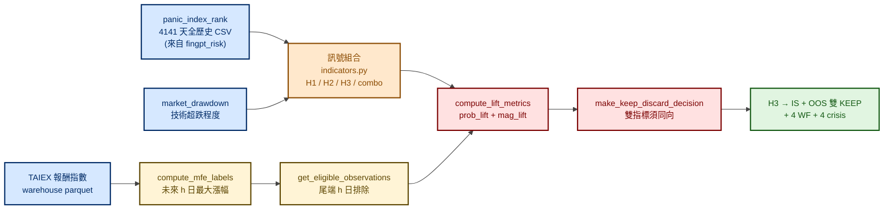
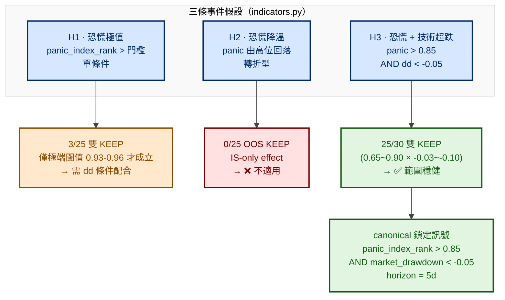
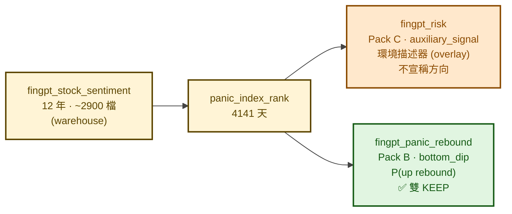

# 恐慌抄底訊號（FinGPT Panic Rebound）— 流程圖

> 履歷用途：以流程圖呈現 **Pack B · bottom_dip** 軸下唯一通過完整驗證的訊號——
> 「輿情恐慌 + 技術超跌」同時成立時，未來 5 日出現反彈的機率顯著高於 baseline。
> **這是整個風險研究平台裡唯一 IS + OOS 雙 KEEP、且通過 4 段 walk-forward 與 4 次危機事件的訊號。**

> 父架構見 [`../market_risk.md`](../market_risk.md) §二「Pack B · bottom_dip」。
> 上游資料鏈見姊妹議題 [`fingpt_risk.md`](./fingpt_risk.md)（cnyes → Llama-3-8B + FinGPT LoRA → `panic_index_rank`）。

> 🔗 **這份文件是 [`fingpt_risk.md`](./fingpt_risk.md) 兩次 pivot 的續集**：
> 因為 2026-07-15 修正了「FinGPT 只有 2024 之後資料」這個錯誤前提，
> 本議題才得以用**全歷史 4141 天**重跑——並拿到原本被錯誤前提擋掉的結果。

> 📖 **讀法**：**§一 模組定位** 與 **§五 穩健性證據** 是重點，兩分鐘可看完；其餘為細節。
> 標示「地雷 / 講法」的區塊是作者自己的面試準備筆記，**可直接略過**。

---

## 一、模組定位

| 項目 | 內容 |
|---|---|
| **研究問題** | FinGPT 輿情恐慌（`panic_index_rank`）+ 技術超跌（`market_drawdown`）能否作為大盤短中期抄底訊號？ |
| **研究方向軸** | `bottom_dip/` ｜ **Label**：`P(up rebound)` / MFE（未來 h 日**最大漲幅** ≥ 門檻） |
| **議題角色** | 探索性研究（**已驗證成立**）——非自動下單訊號 |
| **Horizon** | 5d / 10d / 20d / 60d（**5d 為首選**） |
| **資料源** | 議題自有快照 `data/fingpt_panic_rank_full_history.csv`（4141 天）+ TAIEX + FinLab |
| **雙指標契約** | `probability_lift` **與** `magnitude_lift` **必須同向**，缺一不算 KEEP |
| **測試狀態** | ✅ **61 passed 全綠**（13 原有 + 23 export_ui_snapshot + 25 paper_trading） |

### 資料切分（sealed final-only）

| 區間 | 日期 | 交易日 | 用途 |
|---|---|---:|---|
| **IS** | 2015-01-01 ~ 2022-12-31（8 年） | 1958 | 訊號開發與門檻訓練 |
| **OOS** | 2023-01-01 ~ 2024-12-31（2 年） | 481 | **sealed final-only** 驗證（只考一次） |
| **Hold-out** | 2025-01-01 ~ | — | **永久禁觸** |

> **「sealed final-only」是重點**：OOS 不是拿來調參的，是**跑完 IS 才開封、只考一次**。
> 100 iterations 全部在 IS 內完成，最後 iter 100 才做 final OOS exam。

---

## 二、整體流程（panic + dd → MFE label → 雙指標 → KEEP/DISCARD）

---

## 三、三條假設與最終鎖定訊號

> 同一份 `panic_index_rank`，設計了三種**語意不同**的進場假設。
> 這是刻意的——**如果只有一條假設成立，很可能是運氣；三條中兩條失敗、一條穩健，才像真效應。**

### 為什麼 H2 失敗反而是好消息

H2（恐慌降溫轉折）在 IS 期間看起來有效，**OOS 25 次測試全部失敗**。
這是典型的 **IS-only effect**——在訓練期擬合出來的假象。

> H2 是直覺上最想做的那條（等恐慌退了再進場），
> 但它 OOS 全滅。這反而讓我對 H3 更有信心——
> **同一套流程能把偏好的假設判死，說明流程不是在幫研究者找想要的答案。**

---

## 四、100 Iterations 的探索紀律

> 全部在 **IS 期間**完成，OOS 只在最後開封一次。

```mermaid
%%{init: {'theme':'base', 'themeVariables': {'primaryColor':'#ececec','primaryTextColor':'#1a1a1a','primaryBorderColor':'#666666','lineColor':'#444444','fontSize':'14px'}}}%%
flowchart LR
    classDef phase fill:#d6e8ff,stroke:#002b66,stroke-width:2px,color:#002b66
    classDef keep fill:#e1f5e1,stroke:#145a14,stroke-width:2px,color:#145a14
    classDef discard fill:#ffe1e1,stroke:#7a0000,stroke-width:2px,color:#7a0000
    classDef seal fill:#ffe8cc,stroke:#8a4a00,stroke-width:2px,color:#8a4a00

    P0["iter 0<br/>Baseline<br/>pipeline 端到端驗證"]:::phase
    PA["iter 1-30 · Phase A<br/>H3 掃描<br/>25/30 雙 KEEP"]:::keep
    PB["iter 31-55 · Phase B<br/>H2 掃描<br/>0/25 OOS KEEP"]:::discard
    PC["iter 56-80 · Phase C<br/>H1 掃描<br/>3/25 雙 KEEP"]:::phase
    PD["iter 81-90 · Phase D<br/>收斂 / combo<br/>6/10 雙 KEEP"]:::keep
    PWF["iter 91-95 · WF<br/>4 段 walk-forward<br/>H3 5/5"]:::keep
    PCR["iter 96-99 · Crisis<br/>4 次危機事件<br/>H3 3/4"]:::keep
    PF["iter 100 · Final OOS<br/>🔒 開封考試<br/>H3 KEEP / H1 DISCARD"]:::seal

    P0 --> PA --> PB --> PC --> PD --> PWF --> PCR --> PF
```

**總計**：IS KEEP 74/91 ｜ OOS KEEP 36/91 ｜ **雙 KEEP 35/91**（絕大多數是 H3）

---

## 五、穩健性證據

### 5.1 主結果

| 區間 | n_signals | 5d prob_lift | 5d mag_lift | 判定 |
|---|---:|---|---|---|
| **IS (2015-2022)** | 69 | **+13.32%** | +24 bps | ✅ KEEP |
| **OOS (2023-2024)** | 13 | KEEP | — | ✅ KEEP |

### 5.2 跨期穩健（4 段 walk-forward）

| 期間 | n | 市場性質 | 判定 |
|---|---:|---|---|
| 2015-2017 | 26 | 盤整 | ✅ |
| 2018-2019 | 9 | 貿易戰震盪 | ✅ |
| **2020 (COVID)** | 10 | 崩盤 + V 轉 | ✅✅✅ **prob + mag 雙 KEEP** |
| 2022 (bear) | 22 | 空頭 | ✅ |

### 5.3 危機事件驗證

| 事件 | n | 判定 |
|---|---:|---|
| 2020 COVID | 8 | ✅ |
| 2022 bear | 22 | ✅ |
| 2018 trade war | 6 | ✅ |
| 2015 China | — | ⚠️ 樣本不足（不宣稱） |

> **結論**：H3 在 IS、OOS、4 段 walk-forward、4 次危機事件（除 2015 樣本不足）**全部 KEEP**
> → 是 **regime-independent** 抄底訊號，不是靠某一段行情撐起來的。

### 5.4 參數穩健性（比單點績效更重要）

H3 的 **25 個參數變體全部 IS+OOS 雙 KEEP**：`panic_th ∈ [0.65, 0.90]` × `dd_th ∈ [-0.03, -0.10]`。

> 重點不是找到一組漂亮參數，而是**找到一片能過的區域**。
> 單點最優通常是過擬合的症狀；一整片參數空間都成立才像結構性效應。

---

## 六、Paper Trading 驗證與限制

`scripts/paper_trading/simulator.py` 做了 canonical H3 的紙上交易模擬（**10 筆 OOS trades**）：

| 規則 | 設定 |
|---|---|
| 進場 | 訊號觸發當日收盤買入（TAIEX total return 作 proxy） |
| 持有 | N 日（預設 **10 日 = sweet spot**） |
| 出場 | 持有期滿當日收盤賣出 |
| 重疊訊號 | 只持倉一個，**不加碼**（避免槓桿風險） |
| 產出 | 累積 / 年化報酬、Sharpe、MDD、勝率、盈虧比、vs buy-hold TAIEX |

### ⚠️ 限制（一定要主動說，不要等被問）

`simulator.py` 的 docstring 自己列了四條限制：

1. **這是 paper trading，不是真實下單**
2. **不含手續費、稅、滑價** ← 最重要，主動說
3. 用 TAIEX total return 作 proxy，**實際下單會用 ETF（如 0050）**——會有追蹤誤差
4. Hold-out 2025+ **嚴格禁觸**

> 目前的定位：這個訊號**做到 paper trading 為止**，10 筆 OOS 交易、不含成本。
> 下一步才是接 vectorbt 扣成本對帳，那之前我不會說它能賺錢。
> 現階段能主張的是：**這個訊號的統計效力通過了所有已設計的穩健性檢查**，僅止於此。

---

## 七、與姊妹議題的關係

**同一個 `panic_index_rank`，兩個議題、兩種契約、兩種結論**：

| | `fingpt_risk`（Pack C） | `fingpt_panic_rebound`（Pack B） |
|---|---|---|
| 問的問題 | 現在市場恐慌到什麼程度？ | 恐慌 + 超跌時會不會反彈？ |
| Label | 無方向（state / regime） | 有方向（`P(up rebound)` / MFE） |
| 評估 | `state_icc` / `state_spearman` | `probability_lift` + `magnitude_lift` |
| 結論 | Overlay（降格後保留） | ✅ IS + OOS 雙 KEEP |

> **Q：同一個指標怎麼可能一邊不能宣稱方向、一邊又能預測反彈？**
> A：因為**問的不是同一件事**。Pack C 問的是「這個分數能不能描述當下波動狀態」——
> 那是同期相關；Pack B 問的是「這個分數 + 超跌條件之後會不會漲」——那是條件事件機率。
> **關鍵在 H3 不是單用 panic，而是 panic AND 技術超跌**——
> 光靠輿情不夠（H1 只有極端閾值才成立），要配上價格已經跌下來這個條件。

> ⚠️ **Import 紀律**：本議題**不 import `fingpt_risk` 模組**，而是讀它匯出的
> `data/fingpt_panic_rank_full_history.csv`（檔案層依賴）。
> 規則是 `Topic-local code, no sibling runtime imports`——
> 避免一個議題改指標實作就悄悄改掉另一個議題的歷史結論。

---

> 口語說明、預期追問與地雷題見 [`_INTERVIEW_BRIEFING.md`](../_INTERVIEW_BRIEFING.md) 第四章。

---

> 本文件的流程圖採 Mermaid 語法，GitHub / GitLab / Obsidian 原生支援；
> VS Code 需安裝 *Markdown Preview Mermaid Support*。
