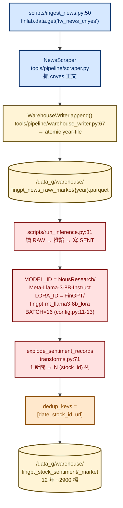
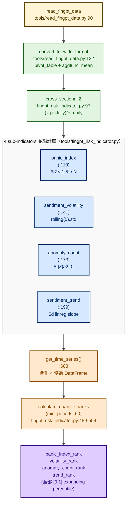
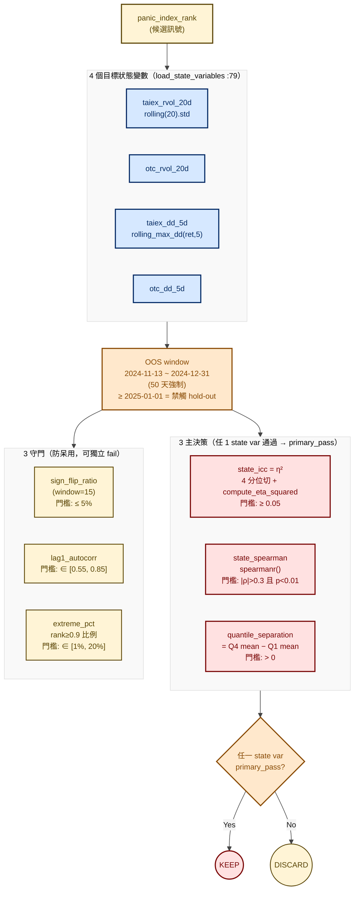
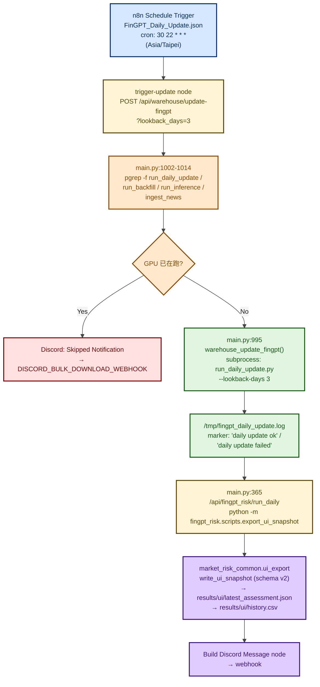
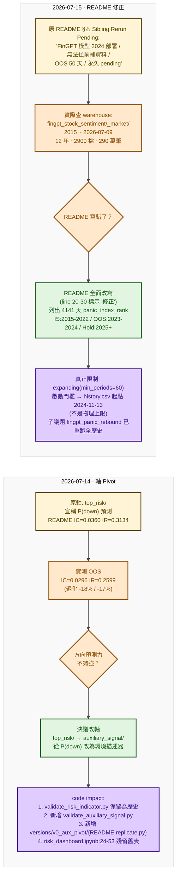

# FinGPT 恐慌指數環境監控 — 流程圖

> 履歷用途：以流程圖呈現 FinGPT 輿情如何從「cnyes 新聞爬蟲 → LLM 推論 → 截面 Z-score → expanding percentile → Pack C 狀態驗證 → n8n 每日釋出 → 儀表板」的完整鏈路。本模組是市場風險平台 `auxiliary_signal/` 軸下的 **環境描述器（overlay）**——**不預測漲跌方向**，只描述當下市場恐慌程度，供下游客層（獨立策略、 dashboard、Discord 通知）做為 regime 條件使用。

> 父架構見 [`../market_risk.md`](../market_risk.md) §二「Pack C · auxiliary_signal」。本圖為 Pack C 底下其中一個獨立研究專案。

---

## 一、模組定位

| 項目 | 內容 |
|---|---|
| **研究問題** | 把 FinGPT 輿情情緒分數轉成 [0, 1] 的「恐慌百分位」，描述當下市場恐慌環境 |
| **議題角色** | **overlay**（環境描述，非主策略訊號），禁止宣稱 P(up) / P(down) |
| **資料資產** | `/data_g/warehouse/fingpt_stock_sentiment/_market/` — **12 年** parquet（2015 ~ 2026-07-09，~2900 檔股票，~290 萬筆）|
| **生產指標** | `panic_index_rank`（expanding window 分位數版本，`min_periods=60`）|
| **驗證主軸** | Pack C auxiliary：`state_icc`（η²）／`state_spearman`（|ρ|）／`quantile_separation` |
| **目標狀態變數** | TAIEX 20d rvol、OTC 20d rvol、TAIEX 5d MDD、OTC 5d MDD（雙市場對照）|
| **每日排程** | n8n「FinGPT Daily Update」22:30 TST（Asia/Taipei）|
| **入口 Notebook** | `notebooks/risk_dashboard.ipynb`（Restart + Run All ✅）|

---

## 二、整體資料鏈（cnyes → LLM → warehouse → indicator → dashboard）

```mermaid
%%{init: {'theme':'base', 'themeVariables': {'primaryColor':'#ececec','primaryTextColor':'#1a1a1a','primaryBorderColor':'#666666','lineColor':'#444444','secondaryColor':'#f4f4f4','fontSize':'14px'}}}%%
flowchart LR
    classDef source fill:#d6e8ff,stroke:#002b66,stroke-width:2px,color:#002b66
    classDef model fill:#ffe1e1,stroke:#7a0000,stroke-width:2px,color:#7a0000
    classDef warehouse fill:#fff4d6,stroke:#5c4500,stroke-width:2px,color:#5c4500
    classDef indicator fill:#e1f5e1,stroke:#145a14,stroke-width:2px,color:#145a14
    classDef consumer fill:#e0ccff,stroke:#3a1488,stroke-width:2px,color:#3a1488

    NEWS["cnyes 新聞清單<br/>FinLab tw_news_cnyes"]:::source
    BODY["新聞正文爬蟲<br/>NewsScraper"]:::source
    RAW["fingpt_news_raw<br/>/warehouse/_market/{year}.parquet"]:::warehouse
    LLM["Llama-3-8B-Instruct<br/>+ FinGPT LoRA 8-bit<br/>( NousResearch / FinGPT )"]:::model
    SENT["fingpt_stock_sentiment<br/>12 年 ~2900 檔<br/>欄位: date / stock_id /<br/>sentiment_score / url"]:::warehouse
    IND["FinGPTRiskIndicator<br/>4 sub-indicators<br/>→ panic_index_rank"]:::indicator
    DASH["risk_dashboard.ipynb<br/>+ results/ui/<br/>latest_assessment.json"]:::consumer
    N8N["n8n Daily Update<br/>22:30 TST cron"]:::consumer

    NEWS --> BODY --> RAW --> LLM --> SENT --> IND
    IND --> DASH
    N8N -. "-> SENT ingest" .-> SENT
    N8N -. "-> UI snapshot" .-> DASH

    class NEWS,BODY source
    class LLM model
    class RAW,SENT warehouse
    class IND indicator
    class DASH,N8N consumer
```



**寫入設計重點**

- `WarehouseWriter.append()`（`tools/pipeline/warehouse_writer.py:67`）走 atomic write + DuckDB `MetadataStore.update_catalog`（`:114`），按年分檔
- `dedup_keys = [date, stock_id, url]`（`config.py:19`）—— 同一篇新聞被重複爬不會重複寫
- `explode_sentiment_records`（`transforms.py:71`）把一篇多股新聞展開為多個 (date, stock_id) 列，**1 新聞 → N 列**

---

## 三、Ingest 與 LLM 推論 Pipeline

> 從 cnyes 清單拉到 LLM 推論寫入 `fingpt_stock_sentiment`。模型 ID 與 batch size **寫死在 config.py**，不走 env var。



**面試亮點**

- **回推 12 年**：`fingpt_stock_sentiment` 從 2015 開始，~2900 檔股票 → 不是只有近期資料
- **FinGPT LoRA**：用 Llama-3-8B 為底，加 8-bit LoRA（FinGPT 預訓權重），GPU batch=16，**沒有依賴商用 API**（OpenAI / Anthropic）
- **欄位最小化**：sentiment 推論後只保留 `date / stock_id / sentiment_score / url` 4 欄，把敘述丟掉以壓縮 parquet 體積

---

## 四、指標計算（4 sub-indicators → panic_index_rank）

> 從 `fingpt_stock_sentiment` 寬表（pivot + cross-sectional Z-score）出發，並聯算 4 個子指標，再各自取 expanding percentile → 最終 `panic_index_rank`。



**`calculate_quantile_ranks` 核心迴圈**（`:531`）

```python
for i in range(len(series)):
    if i < min_periods:                # min_periods=60
        ranked_df[f'{col}_rank'].iloc[i] = np.nan
        continue
    historical = series.iloc[:i+1].dropna()
    current_value = series.iloc[i]
    rank = (historical <= current_value).sum() / historical.notna().sum()
    ranked_df[f'{col}_rank'].iloc[i] = rank
```

- **`min_periods=60`** 是啟動門檻——前 60 天不產出 rank，這也是 `results/ui/history.csv` 從 2024-11-13 起算的真正原因（不是 LLM 部署日期）
- **lookback-only**：`historical.iloc[:i+1]` 只往過去看，**沒有未來洩漏（no lookahead bias）**

---

## 五、Pack C 驗證閘門（auxiliary_signal 評估契約）

> Pack C 不允許「方向預測」的 IC / IR 評估，改用「狀態相關性 + 覆蓋率」3+3 門檻。任一 state variable 通過主決策 → KEEP；全部失守 → DISCARD。



**面試亮點 — 為何 Pack C 不看方向 IC**

| Pack | 評估本質 | 為何如此 |
|---|---|---|
| A · top_risk | P(down) 方向預測 → IC / IR | 預測下跌機率，方向是主訊號 |
| **C · auxiliary_signal** | **狀態相關性 η² + 同期 ρ** | **只是 regime 描述，不應宣稱漲跌預測力**；用 IC 會誤導下游 |

---

## 六、n8n 每日生產排程（22:30 TST）

> Cron trigger → Caddy gateway API → jupyter container subprocess → GPU 防呆 → UI snapshot → Discord 通知。



**面試亮點**

- **GPU 防呆**：用 `pgrep -f` 同時檢查 4 個衝突 process（`run_daily_update / run_backfill / run_inference / ingest_news`），避免 LLM 推論疊加 OOM
- **Atomic UI snapshot**：`market_risk_common.ui_export.write_ui_snapshot` 走 schema_version=2 atomic write，下游 dashboard 不會讀到半成品
- **狀態查詢**：`GET /api/warehouse/fingpt-status`（`main.py:1048`）從 log 末行判定 `result=ok|error|unknown`——不需 DB

---

## 七、兩次 Pivot 故事（誠實修正紀錄）

> 2026-07-14 跟 2026-07-15 連續兩天因為實測結果與 README 宣稱不一致而做出**主動 pivot + README 修正**——是面試時展示「誠實揭露 vs 行銷包裝」差異的最佳案例。



**面試必講重點**

| 日期 | 觸發 | 行動 | 展示的特質 |
|---|---|---|---|
| **2026-07-14** | 實測 IC/IR 退化 17-18% | **主動降格**（從方向預測改為環境描述）| 不為了表面好看而護航失效假設 |
| **2026-07-15** | 發現 README 與 warehouse 事實不符 | **公開修正** + 明確列出物理上限 vs 啟動門檻的差異 | 區分「物理不可能」與「契約選擇」的習慣 |

---

## 八、IDE 與套件顯示指南

本文件全部使用 **Mermaid `flowchart` 語法**，建議安裝下列任一套件以正確渲染：

| IDE / 平台 | 推薦套件 | 安裝指令 |
|---|---|---|
| **VS Code** | Markdown Preview Mermaid Support | `ext install bierner.markdown-mermaid` |
| **VS Code** | Markdown Preview Enhanced | `ext install shd101wyy.markdown-preview-enhanced` |
| **Cursor** | 同 VS Code（沿用 marketplace）| 同上 |
| **JetBrains（DataGrip / PyCharm）**| Markdown 外掛（內建）| Settings → Plugins → Markdown → 啟用 Mermaid |
| **GitHub Web** | 原生支援 | 無需安裝 |
| **GitLab Web** | 原生支援 | 無需安裝 |
| **Obsidian** | 內建 Mermaid | 設定 → Markdown → 啟用 Mermaid |
| **CLI 預覽** | `mermaid-cli` | `npm i -g @mermaid-js/mermaid-cli`<br/>`mmdc -i fingpt_risk.md -o out.svg` |

**配色規範**（與本 repo 其他 flowchart 一致）

- 統一使用 `%%{init}%%` 主題：`primaryColor:#ececec`、`primaryTextColor:#1a1a1a`、`lineColor:#444444`
- classDef 全部補 `color:`（淺底深字，避免白底白字）
- 配色語意：
  - 🔵 藍（source / state）：資料源、狀態變數
  - 🔴 紅（model / primary）：LLM 推論、主決策指標
  - 🟡 黃（warehouse / guard / baseline）：快取、守門、原始狀態
  - 🟢 綠（indicator / process / fix）：計算、流程、修正
  - 🟠 橘（decision / pivot）：分支判斷、Pivot 動作
  - 🟣 紫（consumer / output / lesson）：下游消費、最終輸出、學到的事

---

## 九、程式碼索引（面試時可快速跳轉）

| 角色 | 路徑（host 視角） |
|---|---|
| 🎯 模組入口 README | `Plutus/market-risk/analyses/auxiliary_signal/fingpt_risk/README.md` |
| 🎯 軸契約（禁止方向預測）| `Plutus/market-risk/analyses/auxiliary_signal/fingpt_risk/AGENTS.md` |
| 🔍 主指標類 | `Plutus/market-risk/analyses/auxiliary_signal/fingpt_risk/tools/fingpt_risk_indicator.py` |
| 🔍 資料載入 | `Plutus/market-risk/analyses/auxiliary_signal/fingpt_risk/tools/read_fingpt_data.py` |
| 🔍 Pipeline config（模型 ID）| `Plutus/market-risk/analyses/auxiliary_signal/fingpt_risk/tools/pipeline/config.py` |
| 🔍 Warehouse 寫入 | `Plutus/market-risk/analyses/auxiliary_signal/fingpt_risk/tools/pipeline/warehouse_writer.py` |
| 🔍 推論腳本 | `Plutus/market-risk/analyses/auxiliary_signal/fingpt_risk/scripts/run_inference.py` |
| 🔍 Ingest 腳本 | `Plutus/market-risk/analyses/auxiliary_signal/fingpt_risk/scripts/ingest_news.py` |
| 📓 Dashboard notebook | `Plutus/market-risk/analyses/auxiliary_signal/fingpt_risk/notebooks/risk_dashboard.ipynb` |
| 📓 Pack C 驗證 | `Plutus/market-risk/analyses/auxiliary_signal/fingpt_risk/analysis/validate_auxiliary_signal.py` |
| 📓 v0_aux_pivot 復現 | `Plutus/market-risk/analyses/auxiliary_signal/fingpt_risk/versions/v0_aux_pivot/replicate.py` |
| 🐳 n8n workflow | `Plutus/services/n8n/workflows/FinGPT_Daily_Update.json` |
| 🐳 API endpoint | `Plutus/infrastructure/jupyter/api/main.py`（`/api/warehouse/update-fingpt` L995、`/api/fingpt_risk/run_daily` L365、`/api/warehouse/fingpt-status` L1048）|
| 🐳 共用 UI snapshot | `Plutus/market-risk/src/market_risk_common/ui_export.py` |
| 🐳 Discord sender | `Plutus/infrastructure/jupyter/scripts/risk/discord_sender.py` |
