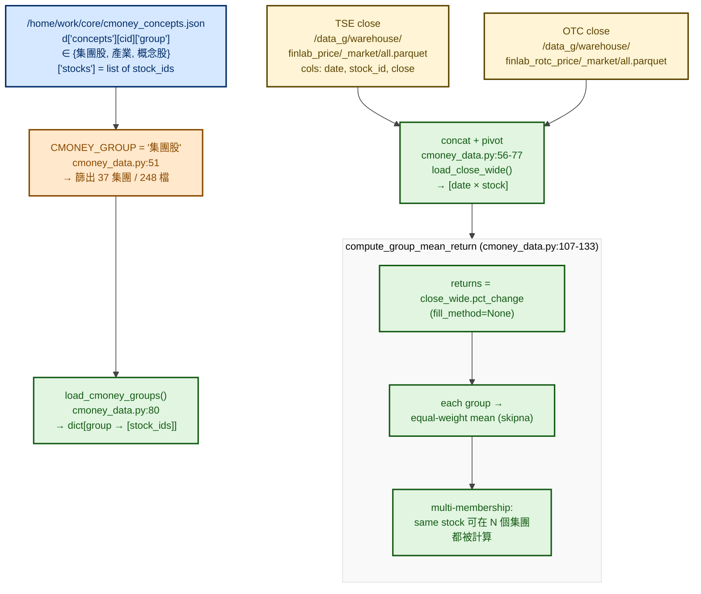
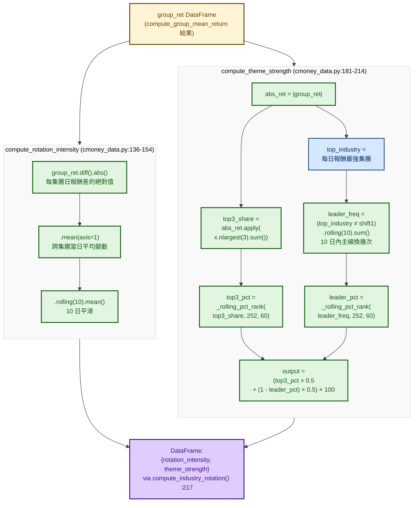
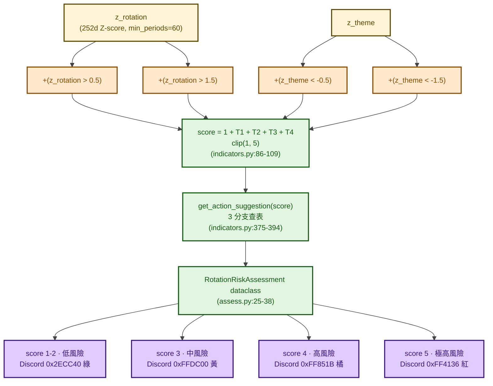
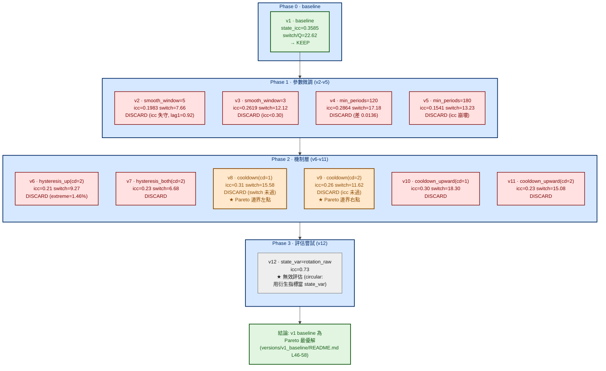
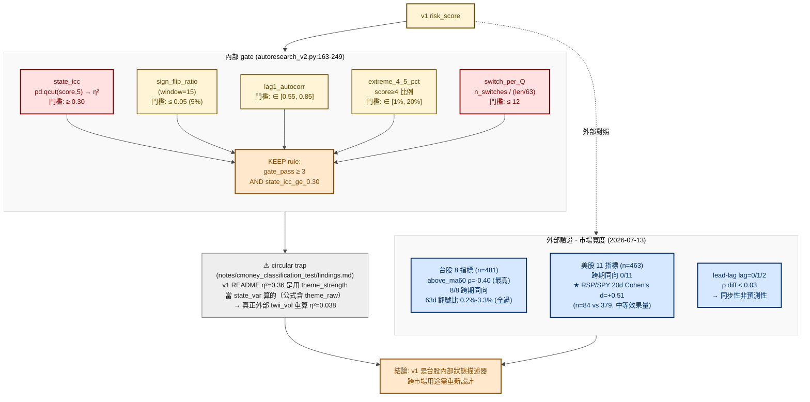

# 產業輪動風險監控 — 流程圖

> 履歷用途：以流程圖呈現「cmoney 37 集團 × TSE/OTC 個股 → rotation_intensity + theme_strength 雙指標 → 1-5 風險分數 → Discord 通知 + UI snapshot」的完整產線；同時記錄 **12 輪 autoresearch** 中 1 個 baseline KEEP + 11 個 DISCARD 的迭代紀律，以及 v8/v9 之間形成的 Pareto 邊界。

> 父架構見 [`../market_risk.md`](../market_risk.md) §二「Pack C · auxiliary_signal」。本圖為 Pack C 底下其中一個獨立研究專案。

> ⚠️ **不要跟 `research/market-analysis/theme_industry_correlation/` 搞混**——那是學術式 5760 組歷史回測（毛 Sharpe 0.80 → 淨 -2.31）；本模組是**生產即時監控**（每日排程 + Discord 通知）。

---

## 一、模組定位

| 項目 | 內容 |
|---|---|
| **核心假設** | 資金在產業間快速輪動（Rotation Intensity ↑）且缺乏明確主線（Theme Strength ↓）時，市場波動加劇 |
| **議題角色** | **市場狀態描述器**（不是漲跌預測訊號）—— 高風險分數代表「主線不明、產業分歧擴大」的環境，**不是**「大盤要跌」|
| **資料來源** | `/home/work/core/cmoney_concepts.json`（集團股分類）+ warehouse TSE/OTC close parquet |
| **生產指標** | `rotation_intensity`（10 日 Z-score）、`theme_strength`（10 日 Z-score）、綜合 `risk_score ∈ [1, 5]` |
| **驗證主軸** | Pack C auxiliary：`state_icc ≥ 0.30`、`sign_flip_ratio ≤ 0.05`、`lag1_autocorr ∈ [0.55, 0.85]`、`switch_per_Q ≤ 12` |
| **迭代紀律** | **12 輪 autoresearch**：1 baseline KEEP + 11 DISCARD，v8/v9 形成 Pareto 邊界 |
| **每日入口** | n8n trigger `/api/research/run_daily/industry_rotation_risk` → `scripts/run_daily.py` |
| **下游通知** | Discord webhook（4 色：綠 / 黃 / 橘 / 紅）+ Plotly gauge PNG + UI snapshot |

---

## 二、整體 Pipeline（cmoney → indicator → score → Discord）

```mermaid
%%{init: {'theme':'base', 'themeVariables': {'primaryColor':'#ececec','primaryTextColor':'#1a1a1a','primaryBorderColor':'#666666','lineColor':'#444444','secondaryColor':'#f4f4f4','fontSize':'14px'}}}%%
flowchart LR
    classDef source fill:#d6e8ff,stroke:#002b66,stroke-width:2px,color:#002b66
    classDef warehouse fill:#fff4d6,stroke:#5c4500,stroke-width:2px,color:#5c4500
    classDef compute fill:#e1f5e1,stroke:#145a14,stroke-width:2px,color:#145a14
    classDef compose fill:#ffe8cc,stroke:#8a4a00,stroke-width:2px,color:#8a4a00
    classDef output fill:#e0ccff,stroke:#3a1488,stroke-width:2px,color:#3a1488

    CM["cmoney_concepts.json<br/>group='集團股'<br/>37 集團 / 248 檔"]:::source
    TSE["TSE close parquet<br/>/finlab_price/_market/all.parquet"]:::warehouse
    OTC["OTC close parquet<br/>/finlab_rotc_price/_market/all.parquet"]:::warehouse
    WIDE["load_close_wide()<br/>pivot → [date × stock]"]:::compute
    GROUP["compute_group_mean_return<br/>equal-weight per 集團"]:::compute

    subgraph IND["雙指標（10d window）"]
        direction TB
        RI["rotation_intensity<br/>= diff().abs().mean(axis=1)<br/>.rolling(10).mean()"]:::compute
        TS["theme_strength<br/>= (top3_pct × 0.5<br/>+ (1-leader_pct) × 0.5) × 100"]:::compute
    end

    CACHE[("data/indicators.parquet<br/>cache")]:::warehouse
    Z["calculate_z_score(window=252<br/>min_periods=60)"]:::compute
    SCORE["calc_risk_score(z_rot, z_theme)<br/>= 1 + (z_rot>0.5) + (z_rot>1.5)<br/>+ (z_theme<-0.5) + (z_theme<-1.5)<br/>clip(1, 5)"]:::compose
    ACTION["get_action_suggestion(score)<br/>3 分支查表"]:::compose
    ASSESS["RotationRiskAssessment dataclass"]:::compose
    REPORT["report.create_gauge_figure()<br/>→ Plotly gauge PNG"]:::output
    DISC["send_to_discord()<br/>4 色 embed"]:::output
    UI["export_ui_snapshot()<br/>→ results/ui/history.csv"]:::output

    CM --> WIDE
    TSE --> WIDE
    OTC --> WIDE
    WIDE --> GROUP --> IND
    IND --> CACHE
    CACHE --> Z --> SCORE --> ACTION --> ASSESS
    ASSESS --> REPORT --> DISC
    ASSESS --> UI

    class CM source
    class TSE,OTC,CACHE warehouse
    class WIDE,GROUP,RI,TS,Z compute
    class SCORE,ACTION,ASSESS compose
    class REPORT,DISC,UI output
```



---

## 三、資料載入（cmoney 37 集團 + 雙市場）

> 從兩個來源組出「集團 → 成員」映射與 wide 收盤表，多歸屬語意：**同一檔股票可屬於多個集團**。



**面試亮點**

- **集團分類的選擇**：從原本 FinLab 46 產業（v1）改為 cmoney 37 集團（v2），`external icc` 提升 **2.9×**（`notes/cmoney_classification_test/`）
- **`pct_change(fill_method=None)`**：明確禁用 pandas 預設的 forward-fill，避免停牌日假造報酬

---

## 四、雙指標計算（rotation_intensity + theme_strength）

> 兩條指標都用 `window=10`，但**公式語意相反**——rotation 看「輪動劇烈程度」（越大越亂），theme 看「主線穩定程度」（越大越有序）。組合兩條才看得出「無主線的高輪動」這個風險狀態。



**`_rolling_pct_rank` 公式（cmoney_data.py:157-178）**

```
滾動窗口 252 天 / min_periods=60
rank = (x.iloc[-1] > x[:-1]).mean()
```

→ **lookback-only percentile**，無 lookahead bias。

**指標語意對照**

| 指標 | 高值代表 | 數學直覺 |
|---|---|---|
| `rotation_intensity` | 集團報酬變動大、輪動快 | 投資人共識換邊站 |
| `theme_strength` | top3 集團穩定、換主線次數少 | 市場有明確主線 |

→ 風險狀態 = **高 rotation + 低 theme** = 沒人帶頭但大家在亂跑。

---

## 五、風險分數組裝（1-5 + 4 色通知）

> `risk_score` 用 4 個獨立 if 觸發加總，最後 `clip(1, 5)`——不是連續函數，是**離散階梯**，方便下游 rule-based 決策與 Discord 視覺。



**面試亮點**

- **離散階梯而非連續**：4 個 boolean trigger 加總 → 易於 rule-based downstream 與人類解讀
- **不對稱軸**：rotation 用 `> 0.5 / > 1.5`（高於平均）；theme 用 `< -0.5 / < -1.5`（低於平均）—— 反映「高輪動 + 弱主線」風險本質
- **v1 鎖定值**（2026-07-01）：score=4/5 高風險、Z_rot=+1.57、Z_theme=-1.08

---

## 六、12 輪 autoresearch 迭代歷程（v1 KEEP + 11 DISCARD）

> 每一輪嘗試一個機制改良（median 平滑、min_periods、hysteresis、cooldown），全部必須過 Pack C gate 才能KEEP；**只有 v1 baseline 過得了**，其餘 11 輪全 DISCARD。v8/v9 之間形成 Pareto 邊界——icc 跟 switch_per_Q 無法同時優化。



**面試必講 — Pareto 邊界的故事**

| 版本 | icc | switch/Q | 結果 |
|---|---|---|---|
| **v8** | **0.31 ✅** | 15.58 ❌ | icc 過、switch 沒過 |
| **v9** | 0.26 ❌ | **11.62 ✅** | switch 過、icc 沒過 |

→ 兩個版本各過一個 gate，沒有任何候選能同時滿足——這就是「真實研究中 gate 互相拉扯」的教科書案例。

**v1 LOCK 後續狀態（2026-07-01）**

- 評估基準日：2026-07-01
- v1 風險分數：4/5（高風險）
- 歷史資料範圍：2007-04-23 ~ 2026-07-01

---

## 七、Pack C 驗證閘門 + 外部寬度驗證

> Pack C gate 來源是 `scripts/autoresearch_v2.py:241-249`——**注意 README 跟實際 gate 數字不一致**（README 寫 sign_flip ≤30% / lag1 ∈ [0.40, 0.85]，實際是 ≤5% / [0.55, 0.85]）。



**面試亮點 — 8 個台股寬度指標**

`ad_ratio`、`pct_advancing`、`above_ma20`、`above_ma60`、`return_dispersion`、`nh_nl_index`、`new_high_ratio`、`new_low_ratio`（`scripts/breadth.py:54-91`）

**樣本結構的不平衡**

| score | 天數 | 比例 |
|---|---|---|
| 1 | 269 | 55.9% |
| 4 | 12 | 2.5% |
| 5 | 3 | 0.6% |

→ 高風險事件稀少，gate 不能只用平均相關，必須看 `extreme_4_5_pct` 這種分位檢定。

---

## 八、IDE 與套件顯示指南

本文件全部使用 **Mermaid `flowchart` 語法**，建議安裝下列任一套件以正確渲染：

| IDE / 平台 | 推薦套件 | 安裝指令 |
|---|---|---|
| **VS Code** | Markdown Preview Mermaid Support | `ext install bierner.markdown-mermaid` |
| **VS Code** | Markdown Preview Enhanced | `ext install shd101wyy.markdown-preview-enhanced` |
| **Cursor** | 同 VS Code（沿用 marketplace）| 同上 |
| **JetBrains（DataGrip / PyCharm）**| Markdown 外掛（內建）| Settings → Plugins → Markdown → 啟用 Mermaid |
| **GitHub Web** | 原生支援 | 無需安裝 |
| **GitLab Web** | 原生支援 | 無需安裝 |
| **Obsidian** | 內建 Mermaid | 設定 → Markdown → 啟用 Mermaid |
| **CLI 預覽** | `mermaid-cli` | `npm i -g @mermaid-js/mermaid-cli`<br/>`mmdc -i industry_rotation_risk.md -o out.svg` |

**配色規範**（與本 repo 其他 flowchart 一致）

- 統一使用 `%%{init}%%` 主題：`primaryColor:#ececec`、`primaryTextColor:#1a1a1a`、`lineColor:#444444`
- classDef 全部補 `color:`（淺底深字）
- 配色語意：
  - 🔵 藍（source / external / intermediate）：資料源、外部驗證、中介值
  - 🔴 紅（primary / discard）：主決策指標、DISCARD 結果
  - 🟡 黃（warehouse / guard / input）：快取、守門、輸入
  - 🟢 綠（compute / compose / keep）：計算流程、KEEP 結果
  - 🟠 橘（decision / trigger / pareto）：分支判斷、觸發、Pareto 邊界
  - 🟣 紫（output / tier）：下游輸出、風險等級
  - ⚪ 灰（warning / invalid）：警告、無效評估

---

## 九、程式碼索引（面試時可快速跳轉）

| 角色 | 路徑（host 視角） |
|---|---|
| 🎯 模組入口 README | `Plutus/market-risk/analyses/auxiliary_signal/industry_rotation_risk/README.md` |
| 🎯 Baseline 契約（v1-v12 詳細）| `Plutus/market-risk/analyses/auxiliary_signal/industry_rotation_risk/notes/baseline_contract.md` |
| 🎯 v1 baseline 結案 | `Plutus/market-risk/analyses/auxiliary_signal/industry_rotation_risk/versions/v1_baseline/README.md` |
| 🔍 cmoney 載入 + 雙指標 | `Plutus/market-risk/analyses/auxiliary_signal/industry_rotation_risk/scripts/cmoney_data.py` |
| 🔍 指標計算（Z-score + score）| `Plutus/market-risk/analyses/auxiliary_signal/industry_rotation_risk/scripts/indicators.py` |
| 🔍 組裝 + 評估 | `Plutus/market-risk/analyses/auxiliary_signal/industry_rotation_risk/scripts/assess.py` |
| 🔍 報告 + Discord | `Plutus/market-risk/analyses/auxiliary_signal/industry_rotation_risk/scripts/report.py` |
| 🔍 每日入口 | `Plutus/market-risk/analyses/auxiliary_signal/industry_rotation_risk/scripts/run_daily.py` |
| 🔍 Autoresearch v2 框架 | `Plutus/market-risk/analyses/auxiliary_signal/industry_rotation_risk/scripts/autoresearch_v2.py` |
| 🔍 指標 cache | `Plutus/market-risk/analyses/auxiliary_signal/industry_rotation_risk/data_loader.py` |
| 📓 台股寬度 8 指標 | `Plutus/market-risk/analyses/auxiliary_signal/industry_rotation_risk/scripts/breadth.py` |
| 📓 美股寬度 OOS | `Plutus/market-risk/analyses/auxiliary_signal/industry_rotation_risk/scripts/run_us_breadth_oos.py` |
| 📓 外部寬度驗證報告 | `Plutus/market-risk/analyses/auxiliary_signal/industry_rotation_risk/notes/breadth_correlation_oos_2023_2024.md` |
| 📓 circular trap 揭露 | `Plutus/market-risk/analyses/auxiliary_signal/industry_rotation_risk/notes/cmoney_classification_test/findings.md` |
| 🐳 共用 gate framework | `Plutus/market-risk/src/market_risk_common/signal_gate.py` |
| 🐳 Discord sender | `Plutus/infrastructure/jupyter/scripts/risk/discord_sender.py` |
| 🐳 共用 UI snapshot | `Plutus/market-risk/src/market_risk_common/ui_export.py` |
