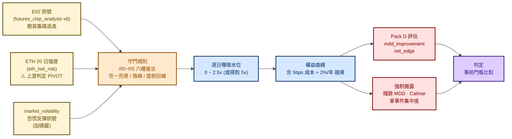
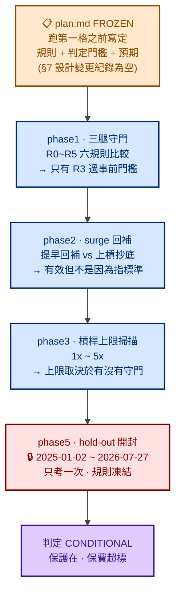
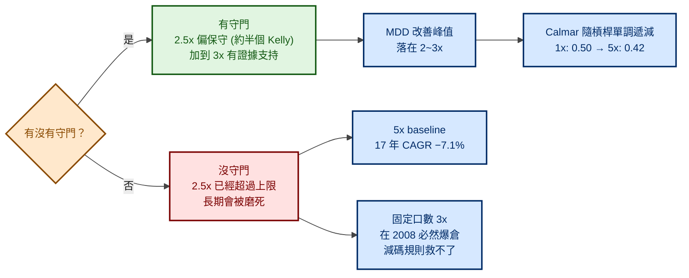

# 槓桿守門 Overlay（Leverage Guard Overlay）— 流程圖

> 履歷用途：以流程圖呈現 **Pack D · 獨立策略層**唯一展開的案例——
> 把上游 Pack A 訊號變成**逐日曝險倍數曲線**，並量化「保險的保費是多少」。
> 這份是整個平台裡唯一回答「**訊號怎麼變成部位**」與「**保護要付多少代價**」的議題。

> 父架構見 [`../market_risk.md`](../market_risk.md) §二「Pack D · 獨立策略」。

> 🎓 **方法論亮點**：本議題採**事前登記（pre-registration）**——
> 規則與判定門檻在跑第一格程式之前就寫進 `plan.md` 並凍結，
> hold-out **只開封一次、不因結果回頭調參**。這是全 repo 方法論最嚴的一份。

> 📖 **讀法**：**§一 模組定位** 與 **§六 hold-out 開封** 是重點，兩分鐘可看完；其餘為細節。
> 標示「地雷 / 講法」的區塊是作者自己的面試準備筆記，**可直接略過**。

---

## 一、模組定位

| 項目 | 內容 |
|---|---|
| **研究問題** | **已經在扛槓桿持有台股指數的人，每天該持有幾倍曝險？** |
| **不是問什麼** | 不是「要不要進場」，也不是「這訊號能不能當策略賣」——是**部位規模管理** |
| **研究方向軸** | `integration`（Pack D）；與三軸平級，**不是** `top_risk/` 的子目錄 |
| **Label** | **無方向 label**（本議題不發明方向標籤，只消費上游訊號） |
| **評估主軸** | Pack D：`mdd_improvement` / `net_edge`；**禁用**方向 lift 當 Keep 依據 |
| **強制揭露** | 殘餘 MDD、Calmar、單事件集中度（三項寫在 `AGENTS.md`） |
| **狀態** | **active** — phase1/2/3 探索期 informative，phase5 hold-out 判定 **CONDITIONAL** |
| **成本口徑** | 5 bps 單邊 + 融資 2%/年 |

### 研究窗與它的代價（必須主動揭露）

| 項目 | 值 |
|---|---|
| 物理最早 | 2003-01-02（TAIEX 報酬指數） |
| **實際研究窗** | **2017-11-09 ~ 2024-12-31（約 7 年）**——受限於 ETH-USD 上市日 |
| 為什麼是 ETH 卡住 | 訊號要全部對齊同一起點；E02 可回到 2007-07-02，但 ETH intensity 最早只有 2017-11-09 |
| 樣本窗規範 | 低於 `minimum-sample-window.md` 預設 8 年、高於 5 年下限 → **強制在報告揭露** |
| **代價** | **測不到 2008 海嘯與 2011 歐債**——正是保護價值最大的兩段。上游顯示 E02 的 MDD 改善有一半來自 2008，本議題窗內看不到那部分 |
| 雙市場 | ⚠️ **OTC 尚未涵蓋**（前置研究僅 TAIEX），且**不算例外已核准** |

> **這張表本身就是加分項**：把「我的樣本不夠、而且剛好缺了最關鍵的兩段」寫在最前面，
> 比等面試官問出來好得多。

---

## 二、整體架構（上游訊號 → 曝險水位 → 績效對帳）

---

## 三、五個階段（每一階段都事前登記）

> **注意沒有 phase4**：編號留白是因為原計畫的某一階段未執行，
> **沒有為了讓編號連續而回頭重編**——這也是事前登記的一部分（紀錄要能對得上原始計畫）。

---

## 四、phase1：六種接法，只有一種過關

**口徑**：L = 2.5 倍槓桿、成本 5 bps 單邊。「改善」= `mdd_improvement`（vs 同槓桿 R0，正 = 回撤更淺）；
「淨增」= `net_edge` 年化（vs R0，正 = 更賺）。

| 規則 | 內容 | IS CAGR | IS MDD | IS 改善 | IS 淨增 | OOS MDD | OOS 改善 | OOS 淨增 | 平均水位 | 空手% |
|---|---|---:|---:|---:|---:|---:|---:|---:|---:|---:|
| **R0** | 恆定 2.5x（對照） | 8.5% | −63.7% | — | — | −42.1% | — | — | 2.50x | 0% |
| **R1** | E02 亮就砍（**現況基準**） | 13.3% | −40.0% | +23.7pp | +4.8pp | −13.4% | +28.6pp | −31.0pp | 1.68x | 33% |
| **R2** | ETH 亮就砍 | 20.1% | −42.9% | +20.7pp | +11.6pp | −32.0% | +10.0pp | −5.9pp | 1.61x | 36% |
| **R3** | **E02 或 ETH 任一亮就砍** ✅ | **19.0%** | **−29.6%** | **+34.0pp** | **+10.5pp** | −13.4% | +28.6pp | −29.8pp | 1.11x | 56% |
| **R4** | 階梯（都亮→0、一個亮→半倉） | 14.7% | −44.2% | +19.5pp | +6.2pp | −23.0% | +19.0pp | −17.9pp | 1.76x | 4% |
| **R5** | R4 + MV 提前回補 | 15.4% | −44.2% | +19.4pp | +6.9pp | −23.0% | +19.0pp | −20.8pp | 1.82x | 4% |

**事前門檻**（寫在 `plan.md` §5，未反推）：相對 R1，**IS 與 OOS 同時**滿足
`mdd_improvement ≥ R1` 且 `net_edge ≥ R1 − 0.5pp`。

**結果**：R3（E02 或 ETH 任一亮就砍）是四個候選裡**唯一**通過的：
- 開發期最大回撤從 **−40.0%（R1）改善到 −29.6%**（多擋 10.3pp）
- 七個年份**全部**回撤改善為正（R1 只有 6/7），改善中位數從 +8.2pp 跳到 **+29.2pp**

### 一個「等於沒裝」的腿——而且我認為原因在我

`market_volatility` 的加碼腿在 1742 天裡**只改變了 79 天的部位（4.5%）**。原因是觸發條件要
「恐慌反彈訊號亮 **且** 兩個減碼訊號都熄 **且** 還在 10 天回補等待窗內」——三個條件同時成立的日子本來就稀少。

> 議題 README 的原話：
> **「這不是 `market_volatility` 訊號沒用，是我這個接法沒給它作用空間。」**
>
> 這句話展示的是：**區分「假設被否證」與「實作沒給假設機會」**。
> 很多人會直接寫「market_volatility 無效」——那是錯的歸因。

---

## 五、phase3：槓桿上限不是一個數字

**一句話結論**（引自議題報告）：

> 「沒有守門的話，2.5x 已經超過上限；有守門的話，2.5x 反而偏保守，往上加到 3x 有證據支持。
> **真正卡住你的不是保證金，是你自己能不能坐得住那個回撤。**」

### 兩個必須一起講的節制

1. **加槓桿本身不改善風險調整後報酬**：Calmar 從 1x 的 0.50 **單調遞減**到 5x 的 0.42。
   所以「該開幾倍」是**要研究的變數**，不是外生給定的參數
2. **逐日再平衡 vs 固定口數要標明**：固定口數 3x 在 2008 **必然爆倉**，減碼規則救不了
   （8 個最痛單日只罩住 3 個）。本議題所有結論都必須註明是哪一種

---

## 六、phase5：hold-out 開封（本議題最該講的一節）

### 6.1 開封規則（事前寫死）

`plan.md` §20：**只開一次、規則完全凍結、不得因結果回頭調參數。**

### 6.2 開封前就寫好的預期（貼在報告裡供事後對照）

> 「2025~2026 是台股強多頭——加權指數近 1 年年化報酬 95.85%（查詢日 2026-07-28）。
> 守門規則在多頭**必然少賺**。所以 `net_edge` 為負是**預期內**的，不構成失敗。
> 判定重點是 `mdd_improvement` 是否仍為正。」

**事後對照：預期完全命中。** 實際期間指數報酬 +91.1%。

### 6.3 主結果

期間：377 個交易日（1.50 年）｜指數報酬 **+91.1%**｜指數最深回撤 **−26.7%**
口徑：L = 2.5x、成本 5 bps、融資 2%/年

| 規則 | 內容 | 終值 | CAGR | MDD | **MDD 改善** | **淨增** | 平均水位 | 空手% |
|---|---|---:|---:|---:|---:|---:|---:|---:|
| **R0** | 恆定 2.5x 不守門（基準） | 3.937x | 149.9% | **−56.3%** | — | — | 2.50x | 0% |
| R1 | E02 單腿 | 1.830x | 49.8% | −16.2% | +40.1pp | −100.2pp | 0.90x | 64% |
| R2 | ETH 單腿 | **5.170x** | 199.9% | −20.5% | +35.7pp | **+49.9pp** | 1.48x | 41% |
| **R3** | **E02 或 ETH（事前選定的主規則）** | 1.894x | 53.3% | **−12.1%** | **+44.1pp** | **−96.7pp** | 0.82x | 67% |

### 6.4 判定

**事前門檻**：`mdd_improvement ≥ +5pp` **且** `net_edge ≥ −15pp`

| 指標 | 值 | 判定 |
|---|---|---|
| MDD 改善 | **+44.1pp** | ✅ 遠超門檻 |
| 淨增 | **−96.7pp** | ❌ 遠低於 −15pp |

▶ **判定：CONDITIONAL** — 保護仍在（回撤從 −56.3% 砍到 −12.1%），但多頭少賺超過事前門檻。

**白話版**（引自報告）：

> 「這一年半台股是史詩級大多頭，守門規則**八次亮燈裡只有一次真的躲對**，其他七次都是虛驚，
> 而每次虛驚你都空手站在旁邊看它漲。**保險有生效，但保費在多頭市場貴得嚇人。**」

### 6.5 ⚠️ 最能證明紀律的一點：R2 在 hold-out 贏最多，我沒有改去用它

看 6.3 的表：**R2（ETH 單腿）在 hold-out 拿到 5.170x、淨增 +49.9pp，是唯一「保護又賺更多」的規則。**

但**主規則是 R3，因為 R3 是在 IS/OOS 階段事前選定的**。
hold-out 開封後**不得回頭改選 R2**——那會讓 hold-out 從「考試」變成「第三次調參」。

> **這一段是本議題方法論價值的核心**：
> 「hold-out 開出來，我沒選的那條規則表現最好。
> 如果我改口說『其實 ETH 單腿才是我的主規則』，這次考試就作廢了。
> 所以我照事前登記報 R3 的 CONDITIONAL，然後把 R2 的結果記錄下來當**下一輪的假設**——
> **它現在是一個待驗證的觀察，不是一個結論。**」

---

## 七、方法論紀律清單（這議題最值得抄的部分）

| 紀律 | 具體做法 |
|---|---|
| **事前登記** | `plan.md` 在跑第一格程式之前 FROZEN，含規則、判定門檻、預期；§7 設計變更紀錄**為空**（表示沒有中途改規則） |
| **一次性 hold-out** | 只開封一次，規則凍結，不因結果回頭調參 |
| **先寫預期再看結果** | 開封前先寫「多頭必然少賺、`net_edge` 為負是預期內」，事後對照 |
| **探索期不下 KEEP** | phase1/2/3 明標「探索期 informative——不下 KEEP、未做 FDR、未接 vectorbt 對帳」 |
| **不引用有利但錯誤的結論** | README 明文禁止引用「降槓桿反而賺更多」（那是 2008 專屬現象，不是通則） |
| **凍結前置研究** | `index_futures_derisk` h3 已判 **0/12 KEEP**（保險有效但保費太貴），**凍結不重跑**，當先驗用 |
| **區分否證與實作不足** | `market_volatility` 腿只動 4.5% 的天數 → 記為「接法沒給空間」，不是「訊號無效」 |
| **樣本窗誠實揭露** | 約 7 年 < 規範預設 8 年 → 強制揭露，並明說缺了 2008/2011 |
| **單市場例外未核准** | OTC 未涵蓋 → 標為待決，**不自行當成已核准的例外** |

### 一條踩過坑才寫下的通則

> **`results/ui/history.csv` 是「發佈窗」，不是訊號的可用長度。**
> 多數 sibling 的 UI 快照只有 400 列（約 1.6 年），但底層訊號往往可回算好幾年。
> **判斷可用性一律看「能不能從 `scripts/` 重算」，不是看 `history.csv` 有幾列。**

這條是本議題 2026-07-28 踩過一次才寫下的。實例：
- `eth_twii_risk` 的 `history.csv` 只有 400 列，但用 `data_loader.load_market_data()` +
  `indicators.compute_intensity()` 可回算到 2017-11-09
- `futures_chip_analysis` 的 `history.csv` 是**已作廢的舊訊號**，
  E01/E02 必須用 `run_v6_escape_top_retest.py` 的 `build_signal_bundle()` 重算

---

## 八、引用上游 PIVOT 訊號的正確姿勢

本議題用了 `eth_twii_risk` 的 ETH 強度訊號，而該議題**判定是 PIVOT**。這需要一段明確說明：

| 問題 | 回答 |
|---|---|
| 上游是 PIVOT，為什麼還能用？ | PIVOT 是**檢力失敗**（事件數天花板 35、OOS 獨立事件僅 4），**不是方向隨機**。上游議題自己的處置建議就是「保留作為人工減碼 overlay 警示參考」——**字面上就是本議題在做的事** |
| 怎麼避免偷渡成 KEEP 宣稱？ | ETH 強度當**減碼加成層**，不當獨立 KEEP 宣稱。引用時必須同時附「上游判定為 PIVOT（檢力不足），本議題僅作 overlay 權重輸入」 |
| 跟 `index_futures_derisk` h2 的 PIVOT 有關嗎？ | **沒有**。h2 判在**放空腿**（ETH 崩跌 → 放空台指期）；本議題**不放空指數**，只降自己的曝險，風險結構不同，h2 的判定不直接適用 |
| 只讀上游 README 夠嗎？ | **不夠，本議題踩過**。README 開頭只寫「PIVOT — 統計效力不足」，要讀到 `notebooks/` 的報告 §3.3、§4.2 才知道是檢力失敗、且議題自己建議可作 overlay |

---

## 九、地雷與講法

- **不要說「回撤從 −56% 砍到 −12%」就停**——必須接著講「代價是同期少賺一半（3.94x → 1.89x）」。
  只講前半段是行銷，講完整才是研究
- **不要說這是 KEEP**——判定是 **CONDITIONAL**，且 phase1/2/3 是探索期 informative
- **不要漏講樣本窗**：約 7 年、**測不到 2008 與 2011**，而那是保護價值最大的兩段
- **不要說「已實盤」**——未接 vectorbt 對帳、未扣完整交易成本鏈
- **被問「八次亮燈只對一次，這訊號不是很差嗎」**：這是保險的本質——
  保費是為了少數幾次真的有事。問題不在命中率，在**保費是否划算**，
  而本議題的結論正是「在這 1.5 年的多頭裡不划算」（所以是 CONDITIONAL 不是 KEEP）
- **被問「為什麼不用表現最好的 R2」**：見 §6.5——那會讓 hold-out 作廢。這題答對是大加分
- **被問「這算策略嗎」**：算 Pack D，但**角色是 overlay（部位規模管理）**，
  不決定進場方向，只決定「已經在場內的人該扛幾倍」

---

## 十、程式碼索引（面試時可快速跳轉）

| 角色 | 路徑（host 視角） |
|---|---|
| 🎯 模組入口 README | `Plutus/market-risk/analyses/leverage_guard_overlay/README.md` |
| 🎯 **事前登記（FROZEN）** | `.../leverage_guard_overlay/plan.md`（§5 phase1 門檻、§8–13 phase2、§14–17 phase3、§20 hold-out 開封規則）|
| 🎯 軸契約 + 強制揭露三項 | `.../leverage_guard_overlay/AGENTS.md` |
| 📓 phase1 三腿守門 | `.../versions/phase1_three_leg_guard_2026_07_28/report.md` + `phase1_{grid,verdict,yearly,diag,conservatism_control}.csv` |
| 📓 phase2 surge 回補 | `.../versions/phase2_surge_addback_2026_07_28/report.md` + `phase2_{grid,verdict,placebo,add_mae,falserebound_*}.csv` |
| 📓 phase3 槓桿上限 | `.../versions/phase3_leverage_ceiling_2026_07_28/report.md` + `report_options.md` |
| 📓 **phase5 hold-out 開封** | `.../versions/phase5_holdout_2026_07_28/report.md` |
| 🔍 執行腳本 | `.../scripts/run_phase3_leverage_ceiling.py`、`run_phase5_holdout.py` |
| 🔗 上游 E01/E02 訊號源 | `Plutus/market-risk/analyses/top_risk/futures_chip_analysis/`（v6 `build_signal_bundle()` 重算；v8 預上線回測）|
| 🔗 上游 ETH 訊號源 | `Plutus/market-risk/analyses/top_risk/eth_twii_risk/`（見 [`../market_risk.md`](../market_risk.md) §六）|
| 🔗 凍結的前置研究 | `Plutus/market-risk/analyses/index_futures_derisk/versions/h3_chip_escape_derisk_2026_07_22/report.md`（0/12 KEEP）|
| 🐳 資料源 | `finlab_benchmark_return`（TAIEX TR）、`finlab_market_price`（OTC `IX0043`）、`finlab_futures_price`（TX 一般）|

---

## 十一、IDE Mermaid 渲染

與本 repo 其他 flowchart 一致（淺底深字、`%%{init}%%` 主題）。
安裝指南見 [`../services.md`](../services.md) §七，或直接貼到 [mermaid.live](https://mermaid.live) 驗證。
