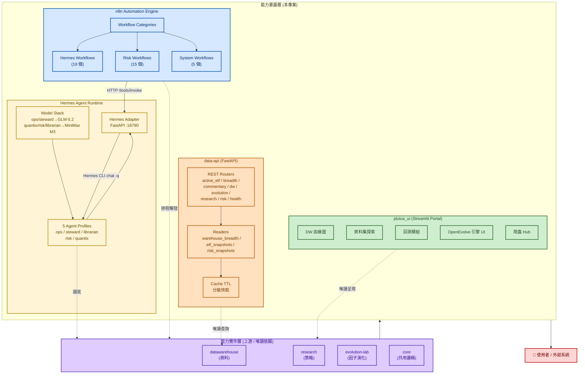
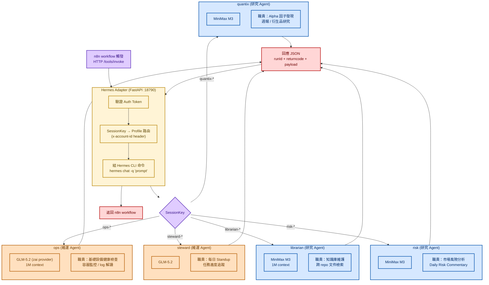
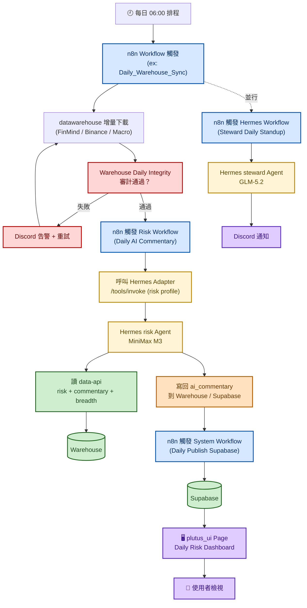

# 統一 AI 服務編排層

## 專案概述

一個把量化研究能力「**對外暴露**」的服務編排層——上游是 `datawarehouse`（資料）、`research`（策略）、`evolution-lab`（演化）、`core`（共用邏輯），本層把這些能力包裝成四種對外形態：**AI Agent Runtime**、**自動化工作流引擎**、**FastAPI 資料 API**、**Streamlit 視覺化 Portal**。

### 為什麼需要這層？

量化研究程式碼本身是「**需要領域知識才能回答的決策**」（Sharpe 門檻、因子篩選、研究方向）——這些屬於**實作層**，不應該被 UI 細節干擾。本層的職責是「**把研究決策對外暴露的機制**」：

- **auto-lessons 注入機制**屬本層；哪些失敗模式該寫進去由 Agents Team 決定
- **回測結果呈現**屬本層；回測怎麼算屬於 research/
- **資料 API endpoints** 屬本層；資料源路由屬於 datawarehouse/

### 四個子服務

| 子服務 | 角色 | 狀態 |
|---|---|---|
| **Hermes** | Production Agent Runtime，承載 5 個 agent profile，透過 adapter 對接自動化引擎 | Primary runtime |
| **n8n** | 自動化引擎，排程 / webhook / 資料 pipeline 全走這裡 | 唯一業務自動化 |
| **data-api** | FastAPI 資料 API，把倉儲結果 query 暴露為 REST endpoint | 補強層 |
| **plutus_ui** | Streamlit Portal，研究產出的視覺化入口（DW 血緣、資料集探索、回測模組、爬蟲 hub） | Portal |

> 本文件所有流程圖使用 **Mermaid** 語法，配色統一採「淺色底 + 深色字」原則，相容於亮／暗 IDE 主題。顯示方式請見**第七節**。

---

## 一、整體架構（四個子服務 + 與上游的關係）

---

## 二、Hermes Agent Runtime（5 個 Profile 的角色分工）

Hermes 是唯一的 Production Agent Runtime。每個 profile 對應一種 agent 角色，配不同的 LLM 模型（維運類 vs 研究類）。

### Model Stack 治理策略

| Agent 類型 | 模型 | 為什麼 |
|---|---|---|
| **維運類** (ops / steward) | GLM-5.2 (zai) | 任務結構化、對中文意圖理解強、成本可控 |
| **研究類** (librarian / risk / quantix) | MiniMax M3 | 1M context，需要讀大量文件 / 程式碼 |
| 無 fallback | — | 任一模型失敗即任務失敗，避免錯誤決策被掩蓋 |

---

## 三、n8n 工作流分類（39 個 Workflow）

n8n 是**唯一業務自動化引擎**。39 個 workflow 分三大類，覆蓋資料、風險、Agent 協作、系統維運。

### Workflow 統計

| 類別 | 數量 | 主要任務 |
|---|---|---|
| Hermes | 19 | Agent 任務派發 / 知識庫 / 記憶進化 |
| Risk | 15 | 每日風險報告 / 週報 / 產業輪動 |
| System | 5 | 資料同步 / 匯出 / 備份 / 審計 |
| **合計** | **39** | — |

---

## 四、data-api（FastAPI 資料 API）

把倉儲結果包成 REST endpoint，給 plutus_ui 與外部系統查詢用。所有 reader 都是唯讀。

```mermaid
%%{init: {'theme':'base', 'themeVariables': {'primaryColor':'#ececec','primaryTextColor':'#1a1a1a','primaryBorderColor':'#555555','lineColor':'#555555','secondaryColor':'#e0e0e0','tertiaryColor':'#f0f0f0','fontFamily':'"Noto Sans TC", "Microsoft JhengHei", sans-serif'}}}%%
flowchart LR
    CLIENT["客戶端<br/>(plutus_ui / 外部)"] --> API

    subgraph API["data-api FastAPI"]
        direction TB
        RT["Routers (REST endpoints)"]
        RT --> R1["active_etf / passive_etf"]
        RT --> R2["breadth (市場廣度)"]
        RT --> R3["commentary (AI 評論)"]
        RT --> R4["dw (Warehouse 直查)"]
        RT --> R5["etf_bh_metrics"]
        RT --> R6["evolution (演化結果)"]
        RT --> R7["research (研究產出)"]
        RT --> R8["risk (風險指標)"]
        RT --> R9["health (健康檢查)"]
    end

    API --> READERS

    subgraph READERS["Readers (資料讀取層)"]
        direction TB
        RD1["warehouse_breadth"]
        RD2["etf_snapshots"]
        RD3["risk_snapshots"]
        RD4["breadth_snapshots"]
        RD5["ai_commentary"]
    end

    READERS --> CACHE

    subgraph CACHE["Cache TTL 分級"]
        direction TB
        C1["即時資料 (短 TTL)"]
        C2["日資料 (中 TTL)"]
        C3["歷史資料 (長 TTL)"]
    end

    CACHE --> WAREHOUSE[("datawarehouse<br/>Parquet / DuckDB")]
    CACHE --> SUPABASE[("Supabase<br/>雲端")]

    classDef highlight fill:#fff4d6,stroke:#b8860b,stroke-width:2px,color:#5c4500;
    classDef loop fill:#d6e8ff,stroke:#0050aa,stroke-width:2px,color:#002b66;
    classDef baseline fill:#e0ccff,stroke:#5a2eb8,stroke-width:2px,color:#3a1488;
    classDef branch fill:#ffe0bf,stroke:#b35a00,stroke-width:2px,color:#6b3a00;
    classDef finlab fill:#cfeecf,stroke:#226622,stroke-width:2px,color:#1f4a1f;
    class API,RT,R1,R2,R3,R4,R5,R6,R7,R8,R9 branch;
    class READERS,RD1,RD2,RD3,RD4,RD5 highlight;
    class CACHE,C1,C2,C3 loop;
    class WAREHOUSE,SUPABASE baseline;
    class CLIENT finlab;
```

---

## 五、端到端流程（一個典型工作日）

把四個子服務串起來看——n8n 排程 → Hermes 處理 → data-api 讀資料 → plutus_ui 呈現。

### 這條流程的關鍵設計

| 設計 | 為什麼 |
|---|---|
| **審計不通過就重試** | 寧可延遲報告，也不要把錯的資料送進 Agent |
| **Risk Agent 走 Hermes** | 風險分析需要長 context 讀歷史資料，MiniMax M3 適合 |
| **Steward 走 Hermes** | Standup 是結構化任務，GLM-5.2 對中文意圖理解強 |
| **結果寫回 Warehouse + Supabase** | 雙寫確保本地與雲端一致，UI 從 Supabase 讀 |
| **Hermes Adapter 是唯一入口** | 每次呼叫都被 Auth Token 驗證，避免 profile 被誤用 |

---

## 六、技術棧

| 領域 | 套件 / 服務 |
|---|---|
| Agent Runtime | **Hermes** (v0.18.2+, Nous Research) |
| Adapter | **FastAPI** (port 18790) |
| 自動化引擎 | **n8n** (Workflow / Webhook / Schedule) |
| 資料 API | **FastAPI** + readers + cache_ttl |
| 視覺化 Portal | **Streamlit** |
| Agent 模型 | **GLM-5.2** (維運) / **MiniMax M3** (研究) |
| 雲端資料庫 | **Supabase** (Postgres) |
| 容器化 | Docker Compose |
| 監控通知 | Discord Webhook |

---

## 七、如何在 IDE 完整呈現 Mermaid 流程圖

這份文件中的所有流程圖使用 **Mermaid** 語法，已內嵌「淺底深字」主題變數，**相容於亮／暗 IDE 主題**。要在 IDE 看到渲染結果，依使用的 IDE 安裝對應套件：

### VS Code / Cursor（最推薦）

在延伸模組市集搜尋並安裝**任一**即可：

| 套件 | Publisher | 說明 |
|---|---|---|
| **Markdown Preview Mermaid Support** | *Matt Biilmann* | 最主流、最穩定，安裝後直接用 `Ctrl+Shift+V` 預覽 Markdown 就會渲染 |
| **Markdown Mermaid** | *Brian Koh* | 整合更完整，支援匯出 PNG/SVG |
| **Mermaid Markdown Syntax Highlighting** | *NETRON* | 額外提供語法高亮（可與上面任一搭配） |

**操作**：打開 `.md` 檔 → `Ctrl+Shift+V`（Mac: `Cmd+Shift+V`）開啟預覽 → 流程圖會自動渲染。

### JetBrains 家族（PyCharm / IntelliJ / DataGrip）

**新版 (2023.1 之後) 內建支援**，無需額外安裝：

1. `Settings` → `Languages & Frameworks` → `Markdown`
2. 勾選 **"Render Mermaid diagrams in preview"**
3. 開啟 Markdown 檔後，右上角切換到 **Preview** 或 **Split** 模式即可

### GitHub / GitLab

**原生支援**，把 `.md` push 上去後直接在網頁上看到渲染結果，**不需安裝任何套件**。

### Obsidian / Notion / HackMD

**原生支援**，把整份內容貼進去即會渲染。適合用來當面試時的展示媒介。

### 瀏覽器直接看（免安裝）

把整份 `.md` 內容貼到以下任一線上工具即可：
- **Mermaid Live Editor**：https://mermaid.live
- **GitHub Gist**：貼成 `.md` gist 直接渲染

---

## 八、附錄：Mermaid 渲染驗證

如果你的 IDE 流程圖顯示空白或出現語法錯誤，先做這兩件事：

1. **確認副檔名為 `.md`**（不是 `.txt`、`.markdown`）
2. **貼到 [mermaid.live](https://mermaid.live) 驗證語法**：能渲染就代表 IDE 端問題；不能渲染代表語法錯（這份文件已通過驗證）。
