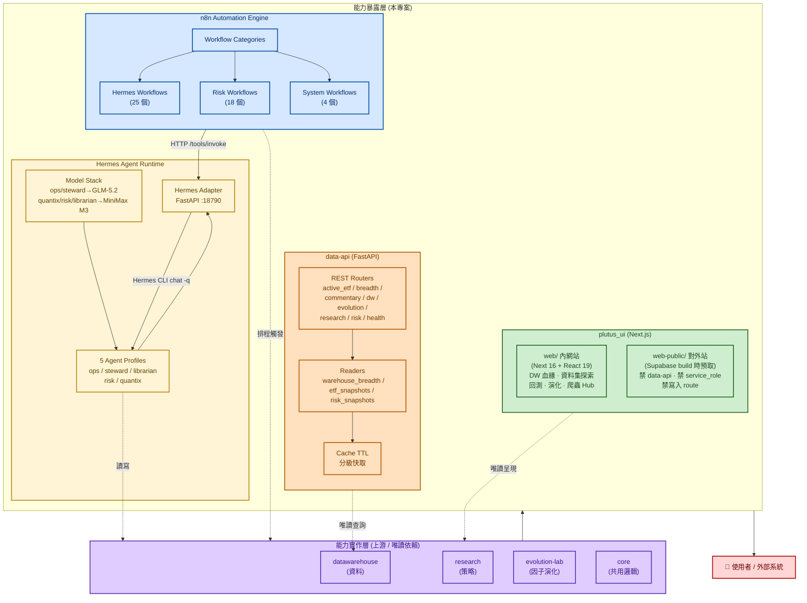
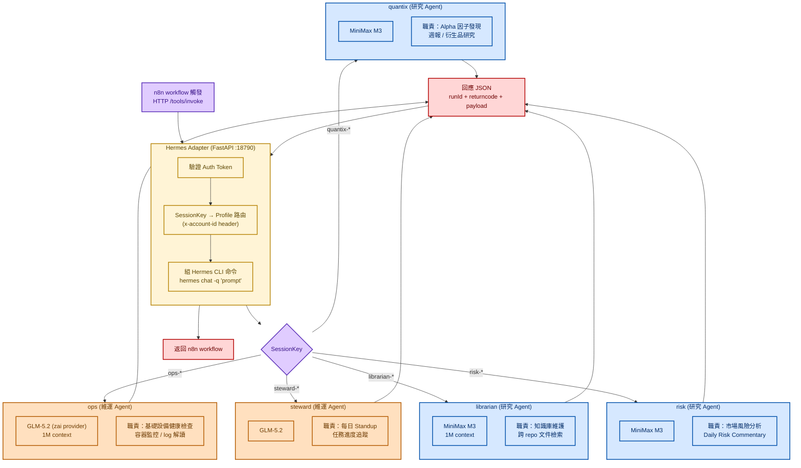
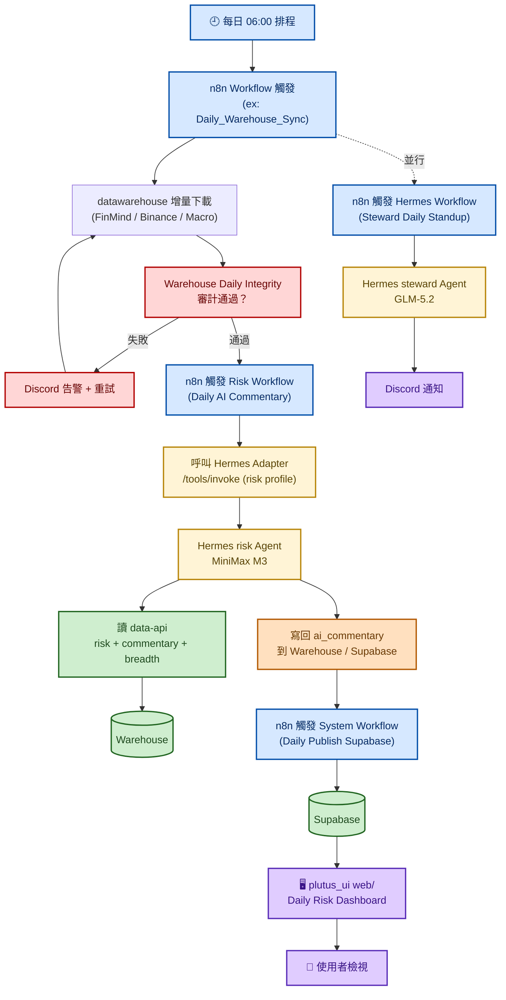

# 統一 AI 服務編排層

## 專案概述

一個把量化研究能力「**對外暴露**」的服務編排層——上游是 `datawarehouse`（資料）、`research`（策略）、`evolution-lab`（演化）、`core`（共用邏輯），本層把這些能力包裝成四種對外形態：**AI Agent Runtime**、**自動化工作流引擎**、**FastAPI 資料 API**、**Next.js 視覺化 Portal**。

### 為什麼需要這層？

量化研究程式碼本身是「**需要領域知識才能回答的決策**」（Sharpe 門檻、因子篩選、研究方向）——這些屬於**實作層**，不應該被 UI 細節干擾。本層的職責是「**把研究決策對外暴露的機制**」：

- **auto-lessons 注入機制**屬本層；哪些失敗模式該寫進去由 Agents Team 決定
- **回測結果呈現**屬本層；回測怎麼算屬於 research/
- **資料 API endpoints** 屬本層；資料源路由屬於 datawarehouse/

### 四個子服務

| 子服務 | 角色 | 狀態 |
|---|---|---|
| **Hermes** | Production Agent Runtime，承載 5 個 agent profile，透過 adapter 對接自動化引擎 | Primary runtime |
| **n8n** | 自動化引擎，排程 / webhook / 資料 pipeline 全走這裡 | 唯一業務自動化 |
| **data-api** | FastAPI 資料 API，把倉儲結果 query 暴露為 REST endpoint | 補強層 |
| **plutus_ui** | **Next.js** 視覺化 Portal，分**內網站**（`web/`）與**對外站**（`web-public/`）兩個獨立 app | Portal |

> **前端技術選型**：Next.js 為唯一前端（[ADR-003](../README.md)）。早期版本為 Streamlit，
> 已於遷移後全面汰除——若面試中被問「為什麼從 Streamlit 換掉」，見 §五。

> 📖 **讀法**：想快速理解看 **§1.0 白板版**（≤7 個框）；想看細節往下讀。標示 `>` 引言與「地雷 / 講法」的區塊是作者自己的面試準備筆記，**可直接略過**。

---

## 一、整體架構（四個子服務 + 與上游的關係）

### 1.0 白板版（被要求「畫一下架構」時畫這張）

> 6 個框、5 條線，60 秒內可畫完。口訣：**上游做決策、本層只暴露；n8n 是神經、Hermes 是大腦。**

```mermaid
%%{init: {'theme':'base', 'themeVariables': {'primaryColor':'#ececec','primaryTextColor':'#1a1a1a','primaryBorderColor':'#555555','lineColor':'#555555','fontFamily':'"Noto Sans TC", "Microsoft JhengHei", sans-serif'}}}%%
flowchart LR
    UP["能力實作層<br/>datawarehouse · research<br/>evolution-lab · core"]
    N8N["n8n<br/>排程 / 觸發"]
    HERMES["Hermes<br/>5 agent profile"]
    API["data-api<br/>FastAPI REST"]
    WEB["plutus_ui<br/>Next.js 內網站"]
    PUB["web-public<br/>對外站 (隔離)"]

    UP --> API
    N8N --> HERMES
    HERMES --> UP
    API --> WEB
    WEB -. "合規過濾" .-> PUB

    classDef up fill:#e0ccff,stroke:#3a1488,stroke-width:2px,color:#3a1488;
    classDef svc fill:#fff4d6,stroke:#5c4500,stroke-width:2px,color:#5c4500;
    classDef ui fill:#cfeecf,stroke:#226622,stroke-width:2px,color:#1f4a1f;
    class UP up;
    class N8N,HERMES,API svc;
    class WEB,PUB ui;
```

### 1.1 細節版

---

## 二、Hermes Agent Runtime（5 個 Profile 的角色分工）

Hermes 是唯一的 Production Agent Runtime。每個 profile 對應一種 agent 角色，配不同的 LLM 模型（維運類 vs 研究類）。

### Model Stack 治理策略

| Agent 類型 | 模型 | 為什麼 |
|---|---|---|
| **維運類** (ops / steward) | GLM-5.2 (zai provider) | 任務結構化、對中文意圖理解強、成本可控 |
| **研究類** (librarian / risk / quantix) | MiniMax-M3 | 1M context，需要讀大量文件 / 程式碼 |
| 全域 fallback | GLM-4.5 | MiniMax 回 429 時自動切換（`config.yaml` 頂層 `fallback_providers`）|

> ⚠️ **被追問「模型設定在哪」要答得出層級**（面試官打開 `config.yaml` 會看到跟上表不同的東西）：
> - `services/hermes/config.yaml` 的 `model.default` 是**全域預設 = MiniMax-M3**，`fallback` = `glm-4.5`
> - 維運類的 `glm-5.2` 是**profile 層覆寫**（每個 profile 有自己的 `~/.hermes/profiles/<name>/config.yaml`），
>   決策紀錄寫在 `services/hermes/README.md`（2026-07-03 切換，走 `ZAI_API_KEY`）
> - 另外 `config.yaml` 還有 `orchestrator` / `researcher` 兩個**排程用角色**（kanban dispatcher），
>   不在「5 個業務 profile」的計數內——被問到「到底幾個 profile」要能分清「業務 profile」與「排程角色」

---

## 三、n8n 工作流分類（48 個 Workflow）

n8n 是**唯一業務自動化引擎**。48 個 workflow 分三大類，覆蓋資料、風險、Agent 協作、系統維運。

> 數字口徑：`find services/n8n/workflows -name '*.json' | wc -l` → **48**
> （`hermes/` 25 + `risk/` 18 + `system/` 4 + 根層 1 個 `FinGPT_Daily_Update.json`）。
> 這個數字會長，講的時候說「目前 48 個」而不是把它當固定規格。

```mermaid
%%{init: {'theme':'base', 'themeVariables': {'primaryColor':'#ececec','primaryTextColor':'#1a1a1a','primaryBorderColor':'#555555','lineColor':'#555555','secondaryColor':'#e0e0e0','tertiaryColor':'#f0f0f0','fontFamily':'"Noto Sans TC", "Microsoft JhengHei", sans-serif'}}}%%
flowchart LR
    TRIGGER["Workflow Trigger<br/>(Schedule / Webhook / Manual)"] --> CAT{"Workflow Category"}

    CAT -- "Hermes (25 個)" --> HERMES_WF

    subgraph HERMES_WF["Hermes Workflows<br/>(與 Agent Runtime 協作)"]
        direction TB
        HW1["📈 Quantix<br/>Alpha Discovery / Weekly<br/>Derivatives Research"]
        HW2["📚 Librarian<br/>Blog Monitor / Knowledge Ops<br/>Research"]
        HW3["🛡️ RiskGuard Research"]
        HW4["🧹 Steward<br/>Daily Standup / Health Check"]
        HW5["🧠 Memory Evolution<br/>Agent 長期記憶"]
        HW6["🔄 ResearchLab Sync<br/>Failed Hypotheses Update"]
    end

    CAT -- "Risk (18 個)" --> RISK_WF

    subgraph RISK_WF["Risk Workflows<br/>(市場風險自動化)"]
        direction TB
        RW1["日風險<br/>AI Commentary / ChipThermometer<br/>ETHTWII / FuturesChip<br/>MarketVolatility"]
        RW2["週風險<br/>LPPL Analysis<br/>Factor Pipeline"]
        RW3["產業 / 大額監控<br/>Industry Rotation<br/>LargeCap Chip Dip<br/>High Price Monitor"]
        RW4["指數 / Backup<br/>TWII OHLC Refresh<br/>Risk Snapshot Audit"]
    end

    CAT -- "System (4 個)" --> SYS_WF

    subgraph SYS_WF["System Workflows<br/>(資料同步與維運)"]
        direction TB
        SW1["📊 Daily Exports<br/>Breadth / Margin / VIX"]
        SW2["🗄️ Daily Sync<br/>Warehouse (FinMind/Binance/<br/>yfinance/KRX/Macro/Finlab)"]
        SW3["📤 Publish Supabase"]
        SW4["💾 Backup Daily"]
        SW5["🔍 Warehouse Audit<br/>Integrity / Auto Reclassify /<br/>DW UI Snapshot"]
    end

    HERMES_WF --> HERMES_CALL["呼叫 Hermes Adapter<br/>/tools/invoke"]
    RISK_WF --> DATA_CALL["直接讀 datawarehouse / data-api"]
    SYS_WF --> DATA_CALL

    HERMES_CALL --> RESPONSE["結果回傳 n8n"]
    DATA_CALL --> RESPONSE
    RESPONSE --> NOTIFY["通知 / 寫入 / 排程下次"]

    classDef loop fill:#d6e8ff,stroke:#0050aa,stroke-width:2px,color:#002b66;
    classDef eval fill:#ffd6d6,stroke:#b30000,stroke-width:2px,color:#6b0000;
    classDef highlight fill:#fff4d6,stroke:#b8860b,stroke-width:2px,color:#5c4500;
    classDef baseline fill:#e0ccff,stroke:#5a2eb8,stroke-width:2px,color:#3a1488;
    classDef branch fill:#ffe0bf,stroke:#b35a00,stroke-width:2px,color:#6b3a00;
    classDef finlab fill:#cfeecf,stroke:#226622,stroke-width:2px,color:#1f4a1f;
    class HERMES_WF,HW1,HW2,HW3,HW4,HW5,HW6 loop;
    class RISK_WF,RW1,RW2,RW3,RW4 eval;
    class SYS_WF,SW1,SW2,SW3,SW4,SW5 highlight;
    class TRIGGER,CAT,RESPONSE,NOTIFY baseline;
    class HERMES_CALL branch;
    class DATA_CALL finlab;
```

### Workflow 統計

| 類別 | 數量 | 主要任務 |
|---|---|---|
| Hermes（`workflows/hermes/`） | 25 | Agent 任務派發 / 知識庫 / 記憶進化 |
| Risk（`workflows/risk/`） | 18 | 每日風險報告 / 週報 / 產業輪動 |
| System（`workflows/system/`） | 4 | 資料同步 / 匯出 / 備份 / 審計 |
| 根層單檔 | 1 | `FinGPT_Daily_Update.json`（22:30 排程，見 [fingpt_risk](./market_risk_studies/fingpt_risk.md)）|
| **合計** | **48** | — |

---

## 四、data-api（FastAPI 資料 API）

把倉儲結果包成 REST endpoint，給 plutus_ui 與外部系統查詢用。所有 reader 都是唯讀。

```mermaid
%%{init: {'theme':'base', 'themeVariables': {'primaryColor':'#ececec','primaryTextColor':'#1a1a1a','primaryBorderColor':'#555555','lineColor':'#555555','secondaryColor':'#e0e0e0','tertiaryColor':'#f0f0f0','fontFamily':'"Noto Sans TC", "Microsoft JhengHei", sans-serif'}}}%%
flowchart LR
    CLIENT["客戶端<br/>(plutus_ui / 外部)"] --> API

    subgraph API["data-api FastAPI"]
        direction TB
        RT["Routers (REST endpoints)"]
        RT --> R1["active_etf / passive_etf"]
        RT --> R2["breadth (市場廣度)"]
        RT --> R3["commentary (AI 評論)"]
        RT --> R4["dw (Warehouse 直查)"]
        RT --> R5["etf_bh_metrics<br/>⚠️ 檔案存在但未註冊"]
        RT --> R6["evolution (演化結果)"]
        RT --> R7["research (研究產出)"]
        RT --> R8["risk (風險指標)"]
        RT --> R9["health (健康檢查)"]
    end

    API --> READERS

    subgraph READERS["Readers (資料讀取層)"]
        direction TB
        RD1["warehouse_breadth"]
        RD2["etf_snapshots"]
        RD3["risk_snapshots"]
        RD4["breadth_snapshots"]
        RD5["ai_commentary"]
    end

    READERS --> CACHE

    subgraph CACHE["Cache TTL 分級"]
        direction TB
        C1["即時資料 (短 TTL)"]
        C2["日資料 (中 TTL)"]
        C3["歷史資料 (長 TTL)"]
    end

    CACHE --> WAREHOUSE[("datawarehouse<br/>Parquet / DuckDB")]
    CACHE --> SUPABASE[("Supabase<br/>雲端")]

    classDef highlight fill:#fff4d6,stroke:#b8860b,stroke-width:2px,color:#5c4500;
    classDef loop fill:#d6e8ff,stroke:#0050aa,stroke-width:2px,color:#002b66;
    classDef baseline fill:#e0ccff,stroke:#5a2eb8,stroke-width:2px,color:#3a1488;
    classDef branch fill:#ffe0bf,stroke:#b35a00,stroke-width:2px,color:#6b3a00;
    classDef finlab fill:#cfeecf,stroke:#226622,stroke-width:2px,color:#1f4a1f;
    class API,RT,R1,R2,R3,R4,R5,R6,R7,R8,R9 branch;
    class READERS,RD1,RD2,RD3,RD4,RD5 highlight;
    class CACHE,C1,C2,C3 loop;
    class WAREHOUSE,SUPABASE baseline;
    class CLIENT finlab;
```

### 快照匯出管線 (Snapshot Pipeline) 與口徑說明

在 UI 展示（如 ETF 績效或策略追蹤）上，系統嚴格遵循「實作與暴露分離」：
1. **即時運算**：由 `data-api` 負責。
2. **定時快照**：透過 **n8n 排程** (如 `Daily ETF Backtest Export`)，每日呼叫 API 算好回測，並匯出成靜態 JSON 存回 Data Warehouse (`ui/etf/`)。
3. **前端讀取**：Web UI 只透過 `etf_snapshots` 這種 reader 讀取靜態結果，不觸發高耗時回測。

> **未來擴展**：此架構已足夠穩定，未來 FinLab 量化選股策略也可直接掛上這套 Snapshot Pipeline，與 ETF 在同一 UI 共同追蹤。

實際對外的 REST router 共 **9 個**（health / dw / research / evolution / risk /
commentary / active-etf / passive-etf / breadth），底下接 **5 個唯讀 reader**。

兩個容易被問到的細節：`commentary` 與 `research` 共用同一個命名空間；
另有一個 ETF 指標模組已寫好但尚未掛上路由，所以「檔案數」會比「endpoint 數」多一個。

---

## 五、內外網隔離（對外站的合規邊界）

> 這是本層**最值得講**的設計：量化平台一旦有對外頁面，**演算法細節本身就是要保護的資產**。
> 我沒有靠「記得不要放」來管，而是把邊界寫成機械化規則。

`plutus_ui` 是兩個**完全獨立**的 Next.js app（不共用 `node_modules`、不互相 import）：

| | `web/`（內網） | `web-public/`（對外） |
|---|---|---|
| 資料源 | `services/data-api` HTTP（即時） | Supabase（**build 時預取**） |
| 寫入能力 | 有 | **禁止**任何寫入型 route handler |
| 憑證 | 內網 token | **禁止出現 `service_role`** |
| 可見路由 | 全部 | 白名單制 |

**硬規則（寫在 `plutus_ui/CLAUDE.md`，不是口頭約定）**

1. `web-public/` **不得引用 `services/data-api`**——對外站沒有任何一條路徑能打到內網 API
2. **不得上架**：`/ops`、`/evolution`、`/research-lab`、`/quantix`、`/chat`、`/dw`
3. **演算法細節與交易指示語彙不得離開內網**——因子代號、閾值、OOS 統計、進場／出場／停損／停利
4. 新增公開路由必須同步 `scripts/check-public-isolation.sh` 的 `ALLOWED_ROUTES` 與 `docs/public-scope.md`
   → **忘記更新就過不了檢查**，這才是規則能撐住的原因

### 為什麼從 Streamlit 遷到 Next.js（ADR-003）

早期 Portal 是 Streamlit——優點是研究端自己就能寫頁面、不用排前端。但兩個問題逼出遷移：

1. **無法做內外分離**：Streamlit 的 server-side 執行模型下，「對外站」與「內網站」很難證明彼此隔離；
   對外要的是 build 時就把資料烤進靜態頁、執行期完全不碰內網
2. **對外站需要真正的前端控制權**：路由白名單、CSP、預取策略、SEO——這些在 Streamlit 裡都是繞路

> 面試時的誠實補充：遷移成本不低（頁面全部重寫），
> 換來的是「對外曝光面可以被腳本驗證」——這在會碰到策略細節的專案上是必要的，不是為了跟流行。

把四個子服務串起來看——n8n 排程 → Hermes 處理 → data-api 讀資料 → plutus_ui 呈現。

### 這條流程的關鍵設計

| 設計 | 為什麼 |
|---|---|
| **審計不通過就重試** | 寧可延遲報告，也不要把錯的資料送進 Agent |
| **Risk Agent 走 Hermes** | 風險分析需要長 context 讀歷史資料，MiniMax M3 適合 |
| **Steward 走 Hermes** | Standup 是結構化任務，GLM-5.2 對中文意圖理解強 |
| **結果寫回 Warehouse + Supabase** | 雙寫確保本地與雲端一致，UI 從 Supabase 讀 |
| **Hermes Adapter 是唯一入口** | 每次呼叫都被 Auth Token 驗證，避免 profile 被誤用 |

---

## 六、技術棧

| 領域 | 套件 / 服務 |
|---|---|
| Agent Runtime | **Hermes** (v0.18.2+, Nous Research) |
| Adapter | **FastAPI** (port 18790) |
| 自動化引擎 | **n8n** (Workflow / Webhook / Schedule) |
| 資料 API | **FastAPI** + readers + cache_ttl |
| 視覺化 Portal | **Next.js 16 + React 19**（`web/` 內網、`web-public/` 對外）|
| Agent 模型 | **GLM-5.2** (維運 profile) / **MiniMax-M3** (研究 profile，亦為全域 default) / **GLM-4.5** (429 fallback) |
| 雲端資料庫 | **Supabase** (Postgres) |
| 容器化 | Docker Compose |
| 監控通知 | Discord Webhook |

---

---

> 本文件的流程圖採 Mermaid 語法，GitHub / GitLab / Obsidian 原生支援；
> VS Code 需安裝 *Markdown Preview Mermaid Support*。
